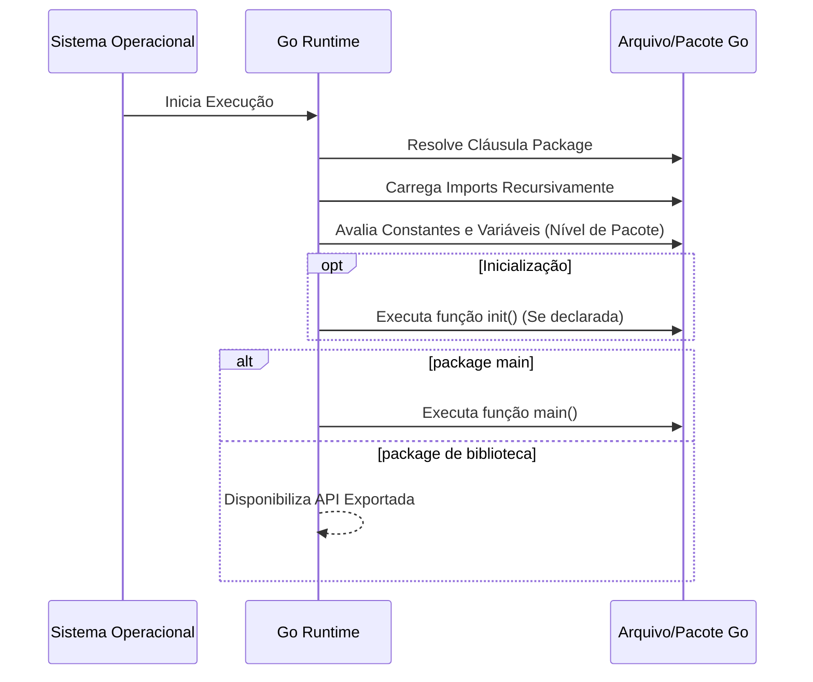

### 1. Visão Geral

A estrutura de um arquivo fonte na linguagem Go (Golang) é regida por uma gramática rigorosa e minimalista. Diferente de linguagens com arquitetura de classes baseada em múltiplos arquivos aninhados, o Go orienta a organização do código em pacotes (packages). A anatomia de um arquivo `.go` dita a visibilidade de variáveis (exportado vs. não-exportado), o gerenciamento rigoroso de dependências (o compilador falha se houver imports não utilizados) e o fluxo de inicialização do programa. O problema principal que essa estrutura resolve é a previsibilidade: independentemente da base de código (seja uma API simples ou um orquestrador em nuvem complexo), a ordem de leitura (pacote -> importações -> estado global -> tipos -> lógicas) é sempre idêntica e garante tempos de compilação extremamente rápidos.

### 2. Organização por Tópicos

A estrutura padrão de um arquivo Go é sequencial e deve respeitar estritamente a seguinte ordem:

- **Declaração de Pacote (`package`):** Define a qual módulo o arquivo pertence e se ele é um executável ou uma biblioteca.
    
- **Importações (`import`):** Declara as dependências de outros pacotes, da biblioteca padrão (stdlib) ou de repositórios externos.
    
- **Declarações de Nível de Pacote:** Agrupa a definição de `const`, `var`, `type` e `interface` globais ao pacote.
    
- **Funções e Métodos:** Implementação da lógica, incluindo funções especiais como `init()` e `main()`, além das funções regulares e métodos vinculados a structs (receivers).
    

### 3. Visualização do Fluxo (Mermaid)

Snippet de código



**Implementação Passo a Passo (Diagrama):**

- **Resolve Cláusula Package:** O Go Runtime primeiro identifica o escopo isolado do arquivo.
    
- **Carrega Imports Recursivamente:** Antes de avaliar qualquer código local, as dependências são carregadas. Se o pacote `A` importa `B`, o runtime resolve `B` completamente antes de voltar para `A`.
    
- **Avalia Constantes e Variáveis:** O espaço em memória é alocado para os dados globais daquele arquivo.
    
- **Executa função `init()`:** Uma mecânica vital do Go. Funções `init()` rodam de forma determinística antes do ponto de entrada principal, ideal para registrar drivers ou configurar estados que não dependem de argumentos em tempo de execução.
    
- **Ponto de Entrada (`main`):** Só existe em `package main` e transfere o controle para a lógica primária do software.
    

### 4 e 5. Exemplos de Código e Implementação Passo a Passo

#### Tópico A: Cabeçalho (Package e Imports)


```go
// Package config gerencia o setup de infraestrutura da aplicação.
// A primeira linha do arquivo define a qual pacote este código pertence.
package config

import (
	"context" // Stdlib: agrupado primeiro
	"fmt"
	"time"

	// Linha em branco separa bibliotecas padrão de pacotes externos ou internos
	"github.com/aws/aws-sdk-go-v2/aws"
)
```

**Implementação Passo a Passo:**

- **`package config`:** Estabelece que este arquivo compõe a biblioteca `config`. Em Go, o nome do pacote é o que outros arquivos usarão para acessar os métodos aqui definidos (ex: `config.Setup()`).
    
- **Bloco `import ()`:** Utilizamos parênteses para fazer o "factoring" (agrupamento) das importações. O padrão idiomático exige ordem alfabética dentro dos blocos, com as bibliotecas nativas acima e as dependências externas/de terceiros separadas por uma linha em branco.
    
- **`context`, `fmt`, `time`:** Pacotes fundamentais do stdlib. O `context` é vital em aplicações Go modernas para gerenciar cancelamentos de goroutines em chamadas de I/O ou rede (ex: interações com AWS).
    

#### Tópico B: Declarações de Escopo Global (Tipos, Variáveis e Constantes)

```go
const (
	// defaultTimeout determina o limite de espera de rede. (Não-exportado)
	defaultTimeout = 30 * time.Second
)

var (
	// ErrLoadTimeout indica que a configuração excedeu o limite. (Exportado)
	ErrLoadTimeout = fmt.Errorf("configuração demorou mais que %v", defaultTimeout)
)

// AWSSettings encapsula credenciais em nuvem. (Exportado)
type AWSSettings struct {
	Region   string
	Profile  string
	retries  int    // Campo privado ao pacote, não serializável externamente.
}
```

**Implementação Passo a Passo:**

- **Blocos `const ()` e `var ()`:** Novamente usamos o "factoring" para evitar repetir as palavras-chave.
    
- **Letra Maiúscula vs Minúscula:** Em Go, a visibilidade (public/private) é gerida pela primeira letra do identificador. `ErrLoadTimeout` é exportado (público) e acessível fora do pacote `config`. `defaultTimeout` e o campo `retries` iniciam com minúscula, o que os torna privados à nível de pacote.
    
- **Declaração de Erros Globais:** A criação de erros sentinela como variáveis de pacote (`var ErrNomeDoErro = ...`) é uma prática padrão para permitir checagem via `errors.Is()` nos consumidores da API.
    
- **Struct `AWSSettings`:** Define a estrutura de dados primária do domínio do pacote.
    

#### Tópico C: Funções (Init, Receiver Methods e Funções Simples)


```go
// init roda no startup do pacote, útil para registrar métricas ou logs base.
func init() {
	fmt.Println("[init] Módulo config carregado na memória.")
}

// NewAWSSettings é a função construtora idiomática para a struct (Factory).
func NewAWSSettings(region string) *AWSSettings {
	return &AWSSettings{
		Region:  region,
		Profile: "default",
		retries: 3,
	}
}

// Connect é um método vinculado a instâncias de AWSSettings via Receiver.
func (awsConfig *AWSSettings) Connect(ctx context.Context) error {
	ctx, cancel := context.WithTimeout(ctx, defaultTimeout)
	defer cancel() // Garante a liberação de recursos do contexto.

	if awsConfig.Region == "" {
		return fmt.Errorf("aws region is required: %w", ErrLoadTimeout)
	}

	// Lógica de infraestrutura omitida...
	return nil
}
```

**Implementação Passo a Passo:**

- **`func init()`:** Não recebe parâmetros nem retorna valores. O Go a executa no exato momento em que o pacote é importado. Útil mas deve ser usada com cautela para não ofuscar lógicas complexas de startup.
    
- **`NewAWSSettings`:** Go não tem construtores nativos (como `new AWS()`). O padrão idiomático é criar uma função nomeada como `New[Tipo]()` que retorna um ponteiro da struct (`*AWSSettings`). Isso permite forçar as dependências e valores default (como o `retries: 3`).
    
- **Receiver Method `(awsConfig *AWSSettings)`:** Anexa a função `Connect` à struct `AWSSettings`. Usamos um ponteiro (`*`) como receiver para evitar a cópia da struct na memória a cada chamada e permitir que o método modifique os campos internos do objeto original, se necessário.
    
- **`defer cancel()`:** Aplicação de LIFO (Last In, First Out) na gestão de recursos. Garante que, independentemente do fluxo que retorne da função (sucesso ou erro), os recursos alocados pelo context sejam destruídos, evitando _memory leaks_.