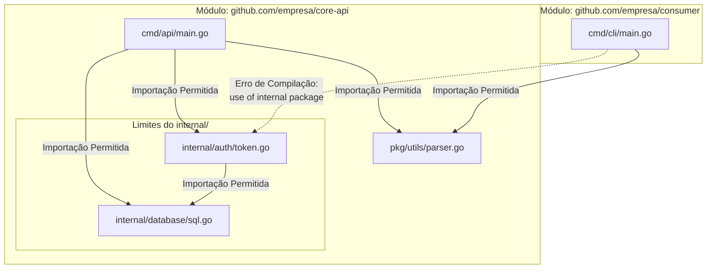

### 1. Visão Geral

No ecossistema da linguagem Go, o conceito de pacotes `internal` é uma funcionalidade nativa e rígida do *toolchain* de compilação projetada para resolver o problema de encapsulamento e definição de limites arquiteturais (API boundaries). Como o Go utiliza a capitalização (letras maiúsculas) para determinar a visibilidade de funções e tipos (exportado vs não-exportado), tudo que é exportado torna-se público para *qualquer* código que importe aquele pacote. O diretório nomeado estritamente como `internal/` introduz uma trava de segurança em nível de compilador: qualquer pacote contido dentro de um diretório `internal` só pode ser importado por códigos que compartilhem a mesma árvore de diretórios pai do próprio diretório `internal`. Isso impede o vazamento de lógicas de domínio central, abstrações não consolidadas ou utilitários específicos do projeto para consumidores externos.

---

### 2. Organização por Tópicos

O conceito de pacotes internos manifesta-se tipicamente através das seguintes mecânicas:

* **Regra da Árvore Pai (Parent Tree Rule):** O compilador do Go restringe a importação com base na localização física do diretório `internal`.
* **Proteção do Core Domain (Business Logic):** Isolamento das regras de negócio em arquiteturas modulares (como Hexagonal ou Clean Architecture), garantindo que APIs externas não acoplem diretamente à lógica volátil.
* **Encapsulamento em Bibliotecas Públicas:** Prevenção de que usuários de uma biblioteca Go de código aberto dependam de funções utilitárias que os mantenedores podem alterar e quebrar em atualizações futuras.

---

### 3. Visualização do Fluxo (Mermaid)



**Implementação Passo a Passo (Diagrama):**

* **`cmd/api/main.go` e `pkg/utils/parser.go`:** Pertencem à raiz ou subdiretórios públicos do módulo. Eles estão "acima" ou no mesmo nível hierárquico pai que o diretório `internal`, portanto, possuem passe livre para importar `internal/auth` e `internal/database`.
* **`internal/auth` chamando `internal/database`:** Pacotes irmãos dentro de `internal/` podem importar uns aos outros sem restrições.
* **`cmd/cli/main.go` (Módulo Externo):** Quando tenta importar o pacote `pkg/utils`, o compilador permite, pois trata-se de uma API pública exposta. Quando tenta acessar `internal/auth`, o *toolchain* do Go avalia o caminho absoluto de importação e bloqueia o processo com um erro em tempo de compilação.

---

### 4. Exemplos de Código (Idiomático) e 5. Implementação Passo a Passo

#### Tópico A: Estrutura Oculta e Serviço Interno

```go
// Arquivo: internal/billing/invoice.go
// Pacote internal/billing lida com lógicas financeiras estritas do sistema.
package billing

import (
	"errors"
	"fmt"
)

// Invoice modela uma fatura. Letra maiúscula (exportada), 
// porém a visibilidade externa é barrada pela pasta 'internal/'.
type Invoice struct {
	ID     string
	Amount float64
}

// Generate cria uma fatura. Só poderá ser chamada pela própria aplicação.
func Generate(id string, amount float64) (*Invoice, error) {
	if amount <= 0 {
		return nil, errors.New("o valor da fatura deve ser maior que zero")
	}
	
	// Simulação de lógica interna de negócio
	fmt.Printf("[Billing Internal] Fatura %s gerada.\n", id)
	return &Invoice{ID: id, Amount: amount}, nil
}

```

**Implementação Passo a Passo:**

* **`package billing` dentro de `internal/billing/`:** O pacote recebe um nome de domínio regular (`billing`), a palavra `internal` existe apenas na estrutura de pastas físicas e nos *import paths*.
* **A Ilusão do Exportado (`Invoice`, `Generate`):** Os tipos e funções iniciam com letra maiúscula. No escopo global do Go, isso significa que eles são públicos. No entanto, por habitarem um diretório `internal`, eles são "públicos apenas para o círculo de confiança" (o diretório pai da pasta `internal`).
* **Por que isso importa:** O desenvolvedor pode usar livremente interfaces e structs bem nomeadas e testáveis (caixa-branca) internamente, sem medo de que um outro microsserviço ou biblioteca acople diretamente na struct `Invoice`.

#### Tópico B: Consumo Permitido (Boundary Interno)

```go
// Arquivo: cmd/worker/main.go
// Este arquivo reside no mesmo módulo/árvore pai da pasta 'internal'.
package main

import (
	"log"

	// Importação do pacote interno permitida pelo compilador
	"github.com/empresa/core-api/internal/billing"
)

func main() {
	// Acesso total à API "pública" do pacote interno.
	invoice, err := billing.Generate("INV-1024", 150.00)
	if err != nil {
		log.Fatalf("Falha na geração: %v", err)
	}

	log.Printf("Worker processou com sucesso: %+v", invoice)
}

```

**Implementação Passo a Passo:**

* **Path de Importação:** A declaração `"github.com/empresa/core-api/internal/billing"` expõe explicitamente o caminho da árvore. O Go valida o prefixo de quem está importando (neste caso, o pacote em `cmd/worker`) contra o caminho de quem está sendo importado.
* **Chamada da Função:** O uso ocorre normalmente (`billing.Generate`). Para o arquivo consumindo a API, o pacote comporta-se como qualquer pacote de terceiros ou da biblioteca padrão. O acoplamento existe, mas é controlado e intencional.

#### Tópico C: Consumo Bloqueado (Violando o Limite)

```go
// Arquivo: main.go (Em outro repositório/módulo, ex: github.com/empresa/consumer)
package main

import (
	"log"

	// O editor e o compilador irão marcar esta linha como inválida.
	"github.com/empresa/core-api/internal/billing" 
)

func main() {
	// Este código jamais compilará.
	invoice, _ := billing.Generate("INV-001", 10.0)
	log.Println(invoice)
}

```

**Implementação Passo a Passo:**

* **A falha no import:** Assim que o comando `go build` ou `go run` é executado neste repositório externo, o processo de compilação é imediatamente abortado.
* **Erro do compilador:** A saída padrão exibirá algo idêntico a: `use of internal package github.com/empresa/core-api/internal/billing not allowed`.
* **Isolamento Garantido:** Isso assegura que se você refatorar o pacote `internal/billing` amanhã, quebrando contratos da função `Generate`, você só precisará se preocupar em consertar o código do próprio projeto `core-api`, sem quebrar sistemas alheios.