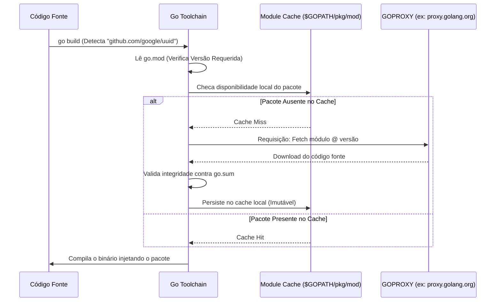

### 1. Visão Geral

No ecossistema Go, pacotes externos são bibliotecas e módulos de terceiros não pertencentes à *Standard Library* (stdlib) ou ao próprio projeto. A importação e o gerenciamento desses pacotes são orquestrados pelos **Go Modules** (introduzido no Go 1.11). Diferente de linguagens que dependem de um registro centralizado (como o NPM para Node.js ou Maven para Java), o Go é projetado de forma descentralizada, permitindo o *fetch* de pacotes diretamente de sistemas de controle de versão (VCS) como GitHub, GitLab ou Bitbucket, utilizando URLs como caminhos de importação. O problema principal que o sistema de pacotes externos resolve é a reprodutibilidade de builds e o reaproveitamento de código comunitário, garantindo através do arquivo `go.sum` (checksums criptográficos) que a dependência baixada na máquina A seja matematicamente idêntica à baixada no servidor de CI/CD, prevenindo ataques de alteração de cadeia de suprimentos (supply chain attacks).

---

### 2. Organização por Tópicos

O consumo de pacotes externos no Go se divide nas seguintes mecânicas fundamentais:

* **Gerenciamento de Estado (`go.mod` e `go.sum`):** O manifesto de dependências e suas travas criptográficas de segurança.
* **Consumo Padrão (Direct Imports):** A inclusão e utilização de bibliotecas via URLs qualificados.
* **Importação Oculta (Blank Imports `_`):** Importação de pacotes exclusivamente para a execução de seus efeitos colaterais na função `init()`, comum em *drivers* de banco de dados.
* **Aliasing (Apelidos de Importação):** Resolução de conflitos de nomenclatura quando múltiplos pacotes possuem o mesmo nome base ou para melhorar a semântica de pacotes com nomes complexos.

---

### 3. Visualização do Fluxo (Mermaid)



**Implementação Passo a Passo (Diagrama):**

* **Lê `go.mod`:** O *toolchain* identifica a declaração de importação no arquivo fonte e cruza com a versão especificada no manifesto `go.mod`.
* **Module Cache (`$GOPATH/pkg/mod`):** O Go não baixa dependências na pasta do projeto (exceto se a flag `-mod=vendor` for ativada). Ele mantém um cache global e imutável de pacotes por versão na máquina do desenvolvedor, economizando disco e rede entre múltiplos projetos.
* **GOPROXY:** Por padrão, o Go não vai direto ao GitHub. Ele intercepta a requisição e busca em um proxy seguro e em cache do Google (`proxy.golang.org`), acelerando downloads e garantindo que o pacote não desapareça se o autor deletar o repositório original (evitando o incidente do tipo *left-pad*).
* **Validação contra `go.sum`:** Antes de mover o código para o cache, o Go calcula um hash criptográfico dos arquivos baixados. Se não bater com o que está no `go.sum`, a compilação aborta, protegendo contra código adulterado.

---

### 4. Exemplos de Código (Idiomático) e 5. Implementação Passo a Passo

#### Tópico A: Importação Padrão

```go
package main

import (
	"fmt"

	// Pacote externo importado via URL do repositório
	"github.com/google/uuid"
)

func main() {
	// Consumo direto da API exportada pelo pacote externo
	id := uuid.New()
	fmt.Printf("ID Externo Gerado: %s\n", id.String())
}

```

**Implementação Passo a Passo:**

* **`github.com/google/uuid`:** A declaração do import é o URL completo (Fully Qualified Name). Isso permite que o `go build` ou `go get github.com/google/uuid` saibam exatamente onde buscar o código, descartando a necessidade de um registro central.
* **Uso (`uuid.New()`):** No código, referenciamos o pacote pelo seu nome base (a última palavra do path, neste caso `uuid`). O compilador abstrai o URL complexo.

#### Tópico B: Blank Import (Importação por Efeito Colateral)

```go
package database

import (
	"database/sql"
	"log"

	// Blank import: O compilador não reclamará da falta de uso explícito.
	// Executa a função init() interna do pacote lib/pq.
	_ "github.com/lib/pq"
)

func ConnectDB(dsn string) *sql.DB {
	// A função sql.Open ("postgres", ...) só funciona porque o driver do postgres
	// registrou a si mesmo na standard library durante a sua função init().
	db, err := sql.Open("postgres", dsn)
	if err != nil {
		log.Fatalf("Falha na alocação do driver: %v", err)
	}

	return db
}

```

**Implementação Passo a Passo:**

* **O prefixo `_` (Underscore):** O Go é extremamente estrito; importar um pacote e não invocar nenhuma de suas funções resulta em erro de compilação. O `_` silencia esse erro.
* **Mecânica de Registro:** Ao compilar, o Go Runtime entra no pacote `github.com/lib/pq` e executa *apenas* sua função mágica `func init()`. Lá dentro, o pacote injeta suas interfaces de conexão dentro da *standard library* `database/sql`.
* **Desacoplamento:** O seu código nunca chama as funções do Postgres diretamente. Ele opera abstraído pelas interfaces do pacote nativo `sql`. Se você mudar para MySQL (`github.com/go-sql-driver/mysql`), você altera o *blank import* e o dialeto na string "postgres", mantendo a lógica inalterada.

#### Tópico C: Aliasing (Tratando Colisões de Nomes)

```go
package logger

import (
	// Standard library
	stdlog "log"

	// Pacote externo apelidado para 'logrus' por semântica.
	logrus "github.com/sirupsen/logrus"
)

func StartLogging() {
	// Chamada ao pacote nativo do Go
	stdlog.Println("Iniciando o sistema de logging...")

	// Chamada ao pacote externo via Alias
	logrus.WithFields(logrus.Fields{
		"module": "worker_pool",
	}).Info("Processamento estruturado iniciado com sucesso.")
}

```

**Implementação Passo a Passo:**

* **`stdlog "log"`:** Ambos os pacotes na *standard library* e no ecossistema externo frequentemente usam o nome base `log`. Para evitar colisão (o compilador não saberia qual `log.Println` invocar), renomeamos explicitamente o nativo para `stdlog`.
* **`logrus "github.com/sirupsen/logrus"`:** O nome oficial do pacote no código fonte (cláusula `package` dentro dos arquivos do repositório) muitas vezes é diferente do último segmento da URL, ou simplesmente desejamos usar um nome mais amigável. Fornecemos a string que precede as aspas do URL de importação como o novo identificador de namespace local.