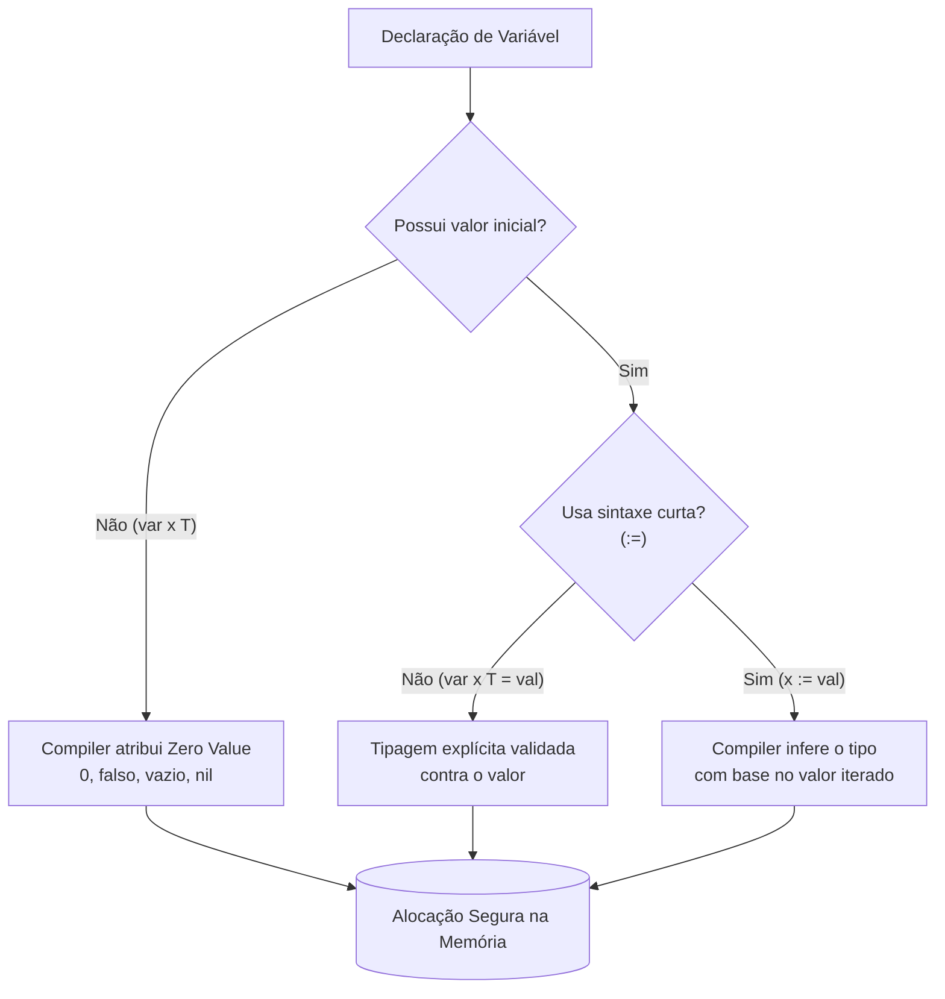

### 1. Visão Geral

No ecossistema Go, o sistema de variáveis e tipos de dados é estaticamente tipado e fortemente tipado. Isso significa que o tipo de uma variável é determinado em tempo de compilação e não sofre coerção implícita (um `int` não pode ser somado a um `float64` sem conversão explícita). O problema central que esse design resolve é a previsibilidade e a segurança de memória, evitando falhas silenciosas em tempo de execução comuns em linguagens de tipagem dinâmica. Além disso, o Go introduz a mecânica de *Zero Values* (garantindo que não existe lixo de memória não inicializado) e a tipagem inferida através do operador `:=`, unindo a robustez das linguagens compiladas com a concisão visual das linguagens de script.

---

### 2. Organização por Tópicos

O domínio de variáveis e tipos de dados no Go é categorizado em:

* **Mecânicas de Declaração:** A diferença semântica e de escopo entre a declaração explícita (`var`) e a declaração curta (`:=`).
* **Zero Values:** A inicialização determinística e automática (padrão de fábrica) para variáveis sem valor atribuído.
* **Tipos Básicos (Primitivos):** Representação de dados em baixo nível (`int`, `float64`, `bool`, `string`, `byte`, `rune`).
* **Tipos Compostos e Referências:** Estruturas complexas de alocação (Slices, Maps e Ponteiros) que modelam coleções e compartilhamento de memória.

---

### 3. Visualização do Fluxo (Mermaid)



**Implementação Passo a Passo (Diagrama):**

* **Possui valor inicial?:** O compilador Go intercepta a declaração. Se nenhum valor é fornecido pelo desenvolvedor, o caminho do Zero Value é invocado.
* **Zero Value:** Previne comportamentos indefinidos (undefined behavior). O runtime garante que um inteiro será `0`, um booleano será `false` e um ponteiro será `nil`.
* **Inferência vs Explícito:** Se um valor é fornecido, o compilador avalia o operador. O operador `:=` delega ao Go a decisão do tipo (ex: `5` vira `int`, `5.0` vira `float64`). O operador `var` com atribuição força um tipo específico que pode não ser o padrão da inferência (ex: `var x int16 = 5`).

---

### 4 e 5. Exemplos de Código (Idiomático) e Implementação Passo a Passo

#### Tópico A: Tipos Básicos, Declaração e Zero Values

```go
package domain

import "fmt"

// Declaração global de pacote (só aceita a sintaxe 'var')
var globalCounter int

func DemostratePrimitives() {
	// 1. Zero Value: 'isActive' inicia como false; 'price' como 0.0
	var isActive bool
	var price float64

	// 2. Inferência (Short Variable Declaration) - Escopo local apenas
	name := "Go Lang" // Inferido como string
	version := 1.22   // Inferido como float64 nativamente (não float32)

	// 3. Casting/Conversão explícita exigida pelo compilador
	var specificInt int16 = 100
	// version = version + specificInt // Erro de compilação
	result := version + float64(specificInt) 

	// 4. Tipos Aliases de baixo nível
	var char rune = 'A'     // 'rune' é alias para int32 (armazena Unicode code points)
	var rawData byte = 255  // 'byte' é alias para uint8

	fmt.Printf("State: %v, Price: %v, Char: %c\n", isActive, price, char)
	_ = name
	_ = result
	_ = rawData
}

```

**Implementação Passo a Passo:**

* **`var globalCounter int`:** Declarações no escopo do pacote exigem o uso da keyword `var`. O operador curto `:=` é ilegal fora do corpo de funções. Este contador nascerá com o valor `0`.
* **Zero Values e Tipagem Forte:** `isActive` e `price` não precisam de inicialização manual (`= false` ou `= 0.0`), o Go as limpa por padrão. Na linha da conversão, o Go recusa-se a somar um `float64` e um `int16` para evitar perda de precisão implícita. É necessário o *cast* manual via `float64(specificInt)`.
* **`rune` e `byte`:** Essenciais para processamento de strings em Go. Uma string no Go é um slice imutável de bytes (UTF-8). Um `rune` representa um caractere único, suportando qualquer símbolo Unicode mundial, ocupando até 4 bytes (int32). O uso de aspas simples (`'A'`) denota um `rune`, enquanto aspas duplas (`"A"`) denotam `string`.

#### Tópico B: Tipos Compostos (Slices e Maps)

```go
package domain

import "fmt"

func DemonstrateAggregates() {
	// Arrays: Tamanho estático (raramente usado diretamente em regras de negócio)
	var staticList [3]string = [3]string{"a", "b", "c"}

	// Slices: Dinâmicos e idiomáticos. Inicializados via 'make' ou literais.
	// O Zero Value de um Slice é 'nil' se declarado apenas como 'var s []int'
	dynamicUsers := make([]string, 0, 10) // Length 0, Capacity 10
	dynamicUsers = append(dynamicUsers, "user_1")

	// Maps: Estruturas de Chave-Valor (Hash tables)
	// O Zero Value de um Map é 'nil', tentativa de escrita em map nil causa Panic.
	configFlags := make(map[string]bool)
	configFlags["feature_x"] = true

	// Checagem segura de existência em Maps (Comma ok idiom)
	isActive, exists := configFlags["feature_y"]
	if !exists {
		fmt.Println("Flag não encontrada. Valor retornado assumiu Zero Value (false).")
	}

	_ = staticList
	_ = isActive
}

```

**Implementação Passo a Passo:**

* **`[3]string` vs `[]string`:** O número dentro dos colchetes define o tipo. Um array de 3 posições e um array de 4 posições são tipos *diferentes* no Go e incompatíveis. O *Slice* (`[]string`) abstrai isso, sendo um tipo de referência que aponta para um array subjacente dinâmico.
* **`make([]string, 0, 10)`:** Ao lidar com memória alocada dinamicamente, usamos a função *built-in* `make`. O terceiro argumento (capacidade 10) pré-aloca a memória contígua para 10 itens, evitando operações caras de realocação de memória no SO durante os `append()` subsequentes.
* **Comma ok idiom (`isActive, exists := ...`):** Ao buscar uma chave inexistente num map, o Go não quebra nem retorna nulo; ele retorna o Zero Value do tipo do valor. Como o valor de `configFlags` é `bool`, buscar `"feature_y"` retorna `false`. A variável booleana extra `exists` é a mecânica idiomática para diferenciar "a chave existe e é falsa" de "a chave não existe".

#### Tópico C: Ponteiros (Referências de Memória)

```go
package domain

import "fmt"

func DemonstratePointers() {
	counter := 10
	
	// pointerToCounter armazena o endereço de memória (&) de counter.
	// O tipo de pointerToCounter é *int
	pointerToCounter := &counter 

	// Desreferenciamento (*): Acessa e altera o valor no endereço apontado.
	*pointerToCounter = 99 

	// counter agora vale 99, pois mutamos a memória original.
	fmt.Printf("Novo valor: %d\n", counter)
}

```

**Implementação Passo a Passo:**

* **Operador `&` (Address-of):** Diferente de Java ou Python onde referências são ocultas, em Go o gerenciamento de referência é explícito (sem aritmética de ponteiros complexa como em C). `&counter` retorna o endereço hexadecimal (ex: `0xc00001a0a8`) onde a variável reside.
* **Operador `*` (Dereference):** O asterisco diz ao runtime: "siga este endereço de memória e modifique/leia o valor exato que está lá".
* **Por que usar:** O Go passa argumentos para funções estritamente por valor (cópia). Se você precisa que uma função altere o estado de uma *struct* pesada ou quer evitar copiar megabytes de dados alocados na memória a cada chamada de função, você passa um ponteiro (a cópia leve do endereço de memória).