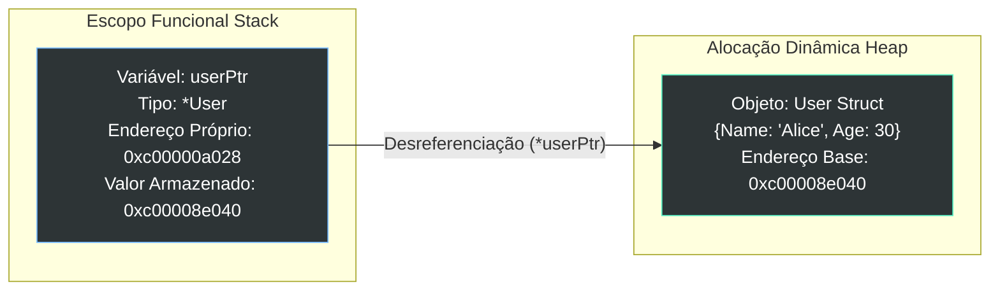

### 1. Visão Geral

No ecossistema Go, ponteiros são abstrações diretas para endereços de memória físicos ou virtuais. Como a linguagem adota a semântica estrita de "passagem por valor" (tudo é copiado ao ser passado para uma função), ponteiros resolvem dois problemas fundamentais: **mutabilidade de estado cruzado** (permitir que uma função altere dados criados em outro escopo) e **eficiência de memória** (evitar a cópia custosa de *structs* grandes, passando apenas um endereço de 8 bytes). Para garantir segurança e previsibilidade, o Go diverge conscientemente de linguagens como C e C++ ao proibir nativamente a aritmética de ponteiros (não é possível fazer `ptr + 1` para navegar na memória), transferindo a responsabilidade do gerenciamento de ciclo de vida para a *Escape Analysis* do compilador e para o *Garbage Collector*.

---

### 2. Organização por Tópicos

O uso de ponteiros em Go estrutura-se nos seguintes pilares:

* **Operadores Base:** A obtenção de endereço via `&` (*Address-of*) e o acesso/mutação do valor original via `*` (*Dereference*).
* **Pointer Receivers em Métodos:** O padrão idiomático para anexar métodos a *structs* que necessitam modificar o estado interno da instância ou otimizar invocações.
* **Instanciação Segura (`new` vs Literais):** As diferentes abordagens para alocar memória e inicializar ponteiros no momento da criação da variável.
* **A Armadilha do `nil`:** O *Zero Value* de um ponteiro e a obrigatoriedade de checagem para evitar *Panics* de violação de acesso à memória (Segmentation Fault).

---

### 3. Visualização do Fluxo (Mermaid)



**Implementação Passo a Passo (Diagrama):**

* **O Ponteiro na Stack:** A variável `userPtr` vive na pilha de execução da função atual. Ela tem seu próprio endereço físico (`0xc000...a028`), mas o valor que ela guarda dentro de si é o endereço de outra variável.
* **A Struct na Heap:** O dado real e pesado (o objeto `User`) foi movido para a Heap pelo compilador (Escape Analysis), alocado no endereço `0xc000...e040`.
* **A Ponte (Seta):** O operador `*` instrui o *runtime* do Go a ler o valor guardado em `userPtr`, navegar fisicamente até aquele endereço na memória e acessar os dados reais de `Alice`.

---

### 4 e 5. Exemplos de Código e Implementação Passo a Passo

#### Tópico A: Mutação de Estado via Parâmetros

```go
package domain

import "fmt"

// addDiscount recebe um ponteiro para um float64. 
// Isso permite mutar a variável original.
func addDiscount(price *float64, discount float64) {
	if price == nil {
		return // Proteção idiomática contra Nil Pointer Dereference
	}
	
	// O operador '*' antes de price acessa a memória apontada para sobrescrevê-la.
	*price = *price - discount
}

func ProcessOrder() {
	basePrice := 100.00
	
	// Passamos o endereço de basePrice usando '&'
	addDiscount(&basePrice, 20.00)
	
	fmt.Printf("Preço final mutado: %.2f\n", basePrice) // Imprime 80.00
}

```

**Implementação Passo a Passo:**

* **`*float64` na Assinatura:** Define que a função `addDiscount` espera um endereço de memória contendo um float64, não o valor numérico em si.
* **Guarda `price == nil`:** É vital checar ponteiros que vêm de fora do escopo. Tentar desreferenciar (`*price`) um ponteiro cujo valor é nulo causa um *panic* imediato, derrubando a aplicação.
* **`*price = *price - discount`:** Aqui lemos o valor original (`*price` da direita), subtraímos o desconto, e inserimos o novo valor no exato local da memória (`*price` da esquerda).
* **Invocação `&basePrice`:** Extrai o endereço hexadecimal da variável local e o injeta como argumento da função. Sem o `&`, o compilador rejeita o código por incompatibilidade de tipos (`float64` vs `*float64`).

#### Tópico B: Structs, Alocação e Pointer Receivers

```go
package domain

import "fmt"

type ServerConfig struct {
	Host string
	Port int
	IsUp bool
}

// Inicialização idiomática retornando um ponteiro.
func NewServerConfig(host string, port int) *ServerConfig {
	// O uso de '&' com um literal de struct é idiomático e seguro.
	// O Go sabe que este dado "escapa" da função e o aloca na Heap.
	return &ServerConfig{
		Host: host,
		Port: port,
		IsUp: false,
	}
}

// Start é um "Pointer Receiver". Anexado a *ServerConfig.
func (c *ServerConfig) Start() error {
	// Go desreferencia os campos da struct implicitamente.
	// c.IsUp é açúcar sintático para (*c).IsUp
	if c.Host == "" {
		return fmt.Errorf("host inválido")
	}
	
	c.IsUp = true // Altera o estado do objeto original.
	return nil
}

```

**Implementação Passo a Passo:**

* **`NewServerConfig` retornando `*ServerConfig`:** É uma *Factory Function* padrão. Em C, retornar o ponteiro de uma variável declarada dentro de uma função causaria falha grave (Dangling Pointer) quando a pilha da função fosse destruída. O compilador Go intercepta isso e move a `ServerConfig` para um lugar seguro da memória (Heap).
* **Pointer Receiver `(c *ServerConfig)`:** Indica que o método `Start()` pertence a referências de `ServerConfig`. Isso permite que a linha `c.IsUp = true` altere definitivamente o status do servidor. Se usássemos um Value Receiver `(c ServerConfig)`, a alteração aconteceria numa cópia isolada e seria perdida ao final da execução do método.
* **Açúcar Sintático em Structs:** Embora `c` seja um ponteiro, você nota que acessamos as propriedades diretamente como `c.Host` e `c.IsUp`. O compilador do Go é inteligente o suficiente para fazer o "auto-dereferencing" em atributos de structs e métodos, livrando o código de sintaxes confusas como `(*c).IsUp` (comum em linguagens C-like com o operador `->`).

#### Tópico C: A Função `new` vs Alocação Literal

```go
package domain

import "fmt"

func InitializePointers() {
	// Abordagem 1: Função nativa 'new(T)'
	// Aloca memória para um int, insere o Zero Value (0), e retorna o ponteiro (*int)
	ptrToCounter := new(int)
	*ptrToCounter = 10 

	// Abordagem 2: Declaração literal e captura de endereço (Mais usada)
	count := 0
	ptrCount := &count

	// Abordagem 3: Ponteiros nil (Cuidado)
	var nilPtr *int // Zero Value de ponteiro é nil
	// *nilPtr = 10 // Isso causaria um PANIC mortal em runtime.

	fmt.Printf("new: %v | var: %v | nil check: %v\n", *ptrToCounter, *ptrCount, nilPtr == nil)
}

```

**Implementação Passo a Passo:**

* **`new(int)`:** É uma função reservada de baixo nível que aloca espaço na memória para um tipo específico, limpa essa memória com o *Zero Value* correspondente (neste caso `0` para int), e retorna o endereço desse espaço. Raramente usada para structs, mas útil para primitivos.
* **O Perigo do `var nilPtr *int`:** Declarar um ponteiro sem inicializá-lo com `new` ou apontá-lo para uma variável existente via `&` o deixa em estado `nil`. Escrever neste endereço não-existente interrompe abruptamente a Goroutine.