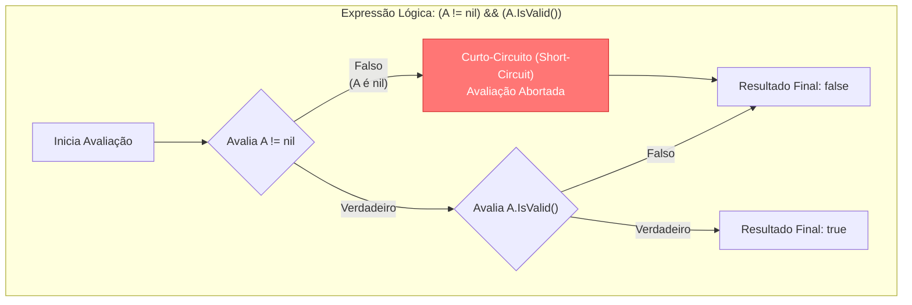

### 1. Visão Geral

No Go, operadores são tokens léxicos predefinidos que instruem o compilador a executar computações matemáticas, lógicas ou relacionais específicas sobre operandos (variáveis ou literais). Fiel à sua filosofia minimalista, o Go recusa a sobrecarga de operadores (operator overloading) — uma decisão arquitetural que garante que um `+` sempre represente uma adição matemática ou concatenação de strings nativa, nunca a chamada de um método complexo e oculto. Além disso, o ecossistema impõe regras estritas de tipagem sobre operadores: você não pode usar operadores relacionais (`==`, `<`) ou aritméticos entre tipos distintos (ex: `int32` e `int64`) sem um *cast* explícito. Uma idiossincrasia vital da linguagem é que os incrementos (`++` e `--`) são classificados como *statements* (instruções isoladas) e não como expressões, o que significa que não podem ser atribuídos a variáveis ou passados como argumentos (ex: `x := y++` é ilegal).

---

### 2. Organização por Tópicos

O arsenal de operadores da linguagem divide-se nas seguintes categorias estritas:

* **Aritméticos e de String:** Operações matemáticas base (`+`, `-`, `*`, `/`, `%`) e o uso do `+` para concatenação de tipos `string`.
* **Atribuição:** Inicialização ou mutação de estado (`=`, `:=`, `+=`, `-=`, `*=`, etc.).
* **Relacionais (Comparação):** Avaliação de igualdade ou magnitude, retornando booleanos não-tipados (`==`, `!=`, `<`, `>`, `<=`, `>=`).
* **Lógicos:** Avaliação de condições compostas com suporte nativo a *Short-Circuit Evaluation* (`&&`, `||`, `!`).
* **Bitwise (Nível de Bit):** Manipulação binária direta, incluindo o operador exclusivo do Go *Bit Clear* (`&`, `|`, `^`, `<<`, `>>`, `&^`).

---

### 3. Visualização do Fluxo (Mermaid)



**Implementação Passo a Passo (Diagrama):**

* **Inicia Avaliação:** O *runtime* examina a expressão da esquerda para a direita.
* **Avalia a Esquerda (`A != nil`):** Esta é uma guarda de segurança. Antes de tentar acessar métodos de `A`, validamos se o ponteiro existe na memória.
* **Curto-Circuito (Short-Circuit):** A mecânica mais importante dos operadores lógicos (`&&`, `||`). Se a condição da esquerda do `&&` for falsa, é matematicamente impossível que a expressão inteira seja verdadeira. O Go, visando performance e segurança, aborta a execução imediatamente, impedindo que `A.IsValid()` seja invocado num ponteiro nulo (o que causaria um *Panic*).

---

### 4 e 5. Exemplos de Código (Idiomático) e Implementação Passo a Passo

#### Tópico A: Aritméticos, Tipagem Estrita e Statements

```go
package domain

import "fmt"

func CalculateMetrics() {
	var totalRequests int64 = 1500
	var failureRate float32 = 2.5

	// 1. Tipagem Estrita: O compilador barra operações entre tipos distintos.
	// errors := totalRequests * failureRate // Erro: mismatched types int64 and float32
	
	// É necessário o cast explícito para o mesmo tipo
	estimatedErrors := float32(totalRequests) * (failureRate / 100.0)

	// 2. Operador de Resto (Modulo) só funciona com inteiros
	partitionIndex := totalRequests % 4

	// 3. Incremento como Statement (não-expressão)
	counter := 0
	counter++ // Correto: executado em uma linha isolada
	// next := counter++ // Ilegal em Go: syntax error

	fmt.Printf("Errors: %.2f | Partition: %d | Count: %d\n", estimatedErrors, partitionIndex, counter)
}

```

**Implementação Passo a Passo:**

* **`float32(totalRequests)`:** Em Go, não existe promoção implícita de tipos (onde a linguagem converte um `int` para `float` silenciosamente). O operador `*` exige que o lado esquerdo e direito sejam estritamente do mesmo tipo. O desenvolvedor é forçado a assumir a responsabilidade pela conversão de memória.
* **Operador `%`:** Utilizado para obter o resto de uma divisão. Fundamental para algoritmos de roteamento, criptografia ou *sharding*.
* **`counter++`:** A equipe de design do Go baniu construções comuns em C como `while(a++ < 10)`. Ao forçar que `++` seja uma instrução que não retorna valor, elimina-se ambiguidades de leitura sobre quando a variável foi incrementada (pré ou pós-avaliação).

#### Tópico B: Lógicos e Atribuição

```go
package domain

import "fmt"

func EvaluatePermissions(isAdmin bool, role string) {
	// 1. Operador Lógico com Curto-Circuito (&&, ||)
	// Se isAdmin for verdadeiro, o lado direito (role == "editor") nem é processado.
	canEdit := isAdmin || role == "editor"

	// 2. Operador de Negação (!)
	isRestricted := !canEdit

	// 3. Atribuição Composta
	baseScore := 10
	if canEdit {
		baseScore += 50 // Açúcar sintático para: baseScore = baseScore + 50
	}

	fmt.Printf("Pode editar: %v | Restrito: %v | Score: %d\n", canEdit, isRestricted, baseScore)
}

```

**Implementação Passo a Passo:**

* **`||` (Logical OR):** Avalia se pelo menos uma das condições é verdadeira. Utiliza curto-circuito: se a primeira condição já for `true`, o resultado final obrigatoriamente será `true`, então a execução ignora a segunda checagem economizando ciclos de CPU.
* **`!` (Logical NOT):** Inverte o valor booleano da variável ou expressão.
* **`+=` (Addition assignment):** O Go suporta operadores de atribuição composta para quase todos os operadores matemáticos e bitwise (`-=`, `*=`, `<<=`, etc.), garantindo concisão na mutação do estado de variáveis alocadas.

#### Tópico C: Bitwise e o Exclusivo 'Bit Clear' (&^)

```go
package domain

import "fmt"

const (
	// Mapeamento de permissões em potências de 2 via Bit Shift (<<)
	Read   = 1 << iota // 0001 (1)
	Write              // 0010 (2)
	Delete             // 0100 (4)
)

func ManipulateFlags() {
	// 1. Bitwise OR (|) - Combina/Adiciona permissões
	var userPerms byte = Read | Write // 0011 (3)

	// 2. Bitwise AND (&) - Checa se possui a permissão
	hasWrite := (userPerms & Write) != 0 // Retorna true

	// 3. Bit Clear (&^) - Remove (zera) os bits do operando direito no operando esquerdo
	userPerms = userPerms &^ Write // Remove Write. Resultado: 0001 (1)

	fmt.Printf("Perms originais: %04b | Pode escrever? %v | Após Bit Clear: %04b\n", 
		Read|Write, hasWrite, userPerms)
}

```

**Implementação Passo a Passo:**

* **`1 << iota`:** O operador de *Left Shift* (`<<`) desloca os bits para a esquerda, multiplicando o número por 2 a cada deslocamento. Usado com o gerador constante `iota`, cria máscaras de bits perfeitas (1, 2, 4, 8) para *feature flags* sem consumir bytes inteiros para cada booleano.
* **`|` (OR):** Combina bits. Se um bit for 1 em qualquer um dos operandos, o bit resultante será 1. Utilizado para agrupar as regras `Read` e `Write` num único byte de estado.
* **`&` (AND):** Filtra bits. Retorna 1 apenas se ambos os bits na mesma posição forem 1. Ideal para verificar a presença de uma flag específica mascarada num conjunto.
* **`&^` (AND NOT / Bit Clear):** Um operador nativo exclusivo do Go (em linguagens como C, você faria `A & ~B`). Ele analisa o lado direito: onde houver `1`, ele força `0` no operando da esquerda. Literalmente, ele "limpa" uma permissão ou estado de memória preexistente de forma direta e concisa.