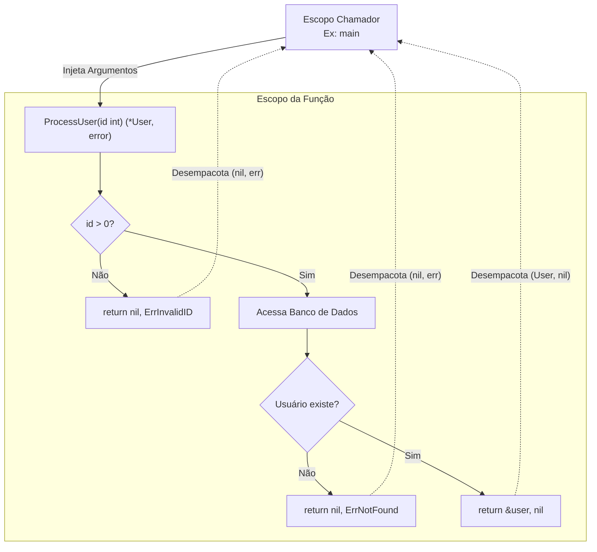

### 1. Visão Geral

No ecossistema Go, funções são *First-Class Citizens* (cidadãos de primeira classe), o que significa que podem ser atribuídas a variáveis, passadas como argumentos e retornadas por outras funções. O design de funções em Go resolve o problema de clareza e previsibilidade no controle de fluxo, especialmente rejeitando exceções (try/catch) em favor de **múltiplos valores de retorno** — um padrão arquitetural que obriga o desenvolvedor a lidar com erros explicitamente no momento da chamada. A ausência de sobrecarga de métodos (method overloading) e a simplicidade da sintaxe garantem tempos de compilação rápidos e uma leitura de código vertical, linear e padronizada em toda a base de projetos.

---

### 2. Organização por Tópicos

O domínio de funções na linguagem subdivide-se nas seguintes mecânicas fundamentais:

* **Sintaxe Base e Múltiplos Retornos:** O padrão idiomático de assinatura de funções, destacando o retorno em tuplas `(resultado, erro)`.
* **Retornos Nomeados (Named Return Values):** A pré-alocação de variáveis de retorno para documentação e uso explícito de `return` limpo (naked return).
* **Funções Variádicas:** Aceitação de um número indefinido de argumentos do mesmo tipo, convertendo-os nativamente em um *Slice*.
* **Closures e Funções Anônimas:** O encapsulamento de estado dinâmico através de funções definidas em tempo de execução que referenciam variáveis de escopos externos.

---

### 3. Visualização do Fluxo (Mermaid)



**Implementação Passo a Passo (Diagrama):**

* **Injeção de Argumentos:** A função chamadora empurra os dados (passados por valor) para a pilha da função executada.
* **Validação Rápida (Fail-Fast):** O fluxo interno prioriza checagens de erro nas primeiras linhas. Se falhar, retorna imediatamente o valor zero do tipo esperado (`nil`) e o erro instanciado.
* **Processamento e Retorno Sucesso:** Se a lógica principal for concluída, a função retorna o ponteiro do objeto construído e `nil` (nulo) para a interface de erro, sinalizando à função chamadora que a operação ocorreu sem falhas.

---

### 4 e 5. Exemplos de Código (Idiomático) e Implementação Passo a Passo

#### Tópico A: Múltiplos Retornos e Retornos Nomeados

```go
package domain

import (
	"errors"
	"fmt"
)

var ErrInvalidDivisor = errors.New("não é possível dividir por zero")

// Divide executa divisão e utiliza múltiplos retornos idiomáticos
func Divide(a, b float64) (float64, error) {
	if b == 0 {
		return 0, ErrInvalidDivisor
	}
	return a / b, nil
}

// CalculateStats utiliza retornos nomeados para pré-alocar memória
func CalculateStats(data []int) (sum int, avg float64) {
	if len(data) == 0 {
		return // Naked return: retorna 0 e 0.0 automaticamente
	}

	for _, v := range data {
		sum += v
	}
	avg = float64(sum) / float64(len(data))
	
	return // Retorna sum e avg no estado atual
}

```

**Implementação Passo a Passo:**

* **`func Divide(a, b float64) (float64, error)`:** Se dois argumentos consecutivos compartilham o mesmo tipo, a tipagem do primeiro pode ser omitida. O retorno duplo `(tipoDado, error)` é a convenção mais importante da linguagem para tratamento de falhas.
* **`return 0, ErrInvalidDivisor`:** Ao encontrar um erro, o padrão é retornar o *Zero Value* para o dado esperado (neste caso `0` para `float64`) acompanhado da variável de erro concreta.
* **`func CalculateStats(...) (sum int, avg float64)`:** O compilador declara silenciosamente `sum` e `avg` no início do escopo da função, inicializadas com seus *Zero Values*.
* **`return` (Naked Return):** Na função com retornos nomeados, usar a palavra `return` isolada faz o Go embalar as variáveis `sum` e `avg` e enviá-las de volta. É útil para funções curtas, mas desencorajado em funções longas por dificultar a legibilidade.

#### Tópico B: Funções Variádicas

```go
package domain

import "fmt"

// Sum aceita qualquer quantidade de inteiros via operador '...'
func Sum(prefix string, numbers ...int) string {
	total := 0
	
	// 'numbers' é nativamente tratado como um slice de inteiros ([]int)
	for _, num := range numbers {
		total += num
	}
	
	return fmt.Sprintf("%s: %d", prefix, total)
}

func ExecuteVariadic() {
	// Chamada direta com múltiplos argumentos
	res1 := Sum("Total Vendas", 10, 20, 30)
	
	// Desempacotamento de slice existente
	prices := []int{50, 100, 150}
	res2 := Sum("Total Custos", prices...) 
	
	fmt.Println(res1, res2)
}

```

**Implementação Passo a Passo:**

* **`numbers ...int`:** O operador *ellipsis* (`...`) antes do tipo indica que a função pode receber de zero a `N` argumentos inteiros separados por vírgula. A regra rígida é que o parâmetro variádico **deve** ser o último parâmetro na assinatura da função.
* **Transformação em Slice:** Dentro da função `Sum`, o compilador encapsula os argumentos passados em um slice (`[]int`), permitindo o uso imediato do `range` para iteração.
* **Desempacotamento (`prices...`):** Se os dados já existem num *Slice*, você não pode passá-lo diretamente como argumento, pois a função espera `int`, não `[]int`. Adicionar `...` após o nome do slice "desempacota" os valores, injetando-os como parâmetros individuais na chamada da função.

#### Tópico C: Funções de Primeira Classe e Closures

```go
package domain

import "fmt"

// SequenceGenerator retorna uma função que retorna um inteiro
func SequenceGenerator(start int) func() int {
	current := start
	
	// Retorna uma função anônima que forma um Closure
	return func() int {
		current++
		return current
	}
}

func ExecuteClosure() {
	// nextID contém a função anônima, amarrada ao estado 'current' alocado na Heap
	nextID := SequenceGenerator(100)
	
	fmt.Println(nextID()) // 101
	fmt.Println(nextID()) // 102
	
	// Um novo gerador possui um estado 'current' isolado
	anotherID := SequenceGenerator(500)
	fmt.Println(anotherID()) // 501
}

```

**Implementação Passo a Passo:**

* **Retornando uma função (`func() int`):** A assinatura indica que `SequenceGenerator` retornará uma referência para uma função executável, e não um valor computado estático.
* **O Closure (`return func() int { ... }`):** A função anônima referencial acessa e modifica a variável `current`, que foi declarada no escopo externo (`SequenceGenerator`).
* **Escape Analysis:** Normalmente, quando `SequenceGenerator` finaliza, suas variáveis locais seriam destruídas. No entanto, como o closure necessita da variável `current` viva para funcionar em chamadas futuras (`nextID()`), o compilador do Go move (escapa) `current` da *Stack* para a *Heap*. Isso cria um estado persistente isolado para cada gerador instanciado, ideal para criar middlewares ou fábricas stateful sem o uso de structs complexas.