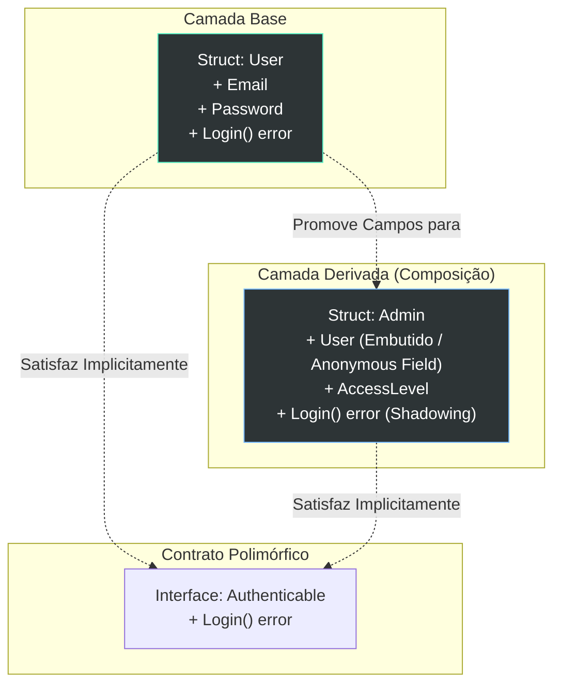

### 1. Visão Geral

No ecossistema Go, a herança clássica orientada a objetos (baseada no paradigma *is-a*, utilizando palavras-chave como `extends` ou `inherits`) **não existe**. A linguagem foi arquitetada deliberadamente para evitar o problema da "classe base frágil" (Fragile Base Class) e as complexidades de hierarquias de herança profundas. Em vez disso, o Go resolve o reaproveitamento de código e o polimorfismo através da regra de **Composição sobre Herança** (Composition over Inheritance). Isso é implementado via *Struct Embedding* (embutimento anônimo de estruturas), que promove campos e métodos internamente, simulando a ergonomia da herança, enquanto as **Interfaces Implícitas** garantem o polimorfismo sem acoplamento rígido de tipos.

---

### 2. Organização por Tópicos

O conceito de "herança" no Go manifesta-se puramente através de mecânicas de composição:

* **Struct Embedding (Embutimento):** A injeção de uma struct anônima dentro de outra, ativando a promoção de campos (acesso direto às propriedades da struct base).
* **Method Shadowing (Sombreamento de Métodos):** A mecânica para simular a "sobrescrita" (override) de métodos da struct embutida.
* **Polimorfismo via Interfaces:** Como structs que embutem outras structs continuam ou passam a satisfazer contratos de interfaces de forma implícita (Duck Typing).

---

### 3. Visualização do Fluxo (Mermaid)



**Implementação Passo a Passo (Diagrama):**

* **O Embutimento:** A struct `Admin` não herda de `User`; ela *contém* um `User` sem dar um nome explícito a essa propriedade. O compilador "promove" as propriedades do `User` para o nível do `Admin`.
* **Sombreamento (Override):** Tanto `User` quanto `Admin` possuem o método `Login()`. Quando chamado via `Admin`, o compilador executa a versão do `Admin` (sombreando a versão do `User`), mas a versão original continua acessível em memória.
* **Interfaces Implícitas:** O Go não utiliza a cláusula `implements`. Se a struct possui os métodos exigidos, ela *é* do tipo da interface. Ambas as structs podem ser injetadas em funções que esperam a interface `Authenticable`.

---

### 4 e 5. Exemplos de Código (Idiomático) e Implementação Passo a Passo

#### Tópico A: Struct Embedding (A "Herança" Estrutural)

```go
package domain

import "fmt"

// BaseModel atua como a entidade "Pai" contendo metadados comuns.
type BaseModel struct {
	ID        string
	CreatedAt int64
}

// Product embutirá BaseModel. Note que não damos um nome ao campo.
type Product struct {
	BaseModel // Embedding: Campo anônimo
	Name      string
	Price     float64
}

func DemonstrateEmbedding() {
	p := Product{
		// A inicialização exige que chamemos o tipo base pelo seu nome explícito
		BaseModel: BaseModel{
			ID:        "prod_001",
			CreatedAt: 1672531200,
		},
		Name:  "Teclado Mecânico",
		Price: 150.00,
	}

	// Promoção de Campos: Acessamos p.ID diretamente, e não p.BaseModel.ID
	fmt.Printf("Produto %s criado em %d. Preço: %.2f\n", p.ID, p.CreatedAt, p.Price)
}

```

**Implementação Passo a Passo:**

* **`BaseModel` (Campo Anônimo):** Ao declarar `BaseModel` dentro de `Product` sem atribuir um nome (como faríamos em `Base BaseModel`), o compilador Go ativa o *Field Promotion*.
* **Promoção de Campos (`p.ID`):** O desenvolvedor tem a ergonomia de tratar as propriedades da base como se pertencessem diretamente à filha (`p.ID` em vez de `p.BaseModel.ID`). Contudo, em nível de alocação de memória, isso continua sendo estritamente Composição.
* **Alocação na Literal (`BaseModel: BaseModel{...}`):** O açúcar sintático da promoção não se aplica na hora de instanciar o objeto estruturalmente. Você deve preencher o sub-objeto base especificando seu nome de tipo.

#### Tópico B: Sombreamento de Métodos (Simulando Method Overriding)

```go
package domain

import "fmt"

type Notification struct {
	Message string
}

// Send é o método atrelado à struct base
func (n *Notification) Send() {
	fmt.Printf("[Base] Enviando notificação genérica: %s\n", n.Message)
}

type EmailNotification struct {
	Notification
	TargetEmail string
}

// Send sofre "Shadowing". A struct filha intercepta a chamada.
func (e *EmailNotification) Send() {
	// Podemos invocar o método da "superclasse" explicitamente se necessário
	// e.Notification.Send() 
	
	fmt.Printf("[Email] Roteando '%s' para: %s\n", e.Message, e.TargetEmail)
}

func Dispatch() {
	email := &EmailNotification{
		Notification: Notification{Message: "Alerta de Segurança"},
		TargetEmail:  "admin@sistema.com",
	}

	// Executará o método da struct EmailNotification
	email.Send() 
}

```

**Implementação Passo a Passo:**

* **Conflito de Nomes:** Como `EmailNotification` embute `Notification`, por padrão ele ganha acesso ao método `Send()` promovido. Porém, ao declararmos `func (e *EmailNotification) Send()`, criamos um método na própria superfície do objeto.
* **Resolução de Rota (Shadowing):** Quando `email.Send()` é invocado, o compilador verifica primeiro o próprio tipo (`EmailNotification`). Como ele encontra o método lá, a busca é encerrada. O método da base é "sombreado" (escondido).
* **Super chamadas (`e.Notification.Send()`):** Diferente de linguagens clássicas que usam `super.Send()`, em Go você chama explicitamente o tipo do pacote base embutido para reutilizar sua lógica sem recursão infinita.

#### Tópico C: Polimorfismo e Duck Typing

```go
package domain

import "fmt"

// Sender é o contrato comportamental. Qualquer tipo que possua Send() é um Sender.
type Sender interface {
	Send()
}

// ProcessQueue aceita qualquer tipo que cumpra a interface Sender.
func ProcessQueue(items []Sender) {
	for _, item := range items {
		// O Go resolve o Dynamic Dispatch em tempo de execução
		item.Send()
	}
}

func ExecutePolymorphism() {
	n1 := &Notification{Message: "Fatura Gerada"}
	n2 := &EmailNotification{
		Notification: Notification{Message: "Fatura Paga"},
		TargetEmail:  "cliente@empresa.com",
	}

	// Ambas as structs, de comportamentos diferentes, agrupadas pelo mesmo contrato
	queue := []Sender{n1, n2}
	
	ProcessQueue(queue)
}

```

**Implementação Passo a Passo:**

* **`interface { Send() }`:** Define puramente comportamento. Diferente de Herança (onde os tipos devem herdar da mesma raiz estrutural), no Go, os tipos não precisam saber que a interface existe.
* **Duck Typing no Go:** O compilador percebe que `*Notification` tem `Send()` e que `*EmailNotification` tem `Send()`. Logo, ambos "são" `Sender`. Se eles andam como um pato e grasnam como um pato, o compilador os trata como patos.
* **Dynamic Dispatch (`item.Send()`):** Dentro de `ProcessQueue`, a variável `item` tem o tipo da interface (`Sender`), carregando dois ponteiros internos: um para os dados reais (`value`) e outro para o tipo específico e sua tabela de métodos (`itable`). O *runtime* do Go consulta essa tabela para disparar a versão correta do método `Send()` para a struct específica instanciada na memória.