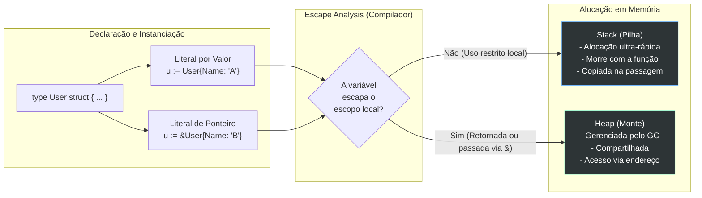

### 1. Visão Geral

No ecossistema Go, uma `struct` (estrutura) é o bloco de construção fundamental para modelagem de dados e design orientado a objetos. Como a linguagem não possui o conceito de "classes", as structs atuam como agregadores tipados, permitindo agrupar dados de diferentes tipos em um único bloco contíguo de memória. O problema central que a struct resolve é o encapsulamento de estado e a criação de tipos de dados customizados. Diferente de objetos em linguagens como Java ou Python, que frequentemente carregam metadados pesados de herança, uma struct em Go é essencialmente "transparente" e leve: seu custo de memória é exatamente a soma de seus campos, alinhados pela arquitetura do processador. Elas interagem com o sistema de tipagem de forma estrita, sendo passadas por valor (cópia) por padrão, o que garante imutabilidade local a menos que ponteiros sejam explicitamente utilizados.

---

### 2. Organização por Tópicos

O domínio de structs na linguagem é caracterizado pelas seguintes mecânicas:

* **Declaração e Instanciação:** A definição de tipos de dados customizados e as múltiplas abordagens de inicialização (Literais, Literais de Ponteiro e a função `new`).
* **Struct Tags (Metadados):** O padrão idiomático para anexar metadados aos campos, consumidos em tempo de execução via *Reflection* (vital para serialização JSON, ORMs e validações).
* **Alinhamento e Padding (Otimização de Memória):** A engenharia de baixo nível sobre como a ordem dos campos afeta diretamente o consumo real de RAM da struct devido ao alinhamento de CPU.
* **Encapsulamento:** O controle de visibilidade (Exportado vs Não-Exportado) baseado em capitalização.

---

### 3. Visualização do Fluxo (Mermaid)



**Implementação Passo a Passo (Diagrama):**

* **Declaração:** A planta baixa da struct é definida. O Go não aloca memória apenas pela declaração do tipo.
* **Instanciação (Valor vs Ponteiro):** O desenvolvedor escolhe criar uma cópia física direta (`User{}`) ou alocar e já capturar a referência de memória (`&User{}`).
* **Escape Analysis:** Uma das mecânicas mais brilhantes do compilador Go. Ele rastreia o ciclo de vida da struct instanciada.
* **Heap vs Stack:** Se o Go detectar que a struct só será usada dentro da função atual, ele a aloca na *Stack* (Custo zero para o Garbage Collector). Se ele detectar que você retornou o ponteiro dessa struct para outra função, ela "escapa" para a *Heap* (Alocação dinâmica, exige limpeza posterior do GC).

---

### 4 e 5. Exemplos de Código (Idiomático) e Implementação Passo a Passo

#### Tópico A: Declaração, Instanciação e Visibilidade

```go
package domain

import "fmt"

// Config é exportada (pública), mas o campo 'retryCount' é não-exportado (privado).
type Config struct {
	Host       string
	Port       int
	retryCount int 
}

func InitStructs() {
	// 1. Zero Value: Todos os campos assumem seus valores nulos padrão ("", 0)
	var c1 Config 

	// 2. Struct Literal com campos nomeados (Idiomático e resistente a quebras)
	c2 := Config{
		Host: "localhost",
		Port: 8080,
		// retryCount será 0 automaticamente
	}

	// 3. Struct Literal Omitindo Chaves (Não-idiomático, frágil a mudanças na struct)
	c3 := Config{"127.0.0.1", 5432, 3}

	// 4. Literal de Ponteiro (Aloca e retorna o endereço)
	c4 := &Config{Host: "0.0.0.0"}

	fmt.Printf("Zero: %+v\nNomeada: %+v\nPosicional: %+v\nPonteiro: %+v\n", c1, c2, c3, c4)
}

```

**Implementação Passo a Passo:**

* **`type Config struct`:** Declara um novo tipo agregado. A letra maiúscula em `Config`, `Host` e `Port` os torna acessíveis fora do pacote. `retryCount` com minúscula garante que outros pacotes não possam adulterar este estado diretamente.
* **`var c1 Config`:** Apenas declarando a variável, o Go já aloca a memória e insere os *Zero Values*. Em Go não existe "struct nula" (a menos que seja um ponteiro nulo para struct `*Config`).
* **`%+v` no `fmt.Printf`:** O modificador `%+v` é uma ferramenta essencial de debug, pois imprime não apenas os valores, mas também o nome de cada campo da struct.

#### Tópico B: Struct Tags e Metadados para Serialização

```go
package domain

import (
	"encoding/json"
	"fmt"
)

// User modela a entidade de banco e sua representação na API REST.
type User struct {
	ID        string `json:"id" db:"user_id"`
	Password  string `json:"-" db:"password"`                 // Oculto no JSON
	Email     string `json:"email,omitempty" db:"email"`      // Omitido se vazio
	IsActive  bool   `json:"is_active" db:"active"`
}

func SerializeUser() {
	u := User{
		ID:       "usr_99x",
		Password: "super-secret-hash",
		IsActive: true,
		// Email é omitido intencionalmente
	}

	// O Marshal usa a biblioteca de 'reflect' para ler as Struct Tags em runtime
	payload, _ := json.MarshalIndent(u, "", "  ")
	
	fmt.Println(string(payload))
}

```

**Implementação Passo a Passo:**

* **Struct Tags (``json:"..." db:"..."``):** São strings literais literais adicionadas ao final da definição do campo. Elas não afetam o comportamento central do Go, mas são interpretadas via pacote `reflect` por bibliotecas de terceiros (como drivers SQL, decodificadores JSON ou validadores).
* **`json:"-"`:** É a diretiva de segurança idiomática. Diz ao serializador JSON para ignorar este campo completamente, prevenindo o vazamento acidental de senhas, hashes ou tokens de segurança em respostas de API REST.
* **`omitempty`:** Se a string `Email` for vazia (seu Zero Value `""`), o campo nem sequer aparecerá no payload JSON resultante, economizando banda na rede.

#### Tópico C: Memory Padding e Otimização Estrutural (Sênior)

```go
package domain

import (
	"fmt"
	"unsafe"
)

// UnoptimizedStruct: Campos declarados sem ordem lógica de tamanho.
// Consome 24 bytes de RAM (devido ao padding adicionado pela arquitetura 64-bits).
type UnoptimizedStruct struct {
	FlagA bool    // 1 byte (+ 7 bytes de padding/espaço morto)
	Count int64   // 8 bytes
	FlagB bool    // 1 byte (+ 7 bytes de padding)
}

// OptimizedStruct: Os mesmos campos, ordenados do maior para o menor.
// Consome 16 bytes de RAM (elimina espaços mortos).
type OptimizedStruct struct {
	Count int64   // 8 bytes
	FlagA bool    // 1 byte
	FlagB bool    // 1 byte (+ 6 bytes de padding no final)
}

func InspectMemory() {
	var bad UnoptimizedStruct
	var good OptimizedStruct

	fmt.Printf("Tamanho Não-Otimizado: %d bytes\n", unsafe.Sizeof(bad))
	fmt.Printf("Tamanho Otimizado: %d bytes\n", unsafe.Sizeof(good))
}

```

**Implementação Passo a Passo:**

* **A Mecânica de Alinhamento da CPU:** Processadores modernos (arquiteturas de 64 bits) não leem a memória byte a byte, eles leem em "palavras" (words) de 8 bytes por vez.
* **O Problema da `UnoptimizedStruct`:** O compilador lê o `bool` (1 byte). O próximo campo é um `int64` (8 bytes). O `int64` não cabe nos 7 bytes restantes do primeiro bloco de leitura da CPU. Para evitar lentidão na leitura, o compilador do Go preenche os 7 bytes restantes com "lixo invisível" (*Padding*) e joga o `int64` para o próximo bloco de 8 bytes.
* **A Solução (`OptimizedStruct`):** A regra de ouro da engenharia de performance em Go é: **ordene os campos da sua struct do maior para o menor tipo de dado (em bytes)**. Ao colocar o `int64` primeiro, ele ocupa um bloco inteiro. Em seguida, os dois `bool` (1+1 byte) cabem juntos confortavelmente no início do segundo bloco, economizando 8 bytes (33% de RAM) por instância da struct, o que é crucial ao alocar fatias com milhões de registros.