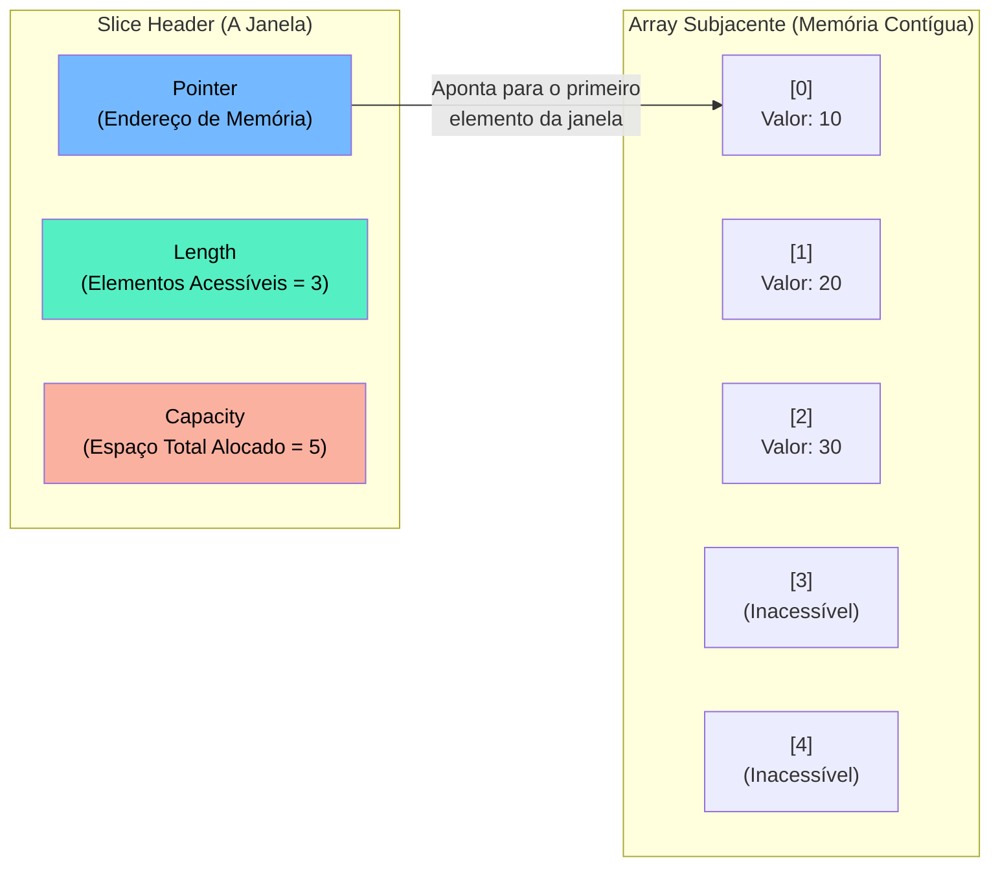

### 1. Visão Geral

No ecossistema Go, coleções de elementos ordenados são gerenciadas por meio de dois tipos interconectados: **Arrays** e **Slices**. Arrays formam a fundação de baixo nível: são sequências de tamanho fixo alocadas de forma contígua na memória, onde o tamanho é estritamente parte da assinatura do tipo (um `[3]int` é um tipo completamente diferente de um `[4]int`). Devido a essa rigidez e ao fato de serem passados por valor (copiando todos os elementos), arrays são raramente usados diretamente em regras de negócio. Para resolver isso, o Go introduz os **Slices**. Slices não armazenam dados diretamente; eles são descritores leves (Slice Headers de 24 bytes em arquiteturas 64 bits) que atuam como "janelas" dinâmicas sobre um array subjacente oculto. Slices resolvem o problema de coleções de tamanho variável, oferecendo eficiência de memória (pois compartilham o array subjacente através de ponteiros) e uma API poderosa e nativa via a função `append`.

---

### 2. Organização por Tópicos

O domínio de coleções ordenadas em Go subdivide-se nas seguintes mecânicas:

* **Arrays Estáticos:** Tipos de tamanho inflexível, alocação direta na *Stack* e semântica de cópia por valor.
* **Slices e Slice Headers:** A anatomia interna do Slice (Ponteiro, Tamanho e Capacidade) e inicialização idiomática via `make`.
* **A Mecânica de Slicing:** A extração de sub-slices a partir de arrays ou outros slices utilizando a sintaxe `[low:high]`.
* **Crescimento Dinâmico (`append`):** O algoritmo de realocação de memória quando a capacidade (Capacity) do array subjacente é excedida.

---

### 3. Visualização do Fluxo (Mermaid)



**Implementação Passo a Passo (Diagrama):**

* **Slice Header:** Quando você passa um slice para uma função, o Go copia apenas esta estrutura leve de três componentes (Ponteiro, Len, Cap), o que é extremamente rápido e eficiente (Zero-Copy do payload real).
* **Pointer:** Um ponteiro que guarda o endereço de memória do elemento inicial do array onde o slice começa (não necessariamente o índice 0 do array original).
* **Length (Len):** O número de elementos que o slice atualmente enxerga e permite que você acesse. Tentar acessar um índice maior ou igual ao `Len` causa *Panic* (Index out of range).
* **Capacity (Cap):** O espaço físico total alocado no array subjacente a partir do ponteiro atual. Define o limite máximo de crescimento contínuo do slice antes que o *runtime* precise alocar um array inteiramente novo na memória.

---

### 4 e 5. Exemplos de Código (Idiomático) e Implementação Passo a Passo

#### Tópico A: Arrays e Construção Idiomática de Slices

```go
package collections

import "fmt"

func DemonstrateAllocation() {
	// 1. Array Estático (Raramente usado na lógica de domínio)
	// O número '3' faz parte da identidade do tipo de dado.
	var staticArray [3]string = [3]string{"Go", "Rust", "C++"}

	// 2. Slice literal (Cria o slice e um array subjacente invisível simultaneamente)
	dynamicSlice := []string{"Go", "Rust"}

	// 3. Inicialização idiomática de Slices via 'make' (Pré-alocação)
	// make([]tipo, length, capacity)
	users := make([]string, 0, 100)

	fmt.Printf("Array: %T | Slice: %T\n", staticArray, dynamicSlice)
	fmt.Printf("Users Len: %d | Cap: %d\n", len(users), cap(users))
}

```

**Implementação Passo a Passo:**

* **`[3]string` vs `[]string`:** A ausência do número entre os colchetes é o que diferencia o tipo primitivo *Array* do tipo referencial *Slice*.
* **O perigo de não pré-alocar:** Declarar um slice sem instanciá-lo (`var users []string`) cria um slice nulo (`nil`). Adicionar 100 elementos nele forçará o sistema operacional a alocar novos blocos de memória e copiar dados antigos dezenas de vezes.
* **`make([]string, 0, 100)`:** O padrão ouro (Senior) em Go para otimização de CPU/Memória. Você informa ao *runtime*: "Inicie um slice vazio (`len = 0`), mas peça ao SO um bloco contíguo de memória para 100 elementos de imediato (`cap = 100`)". Isso evita realocações em *loops* subsequentes.

#### Tópico B: Slicing e Vazamento de Memória por Referência Cruzada

```go
package collections

import "fmt"

func DemonstrateSlicing() {
	baseArray := [5]int{10, 20, 30, 40, 50}

	// Criando um Slice a partir do Array: array[low:high]
	// low é inclusivo, high é exclusivo.
	viewSlice := baseArray[1:4] // Contém: 20, 30, 40

	// Mutação de Estado
	viewSlice[0] = 999 

	// baseArray[1] também foi alterado para 999
	fmt.Printf("Array Base: %v\n", baseArray)
	fmt.Printf("Slice View: %v\n", viewSlice)
}

```

**Implementação Passo a Passo:**

* **`baseArray[1:4]`:** Esta sintaxe cria um novo *Slice Header*. O *Pointer* desse novo header não aponta para o início da memória de `baseArray`, ele aponta para o índice `1` (valor `20`). O `Len` será `4 - 1 = 3`. A `Cap` será a distância do índice `1` até o final do array original (`4`).
* **Mutação de Memória Compartilhada (`viewSlice[0] = 999`):** Como o slice é apenas uma janela, ele altera diretamente os bytes no array subjacente. Isso acarreta que qualquer outra variável que esteja apontando para aquele mesmo trecho de memória (como o `baseArray`) verá a modificação instantaneamente.
* **O Perigo do Memory Leak (Senior Note):** Se `baseArray` fosse um arquivo em memória de 1GB e você criasse um `viewSlice` pegando apenas os últimos 10 bytes para retornar para outra função, o *Garbage Collector* não conseguiria apagar os 999MB inúteis do array base, pois o *Slice Header* do `viewSlice` ainda mantém um ponteiro ativo segurando a raiz daquela região inteira de memória na *Heap*. Nesses casos, a cópia explícita (`copy()`) é necessária.

#### Tópico C: Append, Realocação e Comportamento Assintótico

```go
package collections

import "fmt"

func DemonstrateAppend() {
	// Inicializa um slice com len=2, cap=2
	buffer := []int{1, 2}
	
	// Primeira tentativa de append estoura a capacidade
	buffer = append(buffer, 3)
	
	fmt.Printf("Valores: %v | Len: %d | Cap: %d\n", buffer, len(buffer), cap(buffer))
}

```

**Implementação Passo a Passo:**

* **`buffer = append(buffer, 3)`:** Ao adicionar o número `3`, o `append` checa o *Slice Header*. Como o tamanho atual (2) já atingiu a capacidade máxima (2), não há mais bytes livres após aquele ponteiro.
* **O Algoritmo de Crescimento:** O *runtime* do Go executa uma manobra nos bastidores:
1. Aloca um **novo array** em outro endereço de memória física com o dobro da capacidade original (se cap era 2, o novo array nasce com cap 4. *Nota: Para arrays muito grandes, o fator de crescimento não é exatamente 2x para evitar gasto explosivo de RAM*).
2. Copia os valores antigos (`1`, `2`) do array velho para o novo.
3. Insere o valor `3`.
4. Retorna um novo *Slice Header* atualizado.


* **Reatribuição Obrigatória:** É por isso que o `append` sempre devolve um valor e exige que você reatribua à própria variável (`buffer = append(...)`). O *Slice Header* antigo perde a validade se houve realocação, pois passou a apontar para uma região de memória morta (stale pointer) que o *Garbage Collector* irá varrer eventualmente.