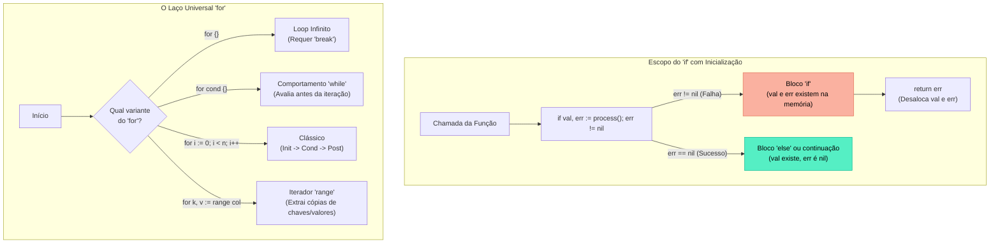

### 1. Visão Geral

No ecossistema Go, as estruturas de controle de fluxo foram projetadas sob a filosofia do minimalismo rigoroso. A linguagem deliberadamente elimina construções redundantes encontradas em outras linguagens C-like (como `while`, `do-while`, ou `foreach`), consolidando toda a lógica de repetição em uma única palavra-chave: `for`. Além disso, o Go reforma comportamentos históricos perigosos: o `switch` não possui *fallthrough* implícito (evitando bugs de esquecimento de `break`) e o `if` permite a inicialização de variáveis restritas ao seu próprio escopo léxico, reduzindo a poluição do *namespace* da função e incentivando o tratamento imediato de erros (Fail-Fast). O problema central que esse design resolve é a complexidade ciclomática e a legibilidade: qualquer desenvolvedor Go, ao ler uma base de código desconhecida, encontra um fluxo de controle altamente previsível e padronizado.

---

### 2. Organização por Tópicos

O controle de fluxo em Go é governado pelas seguintes mecânicas fundamentais:

* **Condicionais com Escopo Limitado (`if/else`):** A capacidade de declarar, atribuir e avaliar variáveis em uma única instrução, restringindo o tempo de vida dessa variável ao bloco da condição.
* **O Laço Universal (`for`):** A mutação da instrução `for` para atuar como laço tradicional, laço condicional (while), loop infinito e iterador de coleções (`range`).
* **Seleção Segura e Dinâmica (`switch`):** O roteamento de fluxo sem *fallthrough* padrão e o uso do `switch` sem condição como substituto idiomático para cadeias longas de `if-else`.

---

### 3. Visualização do Fluxo (Mermaid)



**Implementação Passo a Passo (Diagrama):**

* **Escopo do If:** O compilador cria um mini-escopo. As variáveis `val` e `err` nascem e morrem atreladas à instrução `if`. Isso impede que um `err` anterior seja acidentalmente reutilizado mais abaixo no código.
* **Variantes do For:** Diferente do C ou Java, o Go detecta a ausência de ponto-e-vírgula (`;`) para determinar o comportamento do laço. A mecânica interna do compilador otimiza a mesma estrutura base para quatro cenários lógicos distintos.

---

### 4 e 5. Exemplos de Código (Idiomático) e Implementação Passo a Passo

#### Tópico A: Condicionais e Escopo Fechado

```go
package flow

import (
	"errors"
	"fmt"
)

func processEntity(id int) (*string, error) {
	if id <= 0 {
		return nil, errors.New("id inválido")
	}
	res := "Entity Data"
	return &res, nil
}

func EvaluateCondition() {
	// Padrão Idiomático: Inicialização; Condição
	// 'entity' e 'err' só existem dentro das chaves deste if/else
	if entity, err := processEntity(10); err != nil {
		fmt.Printf("Falha ao processar: %v\n", err)
	} else {
		// 'entity' é acessível no else
		fmt.Printf("Sucesso: %s\n", *entity)
	}

	// fmt.Println(entity) // Erro de Compilação: undefined: entity
}

```

**Implementação Passo a Passo:**

* **Sem Parênteses:** No Go, as condições do `if` não são envolvidas em parênteses `()`, mas as chaves `{}` são estritamente obrigatórias, mesmo para blocos de uma única linha.
* **`entity, err := ...; err != nil`:** Este é o coração do tratamento de erros em Go. O ponto-e-vírgula separa o *Statement* de inicialização da *Expression* de avaliação.
* **Isolamento de Memória (Shadowing Prevention):** Ao confinar `err` ao bloco `if`, você pode ter dezenas de checagens de erro na mesma função usando o nome `err`, sem que os estados colidam ou exijam nomes como `err1`, `err2`.

#### Tópico B: A Versatilidade do Laço `for`

```go
package flow

import "fmt"

func DemonstrateLoops() {
	// 1. For Clássico (Estilo C)
	for i := 0; i < 3; i++ {
		fmt.Printf("Clássico: %d\n", i)
	}

	// 2. Comportamento 'while' (Apenas a condição)
	counter := 3
	for counter > 0 {
		fmt.Printf("While: %d\n", counter)
		counter--
	}

	// 3. Iteração com 'range' sobre um Slice
	// ATENÇÃO: 'value' é uma cópia do dado original. Mutar 'value' não altera o slice.
	names := []string{"Go", "Rust"}
	for index, value := range names {
		fmt.Printf("Índice: %d | Valor: %s\n", index, value)
	}

	// 4. Ignorando retornos indesejados (Blank Identifier)
	for _, value := range names {
		_ = value // Apenas itera pelos valores, ignorando o índice
	}
}

```

**Implementação Passo a Passo:**

* **`for i := 0; i < 3; i++`:** A estrutura tríplice padrão. Novamente, sem parênteses.
* **Omitindo Componentes (`for counter > 0`):** Ao remover o *Init* e o *Post*, o `for` comporta-se exatamente como um `while`. Se você remover até mesmo a condição (apenas `for { }`), terá um loop infinito.
* **A Mecânica do `range`:** Quando acoplado a coleções (Slices, Arrays, Maps ou Channels), o `range` retorna invariavelmente dois valores: o índice (ou chave do map) e uma **cópia** do valor daquela posição. É uma armadilha comum para iniciantes tentar modificar structs iterando via `range` esquecendo que estão alterando uma cópia e não a memória original.

#### Tópico C: Switch Case Otimizado e Fallthrough

```go
package flow

import (
	"fmt"
	"time"
)

func DemonstrateSwitch() {
	// 1. Switch Tradicional (Sem break explícito)
	os := "linux"
	switch os {
	case "darwin", "macos": // Múltiplos valores na mesma cláusula
		fmt.Println("Apple")
	case "linux":
		fmt.Println("Pinguim")
		// O Go insere um 'break' invisível aqui automaticamente
	default:
		fmt.Println("Desconhecido")
	}

	// 2. Switch sem Condição (Clean If-Else Chain)
	now := time.Now()
	switch { // A condição implícita é 'true'
	case now.Hour() < 12:
		fmt.Println("Bom dia")
	case now.Hour() < 18:
		fmt.Println("Boa tarde")
		fallthrough // Força a execução do bloco 'default' logo abaixo
	default:
		fmt.Println("Aviso de turno encerrando")
	}
}

```

**Implementação Passo a Passo:**

* **Fim do "Spaghetti Code" (Implicit Break):** Em C ou Java, se o case `"linux"` não tivesse um comando `break`, o código "cairia" para o `default` executando instruções indevidas. O Go inverteu essa lógica para segurança: o bloco sai do switch assim que o primeiro `case` correspondente termina.
* **Switch True (`switch { ... }`):** Quando você precisa testar lógicas completamente desconexas que não dependem da mesma variável (ex: checar o horário, depois checar o banco de dados, depois checar um status de usuário), o `switch` sem parâmetro age como uma cadeia limpa de `if / else if / else`, melhorando significativamente a leitura vertical do código.
* **`fallthrough`:** Uma *keyword* deliberada para forçar o comportamento antigo de linguagens C-like. Ele ignora a checagem booleana do próximo bloco e simplesmente força a execução do seu conteúdo. Raramente usado, mas disponível para cenários matemáticos específicos.