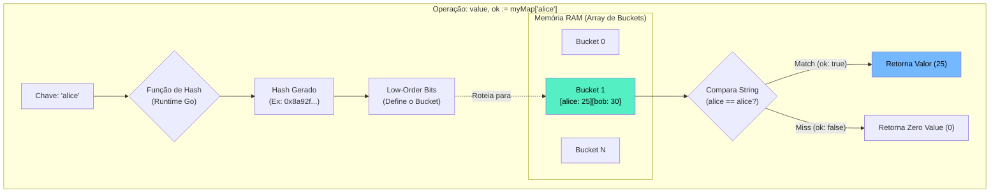

### 1. Visão Geral

No ecossistema Go, `map` é uma estrutura de dados nativa (built-in) que implementa uma tabela de espalhamento (Hash Table). Ele armazena uma coleção não ordenada de pares chave-valor, oferecendo complexidade de tempo amortizada de $O(1)$ para operações de busca, inserção e deleção. O problema central que o map resolve é a recuperação ultra-rápida de dados indexados por identificadores únicos (strings, inteiros, structs), em oposição à busca linear $O(n)$ necessária em Slices. Arquiteturalmente, maps em Go são tipos de referência (abstraem ponteiros para estruturas `hmap` no runtime); portanto, ao passá-los para funções, o custo de memória é quase nulo (cópia de ponteiro). A idiossincrasia mais crítica da linguagem é que maps **não são seguros para concorrência** (*thread-safe*); leituras e escritas simultâneas por múltiplas Goroutines causarão um *Fatal Error* irrecuperável.

---

### 2. Organização por Tópicos

O uso de maps no Go divide-se nas seguintes mecânicas fundamentais:

* **Inicialização e o Perigo do Nil:** As abordagens de alocação de memória usando literais e a função `make` (com predefinição de capacidade para otimização).
* **Operações de CRUD e o Comma-ok Idiom:** Inserção, deleção e a mecânica segura para distinguir chaves inexistentes de chaves com *Zero Value*.
* **Iteração Não-Determinística:** O comportamento intencionalmente randomizado do Go ao iterar sobre as chaves de um map.

---

### 3. Visualização do Fluxo (Mermaid)



**Implementação Passo a Passo (Diagrama):**

* **Função de Hash:** O *runtime* do Go recebe a chave e executa um algoritmo de hash rápido (geralmente AES ou xxHash) que converte a chave em um número inteiro pseudo-aleatório.
* **Buckets (LOB e HOB):** A tabela hash é dividida em blocos de memória chamados *Buckets* (cada um armazenando até 8 pares chave-valor). O Go usa os bits menos significativos (LOB) do hash para descobrir em qual Bucket a chave deve morar.
* **Match / Miss:** Dentro do Bucket selecionado, o Go usa os bits mais significativos (HOB) para achar a chave exata rapidamente. Se encontrada, retorna o valor mapeado e `ok = true`. Se não encontrada, retorna o *Zero Value* do tipo armazenado e `ok = false`.

---

### 4 e 5. Exemplos de Código (Idiomático) e Implementação Passo a Passo

#### Tópico A: Inicialização, Alocação e Nil Maps

```go
package collections

import "fmt"

func InitializeMaps() {
	// 1. Map Nil (Perigo)
	// Zero Value de um map é nil. Pode ser lido, mas escrever causará Panic.
	var nilMap map[string]int
	// nilMap["alice"] = 10 // PANIC: assignment to entry in nil map

	// 2. Map Literal (Idiomático para dados estáticos/configurações)
	statusCodes := map[int]string{
		200: "OK",
		404: "Not Found",
	}

	// 3. Função make() com predefinição de capacidade (Senior Pattern)
	// make(map[KeyType]ValueType, initialCapacity)
	activeSessions := make(map[string]bool, 1000)

	fmt.Printf("Nil map: %v | Literal len: %d | Make len: %d\n", nilMap == nil, len(statusCodes), len(activeSessions))
}

```

**Implementação Passo a Passo:**

* **`var nilMap map[string]int`:** O tipo da chave fica entre os colchetes, e o tipo do valor logo em seguida. Um map não inicializado é um ponteiro `nil`. O *runtime* permite que você consulte chaves nele (retornará o *Zero Value*), mas aborta a aplicação (Panic) se tentar gravar dados, pois os *Buckets* não existem na memória.
* **`make(map[T]T, 1000)`:** Similar aos slices, os maps precisam crescer conforme dados são inseridos. Esse crescimento (Evacuation) exige alocar um novo array de *Buckets* com o dobro do tamanho e copiar todos os hashes antigos. Informar a capacidade inicial (`1000`) se você já sabe a estimativa de tamanho evita ciclos massivos de CPU alocando e realocando memória gradativamente.

#### Tópico B: Operações (CRUD) e Comma-ok Idiom

```go
package collections

import "fmt"

func MapOperations() {
	cache := make(map[string]float64)

	// CREATE / UPDATE
	cache["cpu_usage"] = 45.5
	cache["mem_usage"] = 80.0

	// DELETE (Função nativa. É segura mesmo se a chave não existir)
	delete(cache, "mem_usage")

	// READ e o problema do Zero Value
	// Se lermos uma chave inexistente, retorna 0.0. Mas e se a CPU estiver em 0.0?
	val := cache["disk_io"] 

	// READ com Comma-ok Idiom (Padrão ouro em Go)
	if usage, exists := cache["cpu_usage"]; exists {
		fmt.Printf("CPU Usage existe: %.2f%%\n", usage)
	} else {
		fmt.Println("Chave não encontrada no cache.")
	}

	_ = val
}

```

**Implementação Passo a Passo:**

* **`delete(map, key)`:** Operação O(1) que remove a entrada do *Bucket*. É um *no-op* (não faz nada e não dá erro) se a chave não existir no map ou se o map for `nil`.
* **A Armadilha da Leitura Direta:** Buscar `cache["disk_io"]` retorna `0.0`. O compilador não gera erro e não retorna `null`. Na lógica de negócio, é impossível saber se o dado não existe ou se o valor gravado foi de fato `0.0`.
* **Comma-ok (`usage, exists := ...`)**: A consulta ao map retorna opcionalmente dois valores. O segundo (`exists`, um booleano) informa deterministicamente se o algoritmo de hash encontrou o par chave-valor alocado na memória. O escopo da variável é convenientemente limitado ao bloco `if`.

#### Tópico C: Iteração Não-Determinística (Range)

```go
package collections

import "fmt"

func IterateMap() {
	headers := map[string]string{
		"Authorization": "Bearer token123",
		"Content-Type":  "application/json",
		"Accept":        "text/plain",
	}

	// A ordem de impressão mudará quase toda vez que o código rodar
	for key, value := range headers {
		fmt.Printf("%s: %s\n", key, value)
	}
}

```

**Implementação Passo a Passo:**

* **O laço `for range` em Maps:** Extrai a chave e o valor a cada iteração.
* **Randomização de Segurança:** Em linguagens mais antigas, iterar sobre um hash map geralmente retornava os itens na ordem da memória dos *Buckets*, o que abria brechas para ataques de negação de serviço (Hash DoS) onde invasores descobriam a semente do hash. Para prevenir que programadores dependessem de uma ordem acidental e para garantir segurança, a equipe do Go implementou um deslocamento inicial aleatório. Cada vez que um `range` sobre um map inicia, ele começa em um *Bucket* randômico. Nunca dependa da ordem de iteração de um map no Go. Se precisar de ordem, extraia as chaves para um *Slice* e ordene-o separadamente.