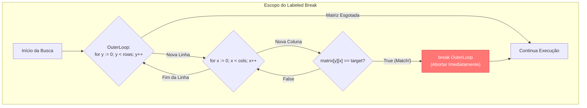

### 1. Visão Geral

No ecossistema Go, a instrução `for` é o único mecanismo de repetição da linguagem, unificando as semânticas de `while`, `do-while`, iteradores e loops infinitos. Esta decisão arquitetural elimina redundâncias sintáticas e reduz a complexidade ciclomática. O problema central que o design do loop em Go resolve (especialmente a partir da versão 1.22) é o escopo e a segurança de memória em iterações concorrentes. Historicamente, variáveis iteradoras eram compartilhadas em toda a execução do loop, causando bugs graves em *closures* e Goroutines. Agora, o Go garante o isolamento léxico das variáveis a cada iteração. Para otimização extrema, o engenheiro sênior deve dominar a diferença de custo entre extrair valores via `range` (que executa cópias em memória) versus o acesso direto via índice e ponteiros.

---

### 2. Organização por Tópicos

O domínio avançado de iterações em Go subdivide-se nas seguintes mecânicas:

* **Mecânica Interna do `range`:** O comportamento de cópia (Value Copy) versus acesso por índice e como iterar sobre *Slices*, *Maps* e *Channels*.
* **Controle Avançado de Fluxo (Labels):** A utilização de rótulos de escopo (Labeled Statements) combinados com `break` e `continue` para rotear a execução em matrizes e loops aninhados multidimensionais.
* **Otimização de Memória:** Estratégias para evitar a cópia massiva de *Structs* pesadas durante loops de alta volumetria.

---

### 3. Visualização do Fluxo (Mermaid)



**Implementação Passo a Passo (Diagrama):**

* **OuterLoop (Rótulo):** Atribuímos um identificador arbitrário à instrução do loop mais externo.
* **InnerLoop:** Itera sobre a dimensão interna (colunas).
* **Condição de Parada (Match):** Se o valor for encontrado na camada mais profunda, um `break` simples apenas pararia o `InnerLoop`, forçando o `OuterLoop` a continuar desnecessariamente.
* **Break Label:** Executar `break OuterLoop` instrui o runtime do Go a saltar imediatamente para fora do loop rotulado, abortando ambas as iterações instantaneamente, economizando ciclos de CPU em operações complexas ($O(N \times M)$).

---

### 4 e 5. Exemplos de Código (Idiomático) e Implementação Passo a Passo

#### Tópico A: Range, Cópias de Memória e Mutação Segura

```go
package flow

import "fmt"

type HeavyStruct struct {
	ID      int
	Payload [1024]byte // 1KB de dados por struct
}

func OptimizeLoopMemory() {
	items := []HeavyStruct{{ID: 1}, {ID: 2}, {ID: 3}}

	// ABORDAGEM 1: Anti-pattern para mutação e performance
	// 'item' é uma CÓPIA de 1KB a cada iteração. Mutar 'item' NÃO altera o slice original.
	for _, item := range items {
		item.ID = 99 // Inútil. Altera apenas a cópia local.
	}

	// ABORDAGEM 2: Acesso por Índice (Padrão Sênior para Performance)
	// Zero cópias de Payload. Mutação ocorre diretamente na memória do array subjacente.
	for i := range items {
		items[i].ID = items[i].ID * 10
	}

	// ABORDAGEM 3: Capturando Ponteiros (Go 1.22+)
	// A partir do Go 1.22, a variável 'item' é recriada a cada iteração, tornando seguro
	// capturar seu endereço. Contudo, em slices pesados, a Abordagem 2 ainda é mais rápida.
	var pointers []*HeavyStruct
	for i, item := range items {
		_ = item // Ainda há cópia aqui
		pointers = append(pointers, &items[i]) // Guarda o endereço real
	}

	fmt.Printf("Primeiro ID mutado: %d\n", items[0].ID)
}

```

**Implementação Passo a Passo:**

* **O Custo do `range`:** Quando você faz `for index, value := range slice`, o *runtime* do Go invisivelmente executa `value = slice[index]`. Se o `value` for um primitivo (int, string), o custo é irrisório. Se for um *Array* estático ou uma *Struct* pesada, a CPU gastará tempo massivo alocando memória para essas cópias a cada volta do loop.
* **Ignorando o Valor (`for i := range`):** Ao omitir o segundo argumento do range, o Go otimiza a iteração e não copia a struct. Você acessa o dado *in-place* usando `items[i]`, que é extremamente rápido e permite mutação real de estado.
* **A Armadilha dos Ponteiros em Loops Antigos:** Antes do Go 1.22, se você fizesse `&item` dentro do loop, o slice de ponteiros terminaria com todos os elementos apontando para o último valor do array, pois a variável `item` era global ao loop. O Go consertou isso na v1.22, mas referenciar o índice original (`&items[i]`) continua sendo a técnica mais robusta estruturalmente.

#### Tópico B: Controle Bidimensional com Labels (Rótulos)

```go
package flow

import "fmt"

func ProcessMatrixData(target string) {
	matrix := [][]string{
		{"idle", "idle", "idle"},
		{"idle", "target_found", "idle"},
		{"idle", "idle", "idle"},
	}

	foundAtX, foundAtY := -1, -1

	// Definindo o rótulo diretamente acima da instrução for
SearchMatrix:
	for y, row := range matrix {
		for x, val := range row {
			if val == target {
				foundAtX, foundAtY = x, y
				
				// Aborta o loop interno e o loop rotulado (SearchMatrix)
				break SearchMatrix 
			}

			if val == "corrupted" {
				// Ignora a linha atual completamente e salta para o próximo 'y' do loop externo
				continue SearchMatrix
			}
		}
	}

	if foundAtX != -1 {
		fmt.Printf("Alvo '%s' interceptado nas coordenadas [X:%d Y:%d]. Busca abortada precocemente.\n", target, foundAtX, foundAtY)
	}
}

```

**Implementação Passo a Passo:**

* **`SearchMatrix:`**: Este é um Rótulo (Label). Ele não é uma função, nem uma variável, mas uma âncora de salto no código compilado. O Go exige que o rótulo esteja colado a blocos `for`, `switch` ou `select`.
* **`break SearchMatrix`:** Em uma arquitetura sem rótulos, você precisaria criar uma variável booleana `found = true`, dar um `break` no loop interno, checar `if found { break }` no loop externo. O Rótulo elimina essa poluição visual e lógica de *flags*, encerrando a matriz complexa num único comando $O(1)$.
* **`continue SearchMatrix`:** Útil para sanitização. Se a camada interna detectar que o pacote de dados atual está corrompido, ela força o loop mais externo a saltar imediatamente para a próxima iteração, ignorando o resto das colunas daquela linha defeituosa.

#### Tópico C: Consumo de Channels em Loop (Concorrência Básica)

```go
package flow

import "fmt"

// ConsumeStream processa um fluxo contínuo de dados assíncronos
func ConsumeStream(stream <-chan int) {
	// O 'range' bloqueia a Goroutine atual até que novos dados cheguem no channel.
	// O loop só termina automaticamente quando o channel for fechado via close(stream).
	for payload := range stream {
		fmt.Printf("Processando pacote: %d\n", payload)
	}
	
	fmt.Println("Stream de dados encerrado pelo produtor.")
}

```

**Implementação Passo a Passo:**

* **`for payload := range stream`:** O `range` possui um comportamento especial e nativo quando lida com *Channels* (o principal mecanismo de comunicação concorrente do Go).
* **Bloqueio Determinístico:** O loop fica suspenso e não consome CPU ("sleeping") enquanto o channel estiver vazio. Quando um dado entra no canal de outra parte do sistema, o loop acorda, consome o `payload`, e dorme novamente se não houver mais dados na fila.
* **Condição de Saída Elegante:** O desenvolvedor não precisa checar manualmente se a conexão caiu ou escrever lógicas complexas de saída. Se a Goroutine produtora invocar `close(stream)`, o *runtime* do Go sinaliza o `range`, que esvazia a fila remanescente e encerra o laço naturalmente, transferindo o fluxo para a linha seguinte.