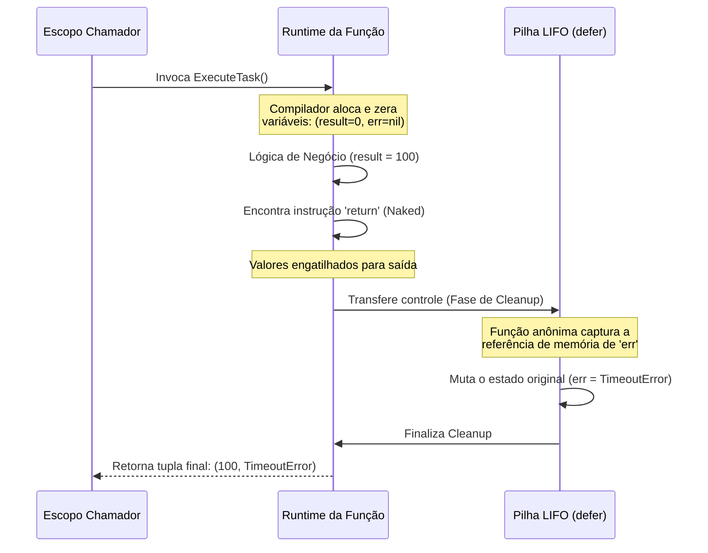

### 1. Visão Geral

No ecossistema Go, a funcionalidade de **Retornos Nomeados** (Named Return Values) permite que as variáveis de saída de uma função sejam declaradas diretamente em sua assinatura. Sob o capô, o compilador trata essas variáveis como locais, inicializando-as automaticamente com seus respectivos *Zero Values* assim que a função é invocada. O problema central que esse recurso resolve é a **documentação intrínseca** (assinaturas de funções tornam-se autoexplicativas sem necessidade de comentários excessivos) e a **manipulação de estado pós-execução**, permitindo que blocos `defer` capturem e mutem o valor de retorno exato antes que o controle seja devolvido à função chamadora.

---

### 2. Organização por Tópicos

O uso de retornos nomeados subdivide-se nas seguintes mecânicas fundamentais:

* **Pré-Alocação e Naked Returns:** A inicialização automática (Zero Value) e o uso da palavra-chave `return` vazia (naked return) para devolver o estado atual das variáveis nomeadas.
* **Documentação de Assinatura (Godoc):** Como a nomeação elimina ambiguidades em funções que retornam múltiplos valores do mesmo tipo (ex: coordenadas, dimensões).
* **Mutação de Retorno via `defer` (Padrão Sênior):** A técnica avançada de interceptar e alterar a variável de retorno durante a execução da pilha de *deferred functions*, vital para recuperação de *panics* ou injeção de contexto em erros.

---

### 3. Visualização do Fluxo (Mermaid)



**Implementação Passo a Passo (Diagrama):**

* **Alocação Inicial:** Diferente de retornos anônimos, o *runtime* pré-aloca o espaço na memória para as saídas antes da primeira linha de código da função ser executada.
* **O Gatilho do Return:** Quando o código atinge o `return`, o Go não devolve o controle ao *Caller* imediatamente. Ele "trava" os valores atuais das variáveis nomeadas como a resposta pendente.
* **A Interceptação do Defer:** As funções `defer` agendadas entram em ação. Como o retorno foi nomeado, o `defer` possui uma referência léxica (Closure) ao endereço de memória exato da variável de retorno, podendo modificá-la antes da entrega final.

---

### 4 e 5. Exemplos de Código (Idiomático) e Implementação Passo a Passo

#### Tópico A: Documentação e Naked Returns

```go
package domain

// SplitGeometry calcula dimensões e exemplifica auto-documentação.
// Retornar (int, int) seria ambíguo. Nomear as saídas clarifica a API.
func SplitGeometry(total int) (width int, height int) {
	// width e height já nascem valendo 0.
	
	if total <= 0 {
		// Naked return: Retorna os Zero Values (0, 0)
		return 
	}

	// Atribuição direta. Não usamos ':=', pois as variáveis já existem.
	width = (total * 2) / 3
	height = total - width

	// Retorna os valores atuais de width e height
	return 
}

```

**Implementação Passo a Passo:**

* **`(width int, height int)`:** A assinatura informa imediatamente a quem consome a API o que cada `int` representa. Sem isso, a IDE e a documentação mostrariam apenas `func(int) (int, int)`, forçando o desenvolvedor a ler o código-fonte para saber qual é a largura e qual é a altura.
* **A ausência do `:=`:** Como `width` e `height` já foram declaradas na assinatura, tentar fazer `width := 10` dentro da função causará um erro de compilação (*no new variables on left side of :=*). O uso correto é a atribuição simples `=`.
* **Naked `return`:** O comando solitário empacota as variáveis nomeadas e as retorna. **Aviso de Senioridade:** Em funções curtas (até 15-20 linhas), isso é limpo e idiomático. Em funções longas, o *naked return* é considerado um anti-padrão de legibilidade, pois obriga o leitor a rolar o código para cima para descobrir quais variáveis estão sendo retornadas.

#### Tópico B: Captura de Panic via Defer e Retorno Nomeado

```go
package domain

import (
	"fmt"
)

// SafeExecution protege o sistema contra crashes usando um retorno nomeado.
func SafeExecution() (err error) {
	// O defer cria um closure que "enxerga" a variável 'err' alocada na assinatura.
	defer func() {
		if r := recover(); r != nil {
			// Mutamos o valor de retorno exato que será entregue ao chamador.
			err = fmt.Errorf("operação abortada via panic: %v", r)
		}
	}()

	// Simulação de um colapso em tempo de execução (ex: slice out of bounds, nil pointer)
	panic("falha crítica de hardware")
	
	// Esta linha nunca será atingida
	return nil
}

```

**Implementação Passo a Passo:**

* **`(err error)`:** Nomeamos propositalmente a interface de erro de saída. Seu *Zero Value* ao entrar na função é `nil`.
* **`defer func() { ... }()`:** Registramos uma função de limpeza que rodará independentemente de como `SafeExecution` terminar (por sucesso, retorno prematuro ou `panic`).
* **Mutação Crítica (`err = fmt.Errorf(...)`):** Quando o `panic` ocorre, a execução normal para e o `defer` é acionado. O `recover()` captura o motivo do crash. Porque `err` foi nomeada na assinatura, a função anônima dentro do `defer` consegue sobrescrever o `nil` original pelo novo erro formatado. Se a assinatura fosse anônima `func() error`, o `defer` não teria como injetar o erro recuperado de volta no fluxo de saída da função chamadora, e o retorno seria invariavelmente o que foi avaliado no momento do crash.

#### Tópico C: Enriquecimento de Erros (Error Wrapping)

```go
package domain

import (
	"errors"
	"fmt"
)

func QueryDatabase(id int) error {
	return errors.New("timeout na conexão")
}

// FetchUser enriquece qualquer erro retornado pelas camadas inferiores.
func FetchUser(id int) (err error) {
	defer func() {
		// Se a função estiver retornando um erro válido, nós o envelopamos
		// adicionando o contexto operacional.
		if err != nil {
			err = fmt.Errorf("FetchUser falhou para id [%d]: %w", id, err)
		}
	}()

	// A execução principal
	err = QueryDatabase(id)
	if err != nil {
		// O naked return dispara o defer, que injeta o contexto e devolve o erro final.
		return 
	}

	return 
}

```

**Implementação Passo a Passo:**

* **O Padrão de Envelopamento Automático:** Em arquiteturas complexas, você frequentemente deseja adicionar contexto ("*O que eu estava tentando fazer quando a falha ocorreu?*") aos erros gerados por funções filhas.
* **`if err != nil` no defer:** O bloco `defer` examina a variável de retorno. Se a transação no banco de dados foi bem-sucedida, `err` será `nil`, o `defer` não fará nada, e a função retorna limpa.
* **Otimização de Código:** Isso evita que o desenvolvedor precise envelopar o erro manualmente `fmt.Errorf(...)` em múltiplos blocos `if err != nil` espalhados por uma função grande e complexa. Toda falha que gerar um retorno será interceptada e enriquecida centralmente pelo `defer` no momento da saída.