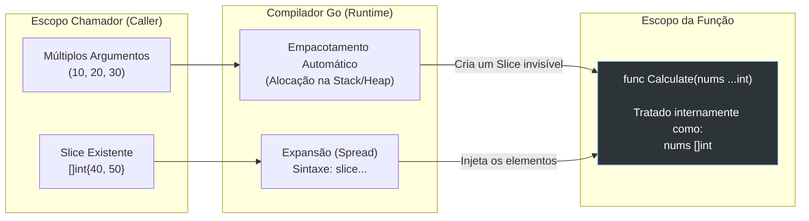

### 1. Visão Geral

No ecossistema Go, funções variáticas (Variadic Functions) são funções arquitetadas para aceitar um número indefinido (zero ou mais) de argumentos de um tipo específico. A linguagem resolve o problema da rigidez de aridade (número fixo de parâmetros) implementando o operador *ellipsis* (`...`). Sob o capô, isso não passa de "açúcar sintático" (syntactic sugar) elegantemente projetado pelo compilador: ao invés de forçar o engenheiro de software a instanciar e popular um *Slice* manualmente no escopo chamador toda vez que precisar passar uma lista de parâmetros, o compilador coleta os argumentos soltos e os empacota nativamente em um *Slice* na entrada da função. Isso é o que viabiliza APIs extremamente ergonômicas na biblioteca padrão, como `fmt.Println` e `append`.

---

### 2. Organização por Tópicos

O domínio de funções variáticas subdivide-se nas seguintes mecânicas estritas:

* **Empacotamento Automático (Packing):** A transformação de argumentos separados por vírgula em um *Slice* dentro do escopo da função.
* **A Regra de Posicionamento:** A restrição léxica que obriga o parâmetro variático a ser exclusivamente o último na assinatura da função.
* **Desempacotamento de Slices (Unpacking):** A injeção direta de um *Slice* pré-existente em uma função variática utilizando a sintaxe `slice...`.
* **Aridade Genérica com `...any`:** A construção de funções que aceitam uma quantidade variável de parâmetros de tipos heterogêneos.

---

### 3. Visualização do Fluxo (Mermaid)



**Implementação Passo a Passo (Diagrama):**

* **Empacotamento:** Quando você passa dados soltos (`10, 20`), o Go intercepta essa chamada, aloca um *Slice* de tamanho equivalente à quantidade de argumentos, insere os dados, e passa o *Header* deste slice para a função.
* **Expansão (Unpack):** O compilador barra a injeção direta de um tipo `[]int` onde se espera `...int`. O operador `...` posicionado após o slice avisa o *runtime* para "desconstruir" a coleção estruturalmente antes de enviá-la para a função, bypassando a necessidade de reempacotamento.

---

### 4 e 5. Exemplos de Código (Idiomático) e Implementação Passo a Passo

#### Tópico A: Declaração Base e Regra de Posicionamento

```go
package domain

import "fmt"

// SummarizeProcess exige uma string de contexto e aceita N inteiros.
// O parâmetro variático 'metrics' DEVE ser o último.
func SummarizeProcess(actionName string, metrics ...int) int {
	total := 0
	
	// Dentro da função, 'metrics' é um autêntico []int.
	// Se zero argumentos variáticos forem passados, 'metrics' será um slice nulo (nil).
	for _, val := range metrics {
		total += val
	}
	
	fmt.Printf("Ação: %s | Total: %d\n", actionName, total)
	return total
}

func ExecutePacking() {
	// Chamada com múltiplos argumentos
	SummarizeProcess("Leituras de Disco", 150, 200, 50)
	
	// Chamada com zero argumentos variáticos (válido e seguro em Go)
	SummarizeProcess("Ping de Rede")
}

```

**Implementação Passo a Passo:**

* **`metrics ...int`:** O compilador exige que este seja o último parâmetro para evitar ambiguidades no *parsing* léxico. Se houvesse um parâmetro adicional após `...int`, o compilador não saberia onde termina a lista variável e onde começa o próximo dado estático.
* **Loop Seguro em Nil Slices:** A chamada `SummarizeProcess("Ping de Rede")` passa zero inteiros. O compilador converte `metrics` para um slice `nil`. Diferente de mapas, iterar sobre um slice `nil` com `range` é uma operação $O(1)$ segura no Go (o loop é simplesmente ignorado), dispensando checagens como `if metrics != nil`.

#### Tópico B: Desempacotamento (Unpacking) e Delegação

```go
package domain

import "fmt"

func ProcessBatch(batchID string, items ...string) {
	fmt.Printf("Lote: %s | Itens: %v\n", batchID, items)
}

func RouteData() {
	// Temos um slice alocado em memória vindo de outra rotina ou banco de dados
	pendingTasks := []string{"task_A", "task_B", "task_C"}

	// Erro de compilação: cannot use pendingTasks (type []string) as type string in argument
	// ProcessBatch("LOTE-001", pendingTasks)

	// Padrão Idiomático: Desempacotamento via operador '...'
	ProcessBatch("LOTE-001", pendingTasks...)
}

func AppendOptimization() {
	base := []int{1, 2}
	newData := []int{3, 4, 5}
	
	// 'append' é a função variática nativa mais usada em Go.
	// O unpacking permite fundir dois slices de forma direta.
	base = append(base, newData...) 
}

```

**Implementação Passo a Passo:**

* **`pendingTasks...`:** Este é o operador de desempacotamento (semelhante ao *Spread Operator* de outras linguagens). Ele não copia todos os elementos um a um. Quando você passa um slice existente para uma função variática via `...`, o Go otimiza a chamada passando diretamente o ponteiro do *Slice Header* original para a função, garantindo alta performance (Zero-Allocation).
* **Fundindo Slices com `append`:** A assinatura nativa do Go é `func append(slice []Type, elems ...Type) []Type`. Para adicionar múltiplos itens de uma vez, passar outro slice desempacotado (`newData...`) é a única via correta e otimizada que não envolve loops manuais.

#### Tópico C: Funções Genéricas com Interface Vazia (`...any`)

```go
package domain

import (
	"fmt"
	"time"
)

// EmitLog aceita um nível de criticidade e qualquer quantidade de tipos mistos.
// 'any' é o alias moderno (Go 1.18+) para 'interface{}'.
func EmitLog(level string, data ...any) {
	fmt.Printf("[%s] %v - ", level, time.Now().Format(time.RFC3339))
	
	// O pacote fmt possui inteligência interna via 'reflect' para interpretar
	// o slice de intefaces genéricas ([]any) e imprimi-los corretamente.
	fmt.Println(data...)
}

func ExecuteLogging() {
	userID := 404
	userName := "admin_root"
	isActive := true

	// Passando int, string e bool simultaneamente
	EmitLog("CRITICAL", "Falha de Autenticação", userID, userName, isActive)
}

```

**Implementação Passo a Passo:**

* **`data ...any`:** Quando os argumentos variáticos precisam ser de tipos diferentes (ex: formatadores de log, construtores JSON), define-se o tipo base como a interface vazia `any` (ou `interface{}`). O compilador criará internamente um slice de interfaces `[]any`, onde cada elemento da interface possui um ponteiro genérico apontando para o tipo real injetado e seu valor subjacente.
* **Atenção ao Custo de `any`:** Funções variáticas com `any` invocam mecanismos de *Escape Analysis* agressivos. Como a interface precisa acomodar qualquer tipo, valores primitivos simples (como o inteiro `404`) muitas vezes escapam da *Stack* e são alocados na *Heap* para que possam ser passados como referências de interface, gerando leve overhead de *Garbage Collection*. É uma arquitetura válida para logs e formatação visual, mas deve ser evitada em loops de *hard-computing* ou processamento matemático intenso.