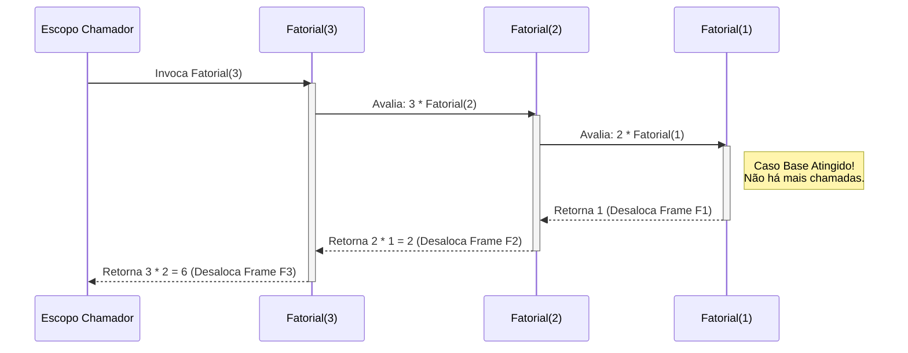

### 1. Visão Geral

No ecossistema Go, uma função recursiva é aquela que invoca a si mesma dentro de seu próprio escopo léxico para resolver instâncias menores de um mesmo problema. O design recursivo resolve o problema da travessia de estruturas de dados não lineares e de profundidade arbitrária (como árvores, grafos e sistemas de diretórios do SO), onde abordagens iterativas puras (`for`) exigiriam a manutenção manual de pilhas (*Stacks*) complexas. A idiossincrasia arquitetural mais crítica para um engenheiro Sênior em Go é que **a linguagem não possui *Tail Call Optimization* (TCO) nativa**. Isso significa que cada chamada recursiva aloca um novo *Frame* na pilha (Stack) da Goroutine. Embora a *Stack* de uma Goroutine inicie pequena (geralmente 2KB) e cresça dinamicamente, recursões infinitas ou extremamente profundas resultarão em *Stack Overflow* (crash irrecuperável) ou *overhead* massivo de alocação de memória.

---

### 2. Organização por Tópicos

O domínio de funções recursivas em Go exige o entendimento estrito das seguintes mecânicas:

* **Anatomia Fundamental:** A obrigatoriedade absoluta de um "Caso Base" (condição de parada) antes do "Passo Recursivo" para evitar vazamentos de *Stack*.
* **Recursão em Funções Anônimas (Closures):** O padrão idiomático (e sintaticamente peculiar) de pré-declarar a assinatura da função para permitir que o *Closure* chame a si mesmo sem erros de compilação.
* **Travessia de Estruturas de Dados:** A aplicação prática da recursão para navegar em tipos agregados hierárquicos, como árvores binárias ou processamento de JSONs aninhados.

---

### 3. Visualização do Fluxo (Mermaid)



**Implementação Passo a Passo (Diagrama):**

* **Invocação e Alocação de Frames:** Quando `Main` chama `Fatorial(3)`, o Go aloca um *Stack Frame* na memória da Goroutine atual contendo as variáveis locais (o valor `3`). Como o resultado depende de `Fatorial(2)`, o estado congela e um novo Frame é empilhado.
* **O Caso Base (`F1`):** A condição de parada intercepta o fluxo antes de uma nova chamada. É o momento de maior consumo de memória RAM, pois todos os *Frames* anteriores estão suspensos esperando a resposta.
* **O Desempilhamento (Unwinding):** O Caso Base retorna um valor concreto. A partir desse ponto, o *runtime* do Go inicia o descarte reverso dos *Frames* (LIFO - Last In, First Out), resolvendo as multiplicações pendentes até devolver o controle ao `Main`.

---

### 4 e 5. Exemplos de Código (Idiomático) e Implementação Passo a Passo

#### Tópico A: Anatomia Fundamental (Caso Base e Passo Recursivo)

```go
package domain

import "fmt"

// CalculateFactorial implementa recursão linear direta.
func CalculateFactorial(n int) int {
	// 1. Caso Base: O gatilho de parada absoluta.
	// Sem isso, a função empilharia até esgotar a memória (Stack Overflow).
	if n <= 1 {
		return 1
	}

	// 2. Passo Recursivo: A função retém o contexto (n) e chama a si mesma.
	return n * CalculateFactorial(n-1)
}

func ExecuteLinearRecursion() {
	result := CalculateFactorial(5)
	fmt.Printf("Fatorial de 5: %d\n", result) // Imprime: 120
}

```

**Implementação Passo a Passo:**

* **`if n <= 1`:** Esta validação deve ser, invariavelmente, a primeira instrução da função recursiva (estilo Fail-Fast / Stop-Fast).
* **`return n * CalculateFactorial(n-1)`:** O Go avalia primeiro o lado direito da expressão. Ele invoca `CalculateFactorial(n-1)`, e só quando essa chamada retornar o valor completo em todo o ciclo descendente, a multiplicação pelo `n` atual ocorrerá.
* **Nota de Senioridade (Limitações do Go):** Em linguagens funcionais puras (como Haskell), se a chamada recursiva for a última operação estrita (Tail Call), o compilador reutiliza o mesmo *Stack Frame*, evitando estouro de memória. Como o Go não otimiza *Tail Calls*, algoritmos que processam milhões de itens linearmente devem ser escritos usando `for` em vez de recursão para preservar a performance da *Stack*.

#### Tópico B: Recursão em Funções Anônimas (Closures)

```go
package domain

import "fmt"

func ExtractValues() {
	nestedData := []any{10, []any{20, 30}, 40}
	var sum int

	// 1. Declaração Antecipada (Forward Declaration)
	// Essencial: Se usarmos 'process := func...', a função anônima não
	// conseguiria chamar 'process' dentro de si, pois a variável ainda não existiria.
	var process func(data []any)

	// 2. Atribuição e Implementação
	process = func(data []any) {
		for _, item := range data {
			switch v := item.(type) {
			case int:
				sum += v // Caso Base Implícito (folha alcançada)
			case []any:
				process(v) // Passo Recursivo invocando o closure
			}
		}
	}

	// 3. Invocação Inicial
	process(nestedData)
	fmt.Printf("Soma total dos dados aninhados: %d\n", sum) // Imprime: 100
}

```

**Implementação Passo a Passo:**

* **`var process func(data []any)`:** O "truque" idiomático do Go para recursão anônima. Primeiro, declaramos o ponteiro da função na *Stack*. O compilador agora sabe que existe uma variável chamada `process` cuja assinatura aceita um slice de `any`.
* **A Atribuição (`process = func(...)`) e Captura de Escopo:** O *Closure* pode mutar a variável `sum` e pode invocar `process(v)`. Como o *parsing* do compilador é sequencial, quando ele analisa o corpo da função, ele já encontra a referência `process` criada na etapa anterior.
* **`switch v := item.(type)`:** O *Type Assertion* descobre em tempo de execução se o elemento atual é um sub-array (exigindo que o nível desça, mergulhando na recursão) ou um inteiro final (adicionando ao acumulador, atuando como o caso base).

#### Tópico C: Travessia de Estruturas de Dados (Árvore Binária)

```go
package domain

import "fmt"

// TreeNode modela um nó típico de estrutura não-linear.
type TreeNode struct {
	Value int
	Left  *TreeNode
	Right *TreeNode
}

// InOrderTraversal visita: Nó Esquerdo -> Raiz -> Nó Direito
func InOrderTraversal(node *TreeNode) {
	// Caso Base: Alcançamos uma folha inexistente. Retorna silenciosamente.
	if node == nil {
		return
	}

	// 1. Recursão para o ramo esquerdo (Desce até o menor valor)
	InOrderTraversal(node.Left)

	// 2. Processa o valor do nó atual
	fmt.Printf("%d ", node.Value)

	// 3. Recursão para o ramo direito
	InOrderTraversal(node.Right)
}

func ExecuteTreeTraversal() {
	// Construção de uma pequena árvore:
	//       10
	//      /  \
	//     5    15
	root := &TreeNode{
		Value: 10,
		Left:  &TreeNode{Value: 5},
		Right: &TreeNode{Value: 15},
	}

	fmt.Print("Caminho In-Order: ")
	InOrderTraversal(root) // Imprime: 5 10 15
	fmt.Println()
}

```

**Implementação Passo a Passo:**

* **O Paradigma da Travessia:** Estruturas baseadas em ponteiros bidirecionais ou multidirecionais (`*TreeNode`) são os candidatos primários (e muitas vezes exclusivos) para recursão em sistemas de alta performance, pois transformá-los em estruturas iterativas exige emular a *Stack* nativa manualmente com fatias (`slices`).
* **`if node == nil { return }`:** O caso de parada perfeito. Em árvores dinâmicas, não sabemos a profundidade exata. Confia-se que a ponta final da árvore apontará para um endereço *nulo*. A função bate no nulo, volta para o nó pai, imprime o valor, e em seguida desce para a direita, garantindo uma ordenação topológica matematicamente precisa.