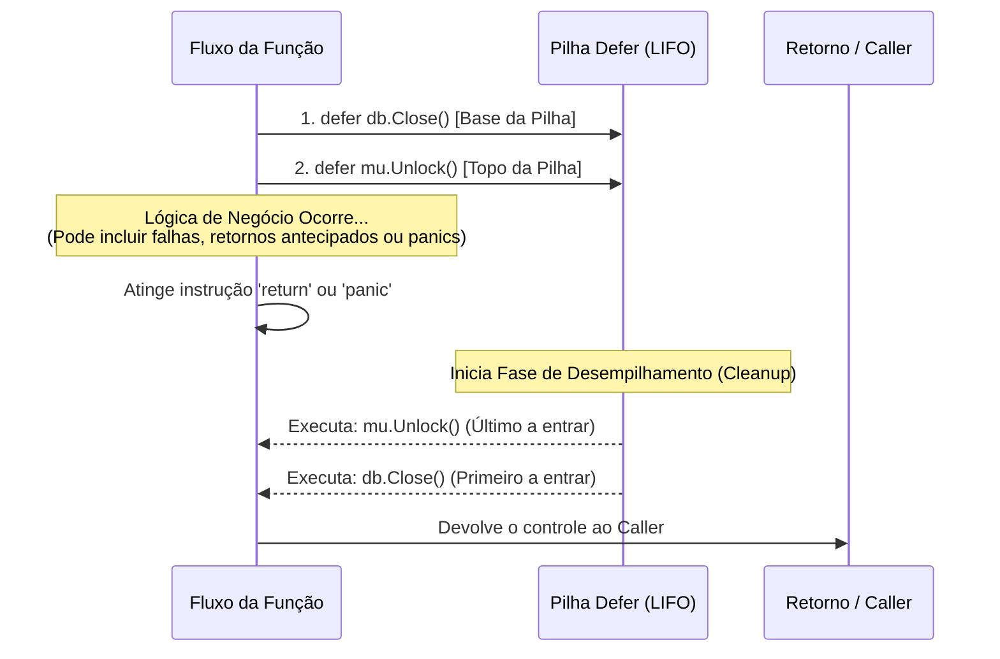

### 1. Visão Geral

No ecossistema Go, a instrução `defer` é um mecanismo de controle de fluxo projetado primariamente para garantir a liberação determinística de recursos (arquivos, locks de concorrência, conexões de rede), independentemente de como a função é encerrada — seja por um fluxo de sucesso (`return` normal), um encerramento prematuro (Fail-Fast) ou um colapso em tempo de execução (`panic`). O problema central que o `defer` resolve é a prevenção de *Memory/Resource Leaks* que frequentemente ocorrem em cadeias complexas de `if/else`, onde o desenvolvedor pode esquecer de invocar as rotinas de limpeza (cleanup) em todos os caminhos de saída. Arquiteturalmente, o Go empilha as chamadas diferidas em uma estrutura de dados dedicada (LIFO) e avalia os argumentos da função diferida no exato momento do **agendamento**, mas executa seu corpo apenas no momento do **desempilhamento**.

---

### 2. Organização por Tópicos

O domínio profundo da instrução `defer` subdivide-se nas seguintes mecânicas fundamentais:

* **Gestão Determinística de Recursos:** O emparelhamento imediato de alocação/liberação para garantir que locks ou arquivos não fiquem órfãos (ex: `Lock()` seguido imediatamente por `defer Unlock()`).
* **A Pilha LIFO (Last-In, First-Out):** O comportamento de empilhamento reverso quando múltiplos comandos `defer` são declarados no mesmo escopo.
* **Avaliação Imediata de Argumentos:** A armadilha clássica onde argumentos passados para a função diferida são computados na hora da declaração, e não na hora da execução.
* **O Padrão de Closure para Avaliação Tardia:** O uso de funções anônimas (IIFE) no defer para capturar o estado final das variáveis ou recuperar *Panics*.

---

### 3. Visualização do Fluxo (Mermaid)



**Implementação Passo a Passo (Diagrama):**

* **Empilhamento (Push):** Assim que a execução passa pelas linhas `defer`, a função especificada e seus argumentos são empacotados e armazenados em uma *Stack* atrelada ao *Frame* atual da Goroutine.
* **Sobrevivência ao Fluxo:** A lógica de negócio prossegue. Mesmo que um `panic` destrua o fluxo normal, o *runtime* do Go intercepta a falha e obrigatoriamente aciona a Pilha Defer antes de derrubar a aplicação.
* **Desempilhamento (Pop - LIFO):** O último recurso adquirido (ex: o Mutex) é o primeiro a ser liberado, seguido pelos recursos mais antigos (ex: a conexão de banco), garantindo que dependências de destruição não entrem em *deadlock*.

---

### 4 e 5. Exemplos de Código (Idiomático) e Implementação Passo a Passo

#### Tópico A: Gestão de Recursos e Ordem LIFO

```go
package domain

import (
	"fmt"
	"sync"
)

func ProcessDataSecurely() {
	var mu sync.Mutex

	// Adquire o recurso
	mu.Lock()
	// Padrão Ouro: Agendar a liberação imediatamente após a aquisição bem-sucedida
	defer mu.Unlock()

	defer fmt.Println("[Cleanup] Liberando memória auxiliar... (Defer 2)")
	defer fmt.Println("[Cleanup] Fechando arquivo de log... (Defer 3)")

	fmt.Println("Lógica crítica processando...")
	// O retorno dispara a pilha LIFO: Defer 3 -> Defer 2 -> Unlock
}

```

**Implementação Passo a Passo:**

* **`defer mu.Unlock()`:** O uso mais crucial do `defer`. Ao colar o "destrutor" diretamente abaixo do "construtor" (`mu.Lock()`), o engenheiro garante visualmente que o *Mutex* jamais continuará travado, mesmo se 50 linhas abaixo houver um `return error` ou um *panic*.
* **A Ordem de Impressão:** Ao rodar esta função, a saída obrigatória será:
1. `Lógica crítica processando...` (Fluxo síncrono normal)
2. `[Cleanup] Fechando arquivo de log...` (Último defer inserido na pilha)
3. `[Cleanup] Liberando memória auxiliar...`
4. O Mutex é destravado.


#### Tópico B: A Armadilha da Avaliação de Argumentos

```go
package domain

import (
	"fmt"
	"time"
)

func TrackExecutionFlawed() {
	start := time.Now()
	
	// ANTI-PATTERN: 'time.Since(start)' é executado AGORA (na hora do agendamento).
	// O resultado computado (0s) é guardado na pilha, não o tempo final.
	defer fmt.Println("Tempo falho:", time.Since(start)) 

	time.Sleep(1 * time.Second) // Simula carga de trabalho
}

func TrackExecutionCorrect() {
	start := time.Now()
	
	// PADRÃO IDIOMÁTICO: Um closure adia a execução de toda a lógica interna.
	// O 'time.Since' só será invocado no momento do desempilhamento.
	defer func() {
		fmt.Println("Tempo real:", time.Since(start))
	}()

	time.Sleep(1 * time.Second)
}

```

**Implementação Passo a Passo:**

* **A Avaliação Ansiosa do Go (Eager Evaluation):** Na versão `Flawed`, quando o Go lê a linha `defer fmt.Println(time.Since(start))`, a regra da linguagem diz que **todos os argumentos** de uma chamada diferida devem ser calculados instantaneamente. Ele calcula `time.Since` (que dá alguns nanossegundos), congela esse valor, e empilha a instrução para imprimir depois. O log final será algo como `0.000001s`, mesmo que o método demore 10 minutos.
* **A Solução do Closure (`defer func() { ... }()`)**: Quando envelopamos o comando em uma Função Anônima (IIFE), a função externa não tem argumentos para avaliar no momento do agendamento. O código dentro das chaves não é executado até que a função original faça o `return`. Naquele momento, o closure acessa a variável `start` capturada na memória e calcula o tempo decorrido com perfeição.

#### Tópico C: Iteração com Defer em Loops (Risco Sênior)

```go
package domain

import (
	"fmt"
	"os"
)

// Anti-Pattern: Defer dentro de loops longos pode esgotar limites do SO
func ProcessFilesFlawed(files []string) error {
	for _, filename := range files {
		f, err := os.Open(filename)
		if err != nil {
			return err
		}
		// PERIGO: Arquivos não são fechados até a função inteira acabar.
		// Se houver 10.000 arquivos, o processo atingirá o limite 'too many open files'.
		defer f.Close() 
	}
	return nil
}

// Padrão Sênior: Isolamento de escopo via função anônima
func ProcessFilesSafe(files []string) error {
	for _, filename := range files {
		// A lógica do arquivo é empacotada. O 'defer' agora pertence 
		// a esta função anônima, disparando a cada ciclo do loop.
		err := func(name string) error {
			f, err := os.Open(name)
			if err != nil {
				return err
			}
			defer f.Close() // Fecha OBRIGATORIAMENTE ao fim DESTE escopo
			
			// Manipulação do arquivo...
			return nil
		}(filename)

		if err != nil {
			return err
		}
	}
	return nil
}

```

**Implementação Passo a Passo:**

* **O Risco do Loop (`ProcessFilesFlawed`):** O comando `defer` só se importa com o escopo da *função* pai, não com o escopo do bloco do `for`. Colocar um `defer` solto dentro de um loop significa que ele acumulará indefinidamente na *Stack* e só será drenado quando o método terminar, mantendo *File Descriptors* abertos perigosamente.
* **O Fechamento de Escopo (`ProcessFilesSafe`):** Ao introduzirmos uma IIFE dentro do loop `err := func(...) error { ... }()`, criamos uma barreira léxica. A função anônima inicia, executa seu `defer` particular, termina, e aciona o desempilhamento do `f.Close()` *imediatamente* a cada ciclo do loop. Quando o loop avançar para a próxima iteração, o recurso anterior já estará limpo e devolvido ao Sistema Operacional.