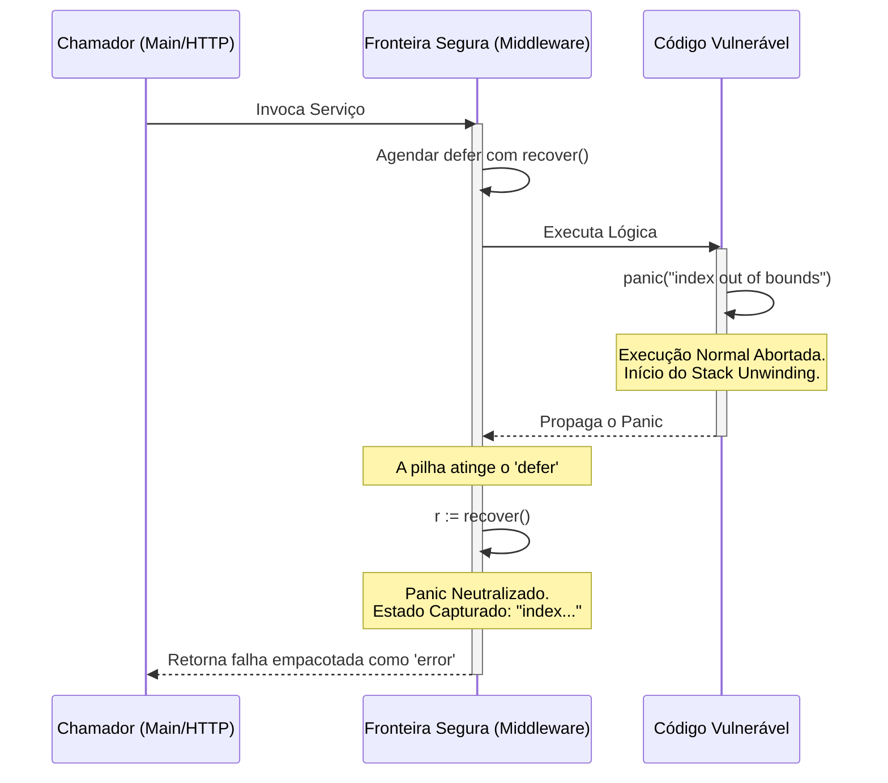

### 1. Visão Geral

No ecossistema Go, o tratamento de erros padrão é feito através de múltiplos retornos explícitos (`return nil, err`), rejeitando categoricamente o modelo de exceções (`try/catch/throw`) para o controle de fluxo de regras de negócio. No entanto, o Go fornece o mecanismo de **Panic e Recover** para lidar com situações verdadeiramente excepcionais e irrecuperáveis em tempo de execução (ex: corrupção de memória, *nil pointer dereference* ou falhas críticas de inicialização). Quando um `panic` é acionado, a Goroutine atual interrompe sua execução normal e inicia o *Stack Unwinding* (desempilhamento destrutivo), subindo pela pilha de chamadas e executando apenas as funções adiadas (`defer`) antes de derrubar todo o processo da aplicação. A função embutida `recover()` resolve o problema do colapso total: quando invocada estritamente dentro de uma função `defer`, ela intercepta o *Unwinding*, captura o valor do *panic*, neutraliza a falha e devolve o controle à Goroutine, permitindo que a aplicação (como um servidor web) sobreviva a falhas isoladas.

---

### 2. Organização por Tópicos

O uso avançado de *Panic* e *Recover* fundamenta-se nas seguintes mecânicas estritas:

* **Stack Unwinding e Defer:** O comportamento da pilha de chamadas quando um *panic* é disparado e a garantia de execução das funções diferidas.
* **Recuperação com Retorno Nomeado:** O padrão idiomático Sênior para capturar o *panic* e transformá-lo em um erro de interface (`error`) comum e previsível para a função chamadora.
* **Isolamento em Fronteiras de Concorrência:** A regra arquitetural mais crítica: um *panic* em uma Goroutine filha derrubará o programa inteiro se não possuir seu próprio *recover*, pois o *Unwinding* não atravessa fronteiras de Goroutines.

---

### 3. Visualização do Fluxo (Mermaid)



**Implementação Passo a Passo (Diagrama):**

* **Fronteira Segura:** A função intermediária (frequentemente um *Middleware* em APIs) prepara a rede de segurança registrando um `defer`.
* **Stack Unwinding:** A função `Vuln` sofre um colapso. O Go ignora todas as linhas de código seguintes, abandona `Vuln` e volta para `Mid`, propagando a onda de destruição.
* **A Interceptação:** Antes de `Mid` ser destruída, o Go obrigatoriamente executa seu `defer`. Dentro desse `defer`, o `recover()` age como um para-raios. Ele consome o `panic`, cessa o *Unwinding* e permite que `Mid` termine graciosamente, protegendo a função `App` (que muitas vezes é o servidor principal da aplicação).

---

### 4 e 5. Exemplos de Código (Idiomático) e Implementação Passo a Passo

#### Tópico A: A Mecânica de Destruição e o Defer

```go
package domain

import "fmt"

func triggerPanic() {
	// Este defer será executado, pois foi agendado antes do panic.
	defer fmt.Println("[Cleanup] Liberando recurso local da função vulnerável.")

	// Dispara o Stack Unwinding
	panic("estado de memória corrompido")

	// Código inacessível. O compilador Go muitas vezes avisa sobre isso.
	fmt.Println("Isso nunca será impresso.")
}

func ExecuteUnwinding() {
	defer fmt.Println("[Cleanup] Defer do chamador também é executado.")
	
	fmt.Println("Iniciando processo...")
	triggerPanic()
}

```

**Implementação Passo a Passo:**

* **`panic("mensagem")`:** O `panic` aceita o tipo `any` (interface vazia). Você pode passar strings, inteiros ou structs de erro personalizadas.
* **A Garantia do `defer`:** A premissa central de segurança do Go é que funções adiadas rodam não importa o que aconteça. Ao executar `ExecuteUnwinding`, a saída no terminal será exatamente a ordem reversa (LIFO) dos defers ativados antes do crash final e encerramento abrupto do processo (`exit status 2`).

#### Tópico B: Interceptação (Recover) com Retornos Nomeados

```go
package domain

import (
	"fmt"
)

// Padrão Sênior: O retorno de erro deve ser nomeado para ser mutado no defer.
func ParseDataSafe() (err error) {
	// A rede de segurança.
	defer func() {
		// recover() retorna a interface{} passada para o panic()
		if r := recover(); r != nil {
			// Empacotamos o panic em um erro comum, neutralizando o colapso.
			err = fmt.Errorf("operação falhou criticamente: %v", r)
		}
	}()

	fmt.Println("Processando dados...")
	
	// Simulação de uma falha de terceiro ou bug lógico profundo.
	var mapNulo map[string]string
	mapNulo["key"] = "value" // PANIC NATIVO: assignment to entry in nil map

	// Nunca será alcançado em caso de panic
	return nil 
}

```

**Implementação Passo a Passo:**

* **`func ParseDataSafe() (err error)`:** Se não usarmos um retorno nomeado, a função `defer` não teria acesso ao endereço de memória exato da variável que está sendo devolvida ao chamador.
* **`if r := recover(); r != nil`:** A chamada a `recover()` só faz efeito e retorna algo diferente de `nil` se a Goroutine estiver ativamente em estado de *panicking*. Se a função rodar com sucesso, `recover()` retorna nulo, e o *cleanup* passa direto sem impacto na performance.
* **O Casamento de Tecnologias:** Este padrão é o coração de *frameworks* web como Gin ou Fiber. Eles envelopam a execução da sua requisição HTTP com esse exato bloco de `defer/recover`. Se o seu código disparar um erro de *slice out of bounds*, o framework intercepta, retorna um *HTTP 500 Internal Server Error* para o cliente, e mantém o servidor de pé para os demais usuários.

#### Tópico C: Fronteiras de Concorrência (O Ponto Cego do Recover)

```go
package domain

import (
	"fmt"
	"sync"
	"time"
)

func ProcessAsyncJobs() {
	var wg sync.WaitGroup

	// Tentativa (FALHA) de capturar panic global.
	// O recover não atravessa fronteiras de Goroutines.
	defer func() {
		if r := recover(); r != nil {
			fmt.Println("Recuperado na Main:", r)
		}
	}()

	wg.Add(1)
	go func() {
		// PADRÃO CORRETO: Toda Goroutine que possui lógica de risco DEVE ter seu próprio recover.
		defer func() {
			if r := recover(); r != nil {
				fmt.Printf("[Worker Cleanup] Panic contido na Goroutine filha: %v\n", r)
			}
			wg.Done()
		}()

		fmt.Println("Worker assíncrono iniciado...")
		time.Sleep(10 * time.Millisecond)
		panic("falha de conexão com broker de fila")
	}()

	wg.Wait()
	fmt.Println("Sistema principal sobreviveu e finalizou com sucesso.")
}

```

**Implementação Passo a Passo:**

* **Pilhas de Memória Isoladas:** Em Go, cada Goroutine possui sua própria *Stack* separada. Quando o *Worker* assíncrono dispara o `panic`, o desempilhamento acontece *apenas* na Stack dele.
* **A Armadilha do Escopo Pai:** O `defer` declarado no topo de `ProcessAsyncJobs` pertence à Goroutine primária (Main). Como o *panic* aconteceu em outra *Stack*, o `recover()` da Main nunca verá essa falha. O *runtime* do Go interpretará isso como um *panic* não tratado (Unhandled Panic) e derrubará a aplicação inteira de forma irreversível.
* **A Regra de Ouro da Concorrência:** Você não pode capturar *panics* disparados por Goroutines filhas a partir da Goroutine que as criou. O padrão Sênior exige que todo ponto de entrada assíncrono (`go func() { ... }`) instale sua própria barreira defensiva `defer/recover` logo na primeira linha se houver risco de colapso.