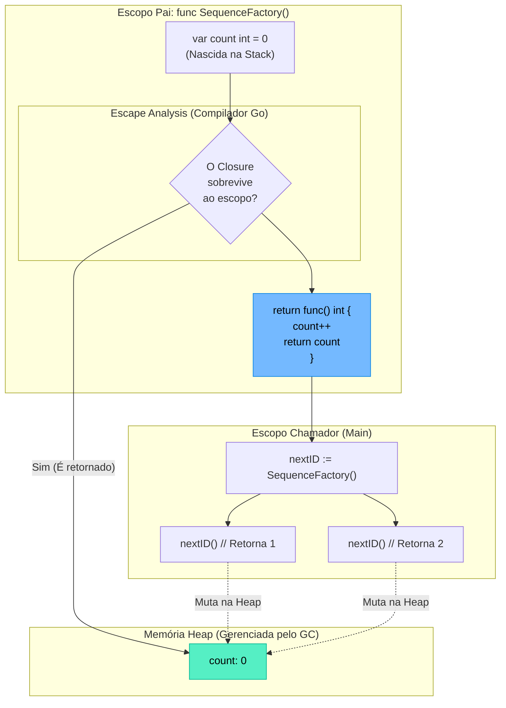

### 1. Visão Geral

No ecossistema Go, um **Closure** (Fechamento) é uma função anônima que "captura" e retém o escopo léxico do ambiente onde foi criada. Isso significa que a função interna pode acessar, ler e modificar variáveis declaradas na função externa (pai), mesmo após a função pai ter retornado e encerrado sua execução. O problema central que os Closures resolvem é o **encapsulamento de estado dinâmico** sem a necessidade de instanciar *Structs* complexas. Sob o capô, a mecânica mais brilhante do Closure no Go envolve a *Escape Analysis*: quando o compilador detecta que uma variável local foi capturada por um Closure que sobreviverá ao escopo atual (por exemplo, sendo retornado ou passado para uma Goroutine), ele move automaticamente essa variável da *Stack* (Pilha) de curta duração para a *Heap* (Monte) de longa duração, prevenindo o problema clássico de *Dangling Pointers* presente em C/C++.

---

### 2. Organização por Tópicos

O domínio profundo de Closures em Go subdivide-se nas seguintes mecânicas:

* **Retenção de Estado (Stateful Functions):** A criação de geradores ou fábricas de funções que mantêm variáveis privadas persistentes na memória *Heap*.
* **Middlewares e Wrappers (Composição):** O encapsulamento de comportamentos (como telemetria, logs ou *rate limiting*) ao redor de funções existentes, retendo a referência da função original no escopo léxico.
* **Isolamento de Escopo em Iterações:** A mecânica de captura de variáveis dentro de loops e o uso de Closures para isolar o estado antes do despacho de Goroutines assíncronas.

---

### 3. Visualização do Fluxo (Mermaid)



**Implementação Passo a Passo (Diagrama):**

* **Declaração Inicial:** A variável `count` é declarada na função fábrica. O fluxo normal do ciclo de vida a destruiria ao fim da execução da função.
* **Escape Analysis:** O compilador percebe a anomalia funcional: a função anônima que está sendo retornada possui uma referência vital à variável `count`.
* **Migração para a Heap:** Para garantir a segurança de memória, o Go move `count` para a *Heap*. A variável local `count` não existe mais na *Stack*, a função anônima agora aponta para um endereço de memória persistente que só será limpo pelo *Garbage Collector* quando o próprio Closure (`nextID`) deixar de ser referenciado.

---

### 4 e 5. Exemplos de Código (Idiomático) e Implementação Passo a Passo

#### Tópico A: Retenção de Estado (Geradores e Contadores)

```go
package domain

import "fmt"

// NumberGenerator atua como uma fábrica. Ele retorna um Closure.
func NumberGenerator(start int) func() int {
	// 'current' é capturado pelo closure abaixo.
	current := start 

	// A função anônima tem acesso total ao escopo de NumberGenerator
	return func() int {
		current++ 
		return current
	}
}

func ExecuteGenerators() {
	// Cada invocação de NumberGenerator cria um ambiente léxico completamente novo
	genA := NumberGenerator(10)
	genB := NumberGenerator(500)

	// O estado é isolado e persistente para cada Closure
	fmt.Println("GenA:", genA()) // 11
	fmt.Println("GenA:", genA()) // 12
	
	fmt.Println("GenB:", genB()) // 501
}

```

**Implementação Passo a Passo:**

* **`func() int` (Retorno):** A assinatura indica que a fábrica não retorna um valor computado, mas sim um ponteiro de função executável.
* **A Captura Léxica (`current`):** A função anônima interna altera `current`. Como `genA` e `genB` são instâncias distintas, a *Escape Analysis* aloca dois blocos de memória separados na *Heap* para as variáveis `current` correspondentes a cada instância.
* **Encapsulamento Oculto:** Do ponto de vista de quem consome (`ExecuteGenerators`), não há como alterar o valor de `current` diretamente de fora (como faríamos alterando uma propriedade de uma *Struct* pública). O estado é mutado estritamente pelas regras de negócio codificadas no Closure.

#### Tópico B: Middlewares e Composição de Funções

```go
package domain

import (
	"fmt"
	"time"
)

// MetricMiddleware recebe uma lógica de negócio e retorna uma nova função
// envelopada com telemetria (Timer).
func MetricMiddleware(operationName string, next func()) func() {
	
	// Retorna o Closure que será de fato executado pelo sistema
	return func() {
		start := time.Now()
		
		fmt.Printf("[Metric] Iniciando operação: %s\n", operationName)
		
		// O Closure captura e executa a função injetada (next)
		next() 
		
		fmt.Printf("[Metric] %s concluída em %v\n", operationName, time.Since(start))
	}
}

func ExecuteMiddleware() {
	// Lógica central crua
	databaseTask := func() {
		time.Sleep(10 * time.Millisecond)
		fmt.Println("   -> Consultando banco de dados...")
	}

	// Composição: Envelopamos a task com o middleware
	wrappedTask := MetricMiddleware("Query_Users", databaseTask)

	// O chamador invoca apenas a função final envelopada
	wrappedTask()
}

```

**Implementação Passo a Passo:**

* **Assinatura Superior (`next func()`):** O padrão clássico de *Middlewares* (muito usado em rotas HTTP). Recebemos a função que contém a regra de negócio central como parâmetro genérico.
* **O Envelopamento (Wrapper):** Retornamos uma nova função anônima. Este Closure lembra tanto a *string* `operationName` quanto o ponteiro para a função `next`.
* **Injeção de Comportamento:** Quando `wrappedTask()` é finalmente chamada, ela inicia o relógio de telemetria, invoca a lógica de domínio isolada (`next()`) e depois calcula o tempo total. Nenhuma alteração foi feita na regra de negócio original `databaseTask`, separando puramente as responsabilidades do sistema via Closures.

#### Tópico C: Captura de Escopo em Iterações e Goroutines

```go
package domain

import (
	"fmt"
	"sync"
)

func ExecuteConcurrentClosures() {
	var wg sync.WaitGroup
	tasks := []int{101, 102, 103}

	for _, taskID := range tasks {
		wg.Add(1)
		
		// Injeção de Escopo via Parâmetro (Padrão Sênior Histórico)
		// Isso previne que a Goroutine leia um valor mutável do loop pai.
		go func(id int) {
			defer wg.Done()
			
			// 'id' é uma cópia isolada na Stack desta nova Goroutine.
			// 'taskID', por outro lado, pertenceria ao escopo do loop.
			fmt.Printf("Processando Task: %d\n", id)
			
		}(taskID) // Passamos o valor atual do loop para a invocação da IIFE
	}

	wg.Wait()
}

```

**Implementação Passo a Passo:**

* **O Risco da Captura (A Armadilha do For):** Se dentro da Goroutine usássemos a variável `taskID` diretamente (ex: `fmt.Println(taskID)` sem passar via parâmetro), criaríamos um Closure que captura o ponteiro da variável do loop. Como Goroutines são assíncronas, o loop `for` poderia terminar antes mesmo das Goroutines iniciarem. Se isso ocorresse em Go < 1.22, todas as três Goroutines acessariam a mesma memória e imprimiriam apenas o último valor (`103`).
* **A Resolução (`go func(id int)`):** Ao forçar a função anônima a aceitar um parâmetro e injetar `(taskID)` no momento do despacho da Goroutine, forçamos o compilador a avaliar o valor naquele exato microssegundo. O Closure copia esse valor congelado (`101`, depois `102`...) para dentro do seu próprio ambiente isolado, desvinculando-se do estado volátil do loop externo. *(Nota técnica: A partir do Go 1.22, as variáveis de loop são instanciadas a cada iteração, tornando o uso direto menos arriscado, mas a injeção explícita de argumentos continua sendo o padrão Sênior de legibilidade arquitetural).*