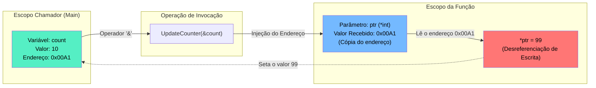

### 1. Visão Geral

No ecossistema Go, todas as passagens de argumentos para funções são, por definição estrita, **passagens por valor** (cópias na *Stack*). Funções com ponteiros introduzem a capacidade de passar a cópia de um endereço de memória de 8 bytes (em arquiteturas 64-bits) em vez de copiar o dado adjacente em si. Este design resolve dois gargalos críticos na engenharia de software: a **mutabilidade de estado cruzado** (permitir que uma função altere variáveis que pertencem a um escopo superior ou externo) e a **eficiência e otimização de CPU/Memória** (prevenir que *Structs* ou *Arrays* maciços, com megabytes de tamanho, sejam repetidamente alocados e copiados a cada nova chamada de função). Arquiteturalmente, o uso de ponteiros em funções invoca ativamente o mecanismo de *Escape Analysis* do compilador, que decide se as variáveis devem residir na *Stack* (rápida, efêmera) ou na *Heap* (gerenciada pelo *Garbage Collector*).

---

### 2. Organização por Tópicos

O domínio de funções com ponteiros em Go exige a compreensão das seguintes mecânicas fundamentais:

* **Mutação Simétrica (Passagem de Referência):** A utilização de parâmetros `*Type` combinada com o operador de extração de endereço `&` no escopo chamador para alterar estado remotamente.
* **Otimização de Payload e Auto-Dereferencing:** A passagem de *Structs* pesadas para evitar *overhead* de cópia e a mecânica idiomática do Go que abstrai a desreferenciação explícita de campos.
* **Factories e Escape Analysis:** Funções construtoras que retornam ponteiros de *Structs* recém-instanciadas, forçando o deslocamento seguro da memória da *Stack* para a *Heap*.
* **Proteção de Acesso (Nil Pointers):** A obrigatoriedade de aplicar *Guard Clauses* contra ponteiros nulos antes de desreferenciá-los.

---

### 3. Visualização do Fluxo (Mermaid)



**Implementação Passo a Passo (Diagrama):**

* **A Variável Original (`count`):** Vive no escopo chamador, fisicamente armazenada em um espaço da *Stack* (ex: `0x00A1`).
* **Invocação com `&`:** Não passamos `10` para a função, passamos a coordenada de onde o `10` está guardado através do operador *Address-Of* (`&`).
* **A Cópia do Endereço:** O parâmetro `ptr` na função recebe uma cópia dessa coordenada. O custo de tráfego na rede interna de memória é pífio (8 bytes constantes), seja a variável original um simples `int` ou um buffer de 50MB.
* **Desreferenciação e Mutação (`*ptr`):** O uso do asterisco atua como um "teletransporte". A instrução diz ao *runtime*: "Vá para a memória que este endereço aponta e sobrescreva o que está lá com `99`".

---

### 4 e 5. Exemplos de Código (Idiomático) e Implementação Passo a Passo

#### Tópico A: Mutabilidade e Proteção Contra Nil Pointers

```go
package domain

import "fmt"

// ApplyDiscount altera diretamente o saldo original.
func ApplyDiscount(balance *float64, discount float64) {
	// Padrão Sênior: Proteção estrita contra Nil Pointer Dereference
	if balance == nil {
		fmt.Println("[Erro] Tentativa de mutação em ponteiro nulo abortada.")
		return 
	}

	// *balance = (Lê o valor remoto) - discount
	// O lado esquerdo da atribuição (*balance =) grava no valor remoto.
	*balance = *balance - discount
}

func ExecuteMutation() {
	wallet := 150.00
	
	// Passagem do endereço da variável
	ApplyDiscount(&wallet, 30.00)
	
	fmt.Printf("Saldo mutado: %.2f\n", wallet) // Imprime: 120.00
	
	// Chamada insegura contida pelo Fail-Fast
	ApplyDiscount(nil, 10.00) 
}

```

**Implementação Passo a Passo:**

* **`balance *float64`:** A assinatura exige explicitamente um ponteiro.
* **`if balance == nil`:** Em Go, tentar aplicar `*` (desreferenciar) um ponteiro nulo invoca um colapso imediato do processo (*Panic*). Funções defensivas validam a existência da referência antes de usá-la.
* **A Matemática Desreferenciada (`*balance = *balance - discount`):** Lemos os dados localizados no endereço, processamos a subtração matematicamente, e enviamos a nova carga de volta pelo mesmo canal (ponteiro), substituindo o valor original de forma global para a aplicação.

#### Tópico B: Eficiência de Memória e Auto-Dereferencing de Structs

```go
package domain

import "fmt"

// HeavyData modela um payload grande (Ex: 10KB na memória).
type HeavyData struct {
	ID      string
	Payload [10240]byte 
}

// ProcessPayload evita a cópia de 10KB passando apenas a referência (8 bytes).
func ProcessPayload(data *HeavyData) {
	if data == nil {
		return
	}

	// Açúcar sintático do Go: Não precisamos fazer (*data).ID
	// O compilador auto-desreferencia ponteiros de structs.
	data.ID = "PROCESSADO_200"
}

func ExecuteOptimization() {
	// A struct é gerada na memória
	document := HeavyData{ID: "DOC_001"}

	// Em vez de copiar o bloco todo, passamos um elo direto.
	ProcessPayload(&document)
	
	fmt.Println(document.ID) // Imprime: PROCESSADO_200
}

```

**Implementação Passo a Passo:**

* **O Problema Invisível de Custo:** Se a assinatura fosse `func ProcessPayload(data HeavyData)`, o Go alocaria silenciosamente novos 10KB de RAM a cada vez que essa função fosse chamada, derrubando os *caches* L1/L2 do processador.
* **Auto-Dereferencing (`data.ID`):** Em linguagens clássicas como C++, para acessar um atributo dentro de um ponteiro de estrutura, usaríamos o operador *Arrow* (`data->ID`). O Go foi desenhado para maior ergonomia; quando você acessa o atributo de um ponteiro de *struct*, o compilador embute o operador de desreferenciação `(*data).ID` automaticamente nos bastidores, limpando a legibilidade do código.

#### Tópico C: Escape Analysis e Retorno de Ponteiros (Factories)

```go
package domain

// DatabaseConnection representa uma entidade de longa duração.
type DatabaseConnection struct {
	Host string
	Port int
}

// NewConnection é uma fábrica (Factory). Retorna um ponteiro da conexão alocada.
func NewConnection(host string, port int) *DatabaseConnection {
	// 'conn' nasce teoricamente na Stack local desta função.
	conn := DatabaseConnection{
		Host: host,
		Port: port,
	}

	// Retornamos o endereço físico de 'conn'.
	return &conn
}

```

**Implementação Passo a Passo:**

* **A Falha de C/C++ Superada:** Em linguagens antigas, `conn` seria instanciado na pilha (*Stack*) da função `NewConnection`. Ao retornar `&conn`, a função terminaria, a *Stack* seria destruída e o endereço apontaria para o "vazio" (Dangling Pointer), causando colapsos randômicos no sistema futuramente.
* **Escape Analysis do Go:** O compilador do Go é brilhante nesse cenário. Durante a compilação (fase estática), ele roda um algoritmo que detecta o fluxo das variáveis. Ele analisa e conclui: *"A variável `conn` está sendo retornada como ponteiro para um escopo superior. Ela não pode morrer aqui"*.
* **Ação Corretiva do Compilador:** O Go impede silenciosamente que `conn` seja criada na *Stack*. Ele eleva essa alocação para a **Heap** (memória central gerenciada pelo *Garbage Collector*). Dessa forma, o ponteiro retornado permanece infinitamente seguro e acessível no sistema. É por isso que você pode retornar endereços de variáveis locais livremente em Go sem medos arquiteturais.