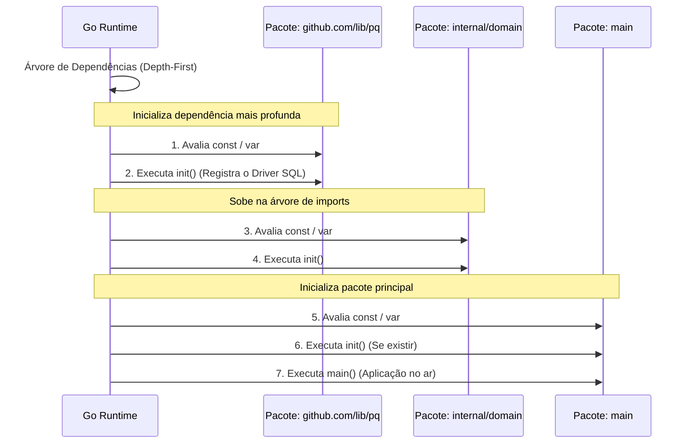

### 1. Visão Geral

No ecossistema Go, `init` é uma função reservada pelo *runtime* da linguagem que executa inicializações de estado **antes** que a função `main` seja invocada. Diferente de funções regulares, `init` não aceita argumentos, não retorna valores e é matematicamente impossível invocá-la explicitamente no código (`init()` causará um erro de compilação). O problema central que o `init` resolve é a preparação de contexto global que não pode ser resolvida em uma simples atribuição de variável (ex: popular um *Map* complexo com cálculos prévios) e a execução de efeitos colaterais (Side Effects) cruciais para a arquitetura, como o registro em tempo de inicialização de *drivers* de banco de dados ou decodificadores de formato. Contudo, na engenharia Sênior, o uso de `init` é tratado com extrema cautela, pois introduz mutação de estado global implícita, dificultando os testes unitários e obscurecendo o fluxo de execução (Magic Behavior).

---

### 2. Organização por Tópicos

O domínio sobre funções `init` subdivide-se nas seguintes mecânicas fundamentais:

* **Mecânica de Ordem e Multiplicidade:** As regras estritas e determinísticas de como o *runtime* resolve a ordem de execução de pacotes, arquivos e declarações múltiplas de `init`.
* **Inicialização de Estado Complexo:** A alocação e cálculo em memória de variáveis em nível de pacote (*Package-Level Variables*) que exigem iterações ou invocações de outras funções.
* **O Padrão de Registro (Registry Pattern):** A utilização de *Blank Imports* (`_`) para invocar exclusivamentes os efeitos colaterais de um `init`, vital para a extensibilidade de interfaces nativas (ex: `database/sql`).

---

### 3. Visualização do Fluxo (Mermaid)



**Implementação Passo a Passo (Diagrama):**

* **Resolução Bottom-Up (Depth-First):** O Go lê a árvore de dependências a partir das folhas. O pacote `main` é sempre o último a ser inicializado. Se `main` importa `domain`, e `domain` importa `driver`, o pacote `driver` é garantidamente inicializado por completo primeiro.
* **Avaliação Léxica Local:** Dentro de cada pacote, antes de rodar o `init()`, o compilador aloca as constantes e variáveis globais daquele arquivo.
* **Singleton Implícito:** Mesmo se 50 arquivos diferentes importarem o `driver`, as variáveis globais e a função `init()` daquele pacote serão executadas **exatamente uma vez** durante todo o ciclo de vida do processo.

---

### 4 e 5. Exemplos de Código (Idiomático) e Implementação Passo a Passo

#### Tópico A: Múltiplos Inits e Restrições de Invocação

```go
package domain

import "fmt"

// O Go permite múltiplas funções init no mesmo pacote e até no mesmo arquivo.
// Elas executam na ordem exata de declaração léxica (de cima para baixo).
func init() {
	fmt.Println("[Init 1] Configurando parâmetros base...")
}

func init() {
	fmt.Println("[Init 2] Aplicando sobrescritas de ambiente...")
}

func ExecuteStartup() {
	fmt.Println("Executando lógica principal da aplicação.")
	
	// Erro de compilação: undefined: init
	// init() 
}

```

**Implementação Passo a Passo:**

* **`func init() { ... }`:** Note que não há conflito de identificador (*redeclaration error*), o que seria ilegal para qualquer outra função. O compilador renomeia internamente esses identificadores (`init.0`, `init.1`) para empilhá-los na inicialização.
* **A Regra de Ordem (Arquivo e Pacote):** Se você tem um pacote com os arquivos `a.go` e `z.go`, e ambos possuem `init()`, o *runtime* do Go rodará o `init` de `a.go` primeiro por ordem alfabética de arquivo, e depois o de `z.go`. **Senior Warning:** Nunca projete a arquitetura do seu software dependendo da ordem alfabética dos arquivos. Se um `init` depende do resultado de outro `init`, eles devem ser explicitamente chamados ou fundidos.
* **Invocação Bloqueada (`init()`):** Uma vez que a fase de *startup* do binário passa para a função `main`, os ponteiros de função para os blocos `init` são descartados (e em alguns casos a memória é coletada pelo GC), prevenindo mutações acidentais por chamadas duplas no meio da execução.

#### Tópico B: Inicialização de Estado Global Complexo

```go
package config

import (
	"log"
	"os"
	"strings"
)

// SupportedCodecs exige lógica condicional para ser construído.
var SupportedCodecs map[string]bool

// systemEnv é capturado uma única vez na inicialização
var systemEnv string

func init() {
	// A inicialização de mapas requer a função make(), que não pode ser
	// executada diretamente na raiz de declaração se envolver laços lógicos.
	SupportedCodecs = make(map[string]bool)

	// Simulação de injeção de codecs dinâmicos via variável de ambiente
	envCodecs := os.Getenv("APP_CODECS")
	if envCodecs == "" {
		envCodecs = "json,xml" // Fallback seguro
	}

	for _, codec := range strings.Split(envCodecs, ",") {
		SupportedCodecs[strings.TrimSpace(codec)] = true
	}

	systemEnv = os.Getenv("APP_ENV")
	log.Printf("[Init] Inicialização em ambiente: %s. Codecs injetados.", systemEnv)
}

```

**Implementação Passo a Passo:**

* **`var SupportedCodecs map[string]bool`:** A variável é declarada em escopo de pacote (nascendo como `nil`).
* **Mutação no `init`:** Dentro da função, realizamos o `make` (alocando a memória na *Heap*) e rodamos laços `for` e checagens `if`, operações que são sintaticamente ilegais no nível de pacote superior (fora de funções).
* **Proteção contra *Race Conditions*:** Inicializar dados no `init` garante segurança de concorrência inerente (*thread-safety*). Como o `init` roda de forma sequencial na Goroutine primordial (antes de qualquer outra instrução poder despachar rotinas assíncronas via `go`), não há risco de duas Goroutines tentarem ler e escrever no mapa `SupportedCodecs` simultaneamente durante o momento do seu nascimento.

#### Tópico C: O Padrão de Registro (Side-Effects e Blank Imports)

```go
package storage

import "fmt"

// DriverFactory é a assinatura esperada para criar conexões.
type DriverFactory func(dsn string) string

// registry é privado. Ninguém fora deste arquivo pode adulterá-lo diretamente.
var registry = make(map[string]DriverFactory)

// Register é a API pública fornecida para que os módulos se auto-inscrevam.
func Register(name string, factory DriverFactory) {
	if _, exists := registry[name]; exists {
		panic(fmt.Sprintf("driver SQL '%s' já está registrado", name))
	}
	registry[name] = factory
}

// ------------------------------------------------------------------
// Em outro arquivo: internal/storage/postgres/postgres.go
// ------------------------------------------------------------------

// init do pacote filho. Este é o Efeito Colateral.
func init() {
	// O pacote postgres chama o registro global ao ser lido pelo compilador.
	Register("postgres", func(dsn string) string {
		return "[PostgreSQL Connection: " + dsn + "]"
	})
}

```

**Implementação Passo a Passo:**

* **A Mágica do Registro Global:** O pacote raiz `storage` mantém um mapa isolado de construtores (`registry`). Ele não sabe que o "PostgreSQL" ou "MySQL" existem; ele apenas fornece a função `Register`.
* **A Auto-Inscrição:** O pacote `postgres` possui seu próprio `init`. Quando o desenvolvedor faz um **Blank Import** (`import _ "projeto/internal/storage/postgres"`) lá na função `main`, o compilador do Go é instruído a executar o `init` do Postgres, mesmo que nenhuma de suas funções seja chamada diretamente.
* **Inversão de Dependência Extrema:** É assim que o famoso pacote `database/sql` nativo do Go funciona. O *Blank Import* força o `init()` do driver (ex: `github.com/lib/pq`) a rodar. O driver injeta sua fábrica dentro do mapa do pacote nativo. Quando o usuário digita `sql.Open("postgres")`, o pacote nativo consulta o mapa, encontra a fábrica que foi depositada invisivelmente pelo `init` do driver, e instancia a conexão.