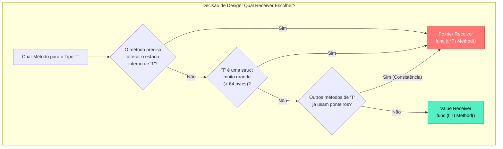

### 1. Visão Geral

No ecossistema Go, a linguagem descarta completamente o conceito de "classes" da Orientação a Objetos clássica, adotando uma abordagem ortogonal para atrelar comportamento a dados: os **Métodos**. Arquiteturalmente, um método no Go é apenas uma função estrita que declara um parâmetro especial adicional, chamado de **Receiver** (Receptor), posicionado entre a palavra-chave `func` e o nome do método. O problema central que os métodos resolvem é o encapsulamento de domínio e a viabilização do polimorfismo via Interfaces. Ao atrelar funções a tipos específicos, evitamos a poluição do *namespace* do pacote com dezenas de funções genéricas (ex: `UpdateUser(u *User)` torna-se `u.Update()`), organizando lógicas complexas ao redor das estruturas de dados que elas manipulam, mantendo tempos de compilação ínfimos e forte localidade de cache.

---

### 2. Organização por Tópicos

O domínio profundo sobre métodos em Go é alicerçado nas seguintes mecânicas fundamentais:

* **A Dualidade dos Receivers (Value vs Pointer):** A escolha arquitetural crítica entre receber uma cópia imutável do objeto (Value Receiver) ou o endereço de memória para mutação de estado (Pointer Receiver).
* **Açúcar Sintático (Auto-Referencing / Dereferencing):** A mecânica nativa do compilador que simplifica a invocação de métodos, abstraindo o uso explícito de `&` e `*` ao chamar métodos a partir de instâncias.
* **Extensão de Tipos Primitivos:** A capacidade de atrelar comportamentos a tipos nativos definidos pelo usuário (alias de `int`, `string`, etc.), viabilizando padrões como *Enums* ricos.
* **Method Sets e Interfaces:** A regra estrita de que tipos instanciados por valor não satisfazem interfaces cujos métodos requerem receivers de ponteiro.

---

### 3. Visualização do Fluxo (Mermaid)



**Implementação Passo a Passo (Diagrama):**

* **Mutação:** Se a resposta for sim, o *Pointer Receiver* é obrigatório. Sem ele, a alteração ocorrerá apenas em uma cópia local que será destruída ao fim da execução do método.
* **Performance (Tamanho da Struct):** Mesmo para métodos *read-only* (apenas leitura), se a *Struct* for gigante (ex: conter arrays megabytes dentro), usar *Value Receiver* causará o esgotamento da *Stack* devido a cópias sucessivas. O uso do ponteiro (8 bytes) é exigido para performance.
* **Consistência do Method Set:** Uma regra Sênior no Go: se uma struct possui 5 métodos e 1 deles precisa ser de ponteiro, projete todos os 5 como ponteiros para manter a consistência da API e evitar falhas imprevisíveis de implementação de interfaces.

---

### 4 e 5. Exemplos de Código (Idiomático) e Implementação Passo a Passo

#### Tópico A: Value Receivers, Pointer Receivers e Auto-Dereferencing

```go
package domain

import "fmt"

type Wallet struct {
	Balance float64
}

// Value Receiver: Recebe uma cópia isolada da Wallet original.
func (w Wallet) GetBalance() float64 {
	// Mutação inútil: altera apenas a cópia local, não a Wallet original.
	w.Balance += 0.0001 
	return w.Balance
}

// Pointer Receiver: Recebe a referência de memória da Wallet original.
func (w *Wallet) Deposit(amount float64) {
	// 'w.Balance' é auto-desreferenciado pelo compilador Go.
	w.Balance += amount
}

func ExecuteMethods() {
	// Instanciado por VALOR
	myWallet := Wallet{Balance: 100.0}

	// 1. Auto-Referencing: O Go automaticamente converte 'myWallet.Deposit(50)' 
	// em '(&myWallet).Deposit(50)' para satisfazer o Pointer Receiver.
	myWallet.Deposit(50.0)

	// 2. O GetBalance opera sobre a cópia e retorna 150.0.
	fmt.Printf("Saldo Final: %.2f\n", myWallet.GetBalance())
}

```

**Implementação Passo a Passo:**

* **`func (w Wallet) GetBalance()`:** A sintaxe do receiver fica antes do nome do método. A variável `w` torna-se disponível no escopo da função. Em um Value Receiver, a integridade do estado original está garantida; é impossível causar *side-effects* indesejados no chamador.
* **Açúcar Sintático (`myWallet.Deposit(50.0)`):** Em linguagens rígidas como C/C++, se você instanciar a variável por valor e tentar chamar um método de ponteiro, o código falhará sem o uso explícito de `&`. O Go implementa o *Auto-Referencing*: ele nota que `Deposit` exige um `*Wallet` e converte secretamente e injeta o ponteiro pra você. O inverso (*Auto-Dereferencing*) também ocorre se você tiver um ponteiro chamando um Value Receiver.

#### Tópico B: Anexando Comportamento a Tipos Nativos (Alias)

```go
package domain

import "fmt"

// Go proíbe criar métodos em tipos padrão como 'int' ou 'string'.
// Solução: Declarar um 'Defined Type' baseado no tipo nativo.
type HTTPStatus int

// Constants atuam como um Enum para o nosso tipo customizado
const (
	StatusOK       HTTPStatus = 200
	StatusNotFound HTTPStatus = 404
)

// Agora podemos atrelar métodos a tipos primitivos que abstraem regras de domínio.
func (s HTTPStatus) IsSuccess() bool {
	return s >= 200 && s < 300
}

func (s HTTPStatus) String() string {
	switch s {
	case StatusOK:
		return "OK"
	case StatusNotFound:
		return "Not Found"
	default:
		return "Unknown"
	}
}

func ExecutePrimitiveMethods() {
	responseCode := StatusNotFound
	
	// Orientação a objetos aplicada diretamente em um tipo numérico básico
	if !responseCode.IsSuccess() {
		fmt.Printf("Erro de requisição: %s (%d)\n", responseCode.String(), responseCode)
	}
}

```

**Implementação Passo a Passo:**

* **`type HTTPStatus int`:** A criação de um novo tipo. Para o compilador de tipagem forte do Go, um `HTTPStatus` e um `int` são totalmente incompatíveis a partir deste momento sem conversão explícita.
* **Extensão de Domínio:** Esta é uma das características mais poderosas do Go em comparação com linguagens baseadas unicamente em Classes. Podemos embutir regras de negócios estritas (`IsSuccess()`) diretamente em variáveis leves nativas de processador (inteiros, floats, strings), eliminando a necessidade de envolver lógicas simples em *Structs* pesadas.

#### Tópico C: Method Sets e o Bloqueio de Interfaces

```go
package domain

import "fmt"

// Mutator é uma interface que exige a implementação do método Mutate()
type Mutator interface {
	Mutate()
}

type Record struct {
	Name string
}

// O método pertence estritamente ao tipo *Record (Ponteiro)
func (r *Record) Mutate() {
	r.Name = "Mutado"
}

func ExecuteInterfaces() {
	recValue := Record{Name: "Original"}
	recPointer := &Record{Name: "Original"}

	// 1. VÁLIDO: O tipo *Record satisfaz a interface Mutator
	var m1 Mutator = recPointer 
	m1.Mutate()

	// 2. INVÁLIDO: O tipo Record (Valor) NÃO satisfaz a interface Mutator.
	// O compilador emitirá o erro clássico:
	// "Record does not implement Mutator (Mutate method has pointer receiver)"
	
	// var m2 Mutator = recValue // <- Causa quebra de compilação
	
	fmt.Println(recPointer.Name)
}

```

**Implementação Passo a Passo:**

* **A Armadilha do Method Set:** O conjunto de métodos (*Method Set*) de um ponteiro `*T` é composto por todos os métodos declarados com receiver `*T` **e** `T`. O conjunto de métodos de um valor `T` contém **apenas** métodos declarados com `T`.
* **A Causa Técnica:** Por que o Go bloqueia o caso `m2` se ele possui o *Auto-Referencing*? Porque a variável instanciada por valor (`recValue`) que você tentou passar para a interface pode, em muitos casos, não ser endereçável na memória (ex: valores extraídos de um *map*, retornos literais de função). Se o Go permitisse isso, o método `Mutate()` alteraria uma cópia invisível injetada na interface, o que criaria falhas silenciosas na aplicação onde o desenvolvedor jura que mutou a variável, mas o valor original continuou inalterado. O compilador corta o mal pela raiz exigindo a passagem do ponteiro explícito.