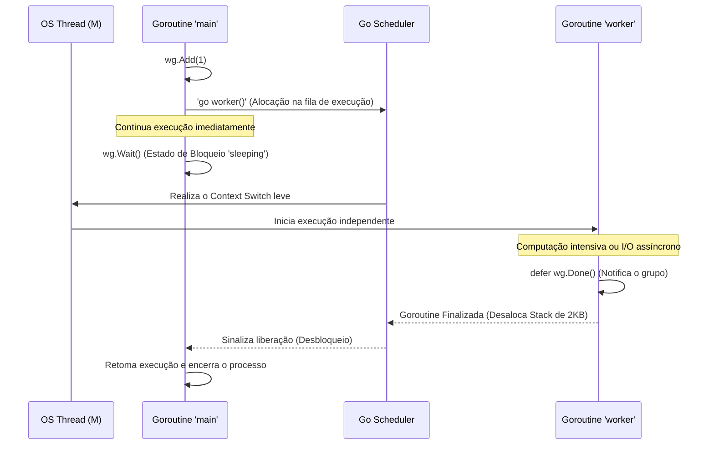

### 1. Visão Geral

No ecossistema Go, **Goroutines** são unidades fundamentais de concorrência. Elas não são *threads* tradicionais do sistema operacional (OS Threads), mas sim *threads* em nível de espaço de usuário (user-space threads) gerenciadas internamente pelo *Go Runtime Scheduler* utilizando o modelo **M:N** (onde $M$ goroutines são multiplexadas e escalonadas sobre $N$ OS threads ativas). O problema central que as goroutines resolvem é a limitação extrema de escalabilidade das linguagens clássicas: enquanto uma *OS Thread* padrão no Java ou C++ exige no mínimo 1MB a 2MB de memória para nascer e sofre com latências altíssimas de *context switching* na CPU, uma goroutine nasce consumindo inicialmente apenas **~2KB** de *Stack* (que cresce e encolhe dinamicamente). Isso permite que um engenheiro de software crie centenas de milhares de tarefas simultâneas (como *handlers* HTTP ou processadores de fila) na mesma máquina, resolvendo o problema $C10K$ nativamente e otimizando o uso de processadores multi-core de forma transparente.

---

### 2. Organização por Tópicos

O domínio arquitetural sobre goroutines subdivide-se nas seguintes mecânicas fundamentais:

* **Mecânica de Disparo e a Tirania da Main:** A assincronicidade alcançada pela *keyword* `go` e a regra de ouro de que a goroutine primordial (`main`) não espera instâncias filhas terminarem por padrão.
* **Orquestração Determinística (`sync.WaitGroup`):** O padrão idiomático e estrito para bloquear o fluxo principal e sincronizar a conclusão de lotes de goroutines (Fan-Out).
* **Segurança de Memória e Data Races:** A contenção de falhas em acessos concorrentes ao mesmo endereço de memória utilizando *Mutexes* e as ferramentas de diagnóstico de compilação.

---

### 3. Visualização do Fluxo (Mermaid)



**Implementação Passo a Passo (Diagrama):**

* **Registro (`go worker()`):** A palavra-chave `go` não executa a função imediatamente. Ela empacota o ponteiro da função e seus argumentos e os joga na fila local de execução (Local Run Queue) de um processador virtual (P) gerenciado pelo Scheduler.
* **Não-bloqueio:** O `main` não espera. Se houver uma linha logo abaixo do comando `go`, ela é executada no mesmo microssegundo.
* **Bloqueio Explícito (`wg.Wait()`):** A goroutine `main` entra em estado de suspensão, liberando a OS Thread para que outras goroutines (como o `worker`) possam rodar.
* **Desempilhamento e Desbloqueio:** O `worker` termina sua carga de trabalho, chama `wg.Done()`, e o Scheduler acorda o `main` para prosseguir.

---

### 4 e 5. Exemplos de Código (Idiomático) e Implementação Passo a Passo

#### Tópico A: Disparo Simples e a Regra do Ciclo de Vida

```go
package domain

import (
	"fmt"
	"time"
)

func fetchExternalAPI(id int) {
	time.Sleep(100 * time.Millisecond) // Simula latência de rede
	fmt.Printf("Processo %d finalizado.\n", id)
}

func ExecuteOrphanGoroutine() {
	// A palavra-chave 'go' despacha a função para rodar em background.
	go fetchExternalAPI(1)
	go fetchExternalAPI(2)

	fmt.Println("Goroutines despachadas.")
	
	// SE NÃO HOUVER BLOQUEIO AQUI, A FUNÇÃO TERMINA E MATA AS GOROUTINES.
	// time.Sleep(200 * time.Millisecond) // Anti-pattern (gambiarra)
}

```

**Implementação Passo a Passo:**

* **A Tirania da Goroutine `main`:** Em Go, quando a função `main()` (ou no caso de testes, a Goroutine primária) atinge sua última linha de código e retorna (ou executa `os.Exit`), o *runtime* do Go aborta **impiedosamente e instantaneamente** todas as demais goroutines ativas no sistema.
* **O Problema do `time.Sleep`:** Em códigos de iniciantes, usa-se `time.Sleep` no final da função para "dar tempo" para as filhas rodarem. Isso é um erro arquitetural gravíssimo, pois não há garantia de latência de rede ou de CPU. O tempo pode ser excessivo (desperdício de CPU) ou insuficiente (tarefa cancelada pela metade).

#### Tópico B: Sincronização Idiomática com WaitGroup

```go
package domain

import (
	"fmt"
	"sync"
	"time"
)

func ProcessBatch() {
	// 1. Instanciação do WaitGroup
	var wg sync.WaitGroup
	
	tasks := []string{"Email_A", "Email_B", "Email_C"}

	for _, task := range tasks {
		// 2. Registramos +1 tarefa PENDENTE antes de despachar a Goroutine
		wg.Add(1)
		
		go func(t string) {
			// 3. Garantia de baixa independentemente de sucesso, erro ou panic
			defer wg.Done()
			
			// Processamento simulado
			time.Sleep(50 * time.Millisecond)
			fmt.Printf("Tarefa concluída: %s\n", t)
		}(task) // Injeção de escopo para evitar condições de corrida em loops
	}

	// 4. Bloqueia o fluxo principal até que o contador chegue exatamente a zero
	wg.Wait()
	fmt.Println("Todo o lote foi processado com sucesso. Sistema liberado.")
}

```

**Implementação Passo a Passo:**

* **`var wg sync.WaitGroup`:** Estrutura primitiva de concorrência baseada em um contador atômico protegido internamente.
* **A Posição Crítica do `wg.Add(1)`:** Deve ser chamado **invariavelmente fora e antes** da invocação da goroutine. Se você colocar `wg.Add(1)` dentro do `go func()`, existe a chance microscópica do `wg.Wait()` ser alcançado e avaliado como `0` pelo *Scheduler* antes mesmo da OS Thread ter tido tempo de iniciar a primeira goroutine, resultando em falsos positivos.
* **`defer wg.Done()`:** Subtrai atomicamente 1 do contador global. Usar o `defer` é o padrão Sênior obrigatório. Se a lógica dentro da goroutine tiver múltiplos retornos prematuros (`if err != nil { return }`) ou disparar um `panic` capturado por `recover()`, o `defer` garante que o `Wait()` da Main não entre em um bloqueio eterno (*Deadlock*).

#### Tópico C: Data Race e a Proteção via Mutex

```go
package domain

import (
	"fmt"
	"sync"
)

func ExecuteUnsafeVsSafe() {
	var wg sync.WaitGroup
	var globalCounter int
	var mu sync.Mutex // Proteção de Memória

	// Despachando 1000 Goroutines para somar +1 no mesmo endereço de memória
	for i := 0; i < 1000; i++ {
		wg.Add(1)
		go func() {
			defer wg.Done()
			
			// A trava (Lock) garante acesso exclusivo de leitura/escrita.
			mu.Lock()
			
			// Seção Crítica
			globalCounter++ 
			
			mu.Unlock()
		}()
	}

	wg.Wait()
	// Sem o Mutex, o valor final seria randômico (ex: 843, 912), pois
	// operações como X = X + 1 não são atômicas no processador.
	fmt.Printf("Contador Global (Seguro): %d\n", globalCounter) 
}

```

**Implementação Passo a Passo:**

* **A Definição de Data Race:** Ocorre quando duas ou mais goroutines acessam o mesmo endereço de memória simultaneamente e, pelo menos uma delas, está realizando uma operação de escrita (Write). No nível da CPU, a operação `globalCounter++` envolve três etapas: Ler o valor na RAM, somar 1 na Unidade Lógica Aritmética, escrever o novo valor na RAM. Se as threads se entrelaçarem nessas três etapas, atualizações são perdidas.
* **`mu.Lock()` e `mu.Unlock()`:** O *Mutex* (Mutual Exclusion) força a serialização instantânea da Seção Crítica. Se a Goroutine 2 chegar enquanto a Goroutine 1 possui a trava, a Goroutine 2 é posta para "dormir" e removida da OS Thread temporariamente para poupar ciclos de CPU.
* **Race Detector (`go run -race`):** Na engenharia de software Go avançada, o código só vai para produção após a suíte de testes passar pela *flag* `-race`. O *runtime* injeta código para monitorar cada acesso à memória e derrubará a aplicação em teste imediatamente com um relatório de colisão, caso uma variável seja adulterada concorrentemente sem o uso do Mutex (ou de *Channels* e do pacote `sync/atomic`).