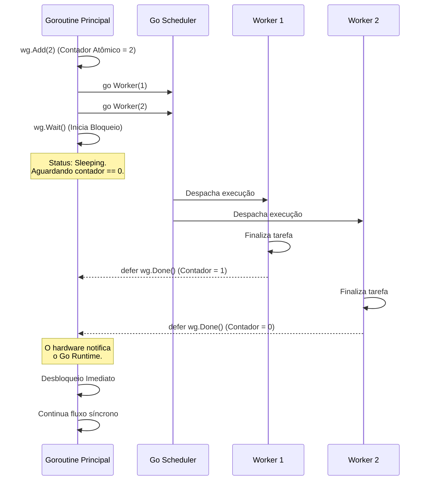

### 1. Visão Geral

No ecossistema Go, o `sync.WaitGroup` é a primitiva de sincronização padrão da biblioteca nativa para orquestrar a concorrência. Ele atua como um contador atômico (thread-safe) em nível de sistema que resolve um problema arquitetural fundamental: bloquear a execução de uma Goroutine (geralmente a `main`) até que uma coleção arbitrária de outras Goroutines conclua seus ciclos de vida. Sem essa barreira de sincronização, o fluxo principal do programa retornaria prematuramente, destruindo as *Stacks* filhas antes que elas terminassem o processamento de I/O ou cálculos em background. O uso estrito e correto desta primitiva elimina a necessidade de *hacks* temporais (como `time.Sleep`) e é o pilar de padrões de design concorrentes avançados, como *Fan-Out* e *Worker Pools*.

---

### 2. Organização por Tópicos

A maestria sobre `sync.WaitGroup` exige o controle das seguintes mecânicas:

* **A Tríade Atômica (`Add`, `Done`, `Wait`):** O ciclo de vida básico de incremento pré-execução, decremento diferido e bloqueio síncrono.
* **Passagem Segura de Memória (No-Copy Rule):** A restrição arquitetural crítica que proíbe a cópia por valor de primitivas do pacote `sync`, exigindo o tráfego restrito de ponteiros.
* **Padrão Fan-In (Fechamento Assíncrono):** A utilização de um WaitGroup dentro de uma Goroutine monitora dedicada para fechar *Channels* de resultados sem causar *Deadlocks* na thread consumidora.

---

### 3. Visualização do Fluxo (Mermaid)



**Implementação Passo a Passo (Diagrama):**

* **Registro Prévio (`wg.Add`):** O contador de tarefas deve obrigatoriamente ser incrementado **antes** da instrução `go`. Se colocado dentro da Goroutine, o *Scheduler* pode avaliar o `wg.Wait()` antes da Goroutine iniciar, resultando em um falso destravamento (Race Condition sintática).
* **Bloqueio (`wg.Wait`):** Interrompe o avanço vertical do código. A Goroutine atual é removida da *OS Thread* e colocada em estado de suspensão, não consumindo ciclos de CPU.
* **Notificação (`wg.Done`):** Por debaixo dos panos, executa um `Add(-1)` utilizando instruções atômicas de processador (CAS - Compare-And-Swap). Quando o valor atinge `0`, um sinal de *broadcast* acorda todas as Goroutines que estavam travadas no `Wait()`.

---

### 4 e 5. Exemplos de Código (Idiomático) e Implementação Passo a Passo

#### Tópico A: O Padrão Base de Iteração

```go
package concurrency

import (
	"fmt"
	"sync"
	"time"
)

func ExecuteBasicBatch() {
	var wg sync.WaitGroup
	batchIDs := []int{101, 102, 103}

	for _, id := range batchIDs {
		// PADRÃO SÊNIOR: Add(1) explicitamente antes do despacho
		wg.Add(1)
		
		go func(taskID int) {
			// PADRÃO SÊNIOR: Done() atrelado a um defer para garantir a 
			// execução mesmo se ocorrerem panics ou retornos prematuros.
			defer wg.Done()

			fmt.Printf("Processando pacote: %d\n", taskID)
			time.Sleep(50 * time.Millisecond) // Simula carga
			
		}(id) // Injeção de escopo para a variável do loop
	}

	wg.Wait()
	fmt.Println("Lote processado inteiramente. Prosseguindo...")
}

```

**Implementação Passo a Passo:**

* **`var wg sync.WaitGroup`:** Diferente de mapas ou *channels*, não usamos `make()` para inicializar um WaitGroup. O seu *Zero Value* já é perfeitamente funcional e pronto para uso.
* **`wg.Add(1)` no Loop:** Poderíamos fazer `wg.Add(len(batchIDs))` de uma só vez antes do loop? Sim. Porém, colocar `Add(1)` imediatamente acima do `go func()` é o padrão ouro na engenharia Go. Torna a base de código mais resiliente a refatorações (se o bloco de código for movido, o controle atômico viaja junto).
* **`defer wg.Done()`:** Inegociável. Se a função contiver lógicas de banco de dados e lançar um erro no meio, forçando um `return`, ou se causar um `panic` recuperável, o `defer` assegura que a subtração ocorrerá. Sem ele, o `Wait()` ficaria esperando para sempre, gerando um *Deadlock* e derrubando a aplicação inteira no *runtime*.

#### Tópico B: Regra do No-Copy (Passagem Segura de Primitivas)

```go
package concurrency

import (
	"fmt"
	"sync"
)

// ProcessRecord exige um ponteiro para o WaitGroup.
// Passar o WaitGroup por valor copiaria o estado do Mutex interno, corrompendo a barreira.
func ProcessRecord(id int, wg *sync.WaitGroup) {
	defer wg.Done()
	fmt.Printf("Gravando no DB: registro %d\n", id)
}

func ExecutePointerPassing() {
	var wg sync.WaitGroup

	for i := 1; i <= 3; i++ {
		wg.Add(1)
		// O operador '&' injeta a referência de memória centralizada
		go ProcessRecord(i, &wg)
	}

	wg.Wait()
}

```

**Implementação Passo a Passo:**

* **A Anatomia do `sync.WaitGroup`:** Internamente, esta *Struct* contém dois valores cruciais em nível de hardware: `noCopy` (um marcador de segurança) e state (os contadores atômicos).
* **O Perigo do `func(wg sync.WaitGroup)`:** Se a assinatura da função filha não tivesse o `*`, o Go passaria o WaitGroup por valor (copiando a Struct inteira). A função executaria `wg.Done()` em uma **cópia local** que nasceu e morreu na *Stack* daquela Goroutine. O `wg.Wait()` original na Main nunca seria notificado do decremento, travando a CPU para sempre.
* **O Linter Oculto (`go vet`):** O compilador do Go carrega uma ferramenta chamada `vet`. Se você tentar passar um WaitGroup por valor, o comando `go vet` falhará o build da sua CI/CD apontando: *assignment copies lock value to wg*.

#### Tópico C: Padrão Fan-In (Coleta Assíncrona de Resultados)

```go
package concurrency

import (
	"fmt"
	"sync"
)

func ExecuteFanInPattern() {
	var wg sync.WaitGroup
	results := make(chan string, 3)

	// Fase 1: Fan-Out (Disparo do processamento paralelo)
	for i := 1; i <= 3; i++ {
		wg.Add(1)
		go func(id int) {
			defer wg.Done()
			results <- fmt.Sprintf("Processado: Item %d", id)
		}(i)
	}

	// Fase 2: A Goroutine Monitora (Evitando o Deadlock)
	// Esta goroutine isolada espera o trabalho terminar e fecha o canal.
	go func() {
		wg.Wait()
		close(results) // Sinaliza aos leitores que não haverá mais dados
	}()

	// Fase 3: Fan-In (Coleta e agregação na rotina principal)
	// O loop range escuta o canal e termina naturalmente quando ele for fechado.
	for result := range results {
		fmt.Println(result)
	}
}

```

**Implementação Passo a Passo:**

* **O Problema de Esperar a Fila (`wg.Wait()`):** Num fluxo inicial, um desenvolvedor poderia colocar `wg.Wait()` logo abaixo do laço `for` original, seguido de `close(results)`. Isso funcionaria se o canal fosse bufferizado o suficiente. Mas se fosse um canal não-bufferizado, o *Worker* bloquearia ao tentar enviar o resultado para o canal, enquanto a *Main* estaria bloqueada no `wg.Wait()`, e ninguém leria o canal. *Deadlock* instantâneo.
* **A Goroutine Monitora:** A técnica mais refinada é criar uma Goroutine anônima cujo único propósito na vida é fazer o `wg.Wait()`. Quando todos os *Workers* finalizarem, ela alcança a próxima linha e executa `close(results)`.
* **Consumo Limpo (`range results`):** O fluxo principal fica livre para imediatamente começar a ler o canal via `for result := range`. À medida que as respostas caem no canal, a *Main* as imprime. Quando a Goroutine Monitora fecha o canal, o `range` entende a mensagem de encerramento (EOF) e destrava o código, permitindo a finalização segura e elegante do processo.