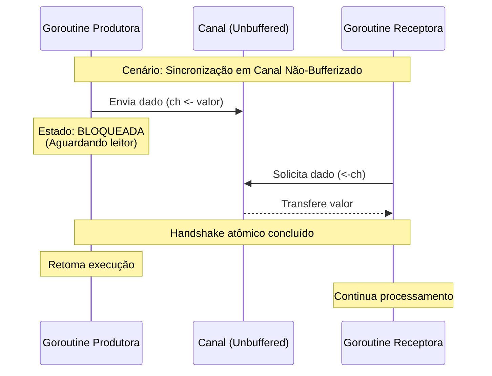

### Visão Geral

Canais (Channels) são conduítes tipados e *thread-safe* no Go que permitem a transferência de dados e a sincronização de execução entre diferentes *goroutines* por meio do operador `<-`.

No ecossistema Go, os canais resolvem a complexidade inerente da concorrência clássica. Em vez de exigir que o desenvolvedor gerencie explicitamente bloqueios de memória (como *Mutexes*) para evitar condições de corrida em estados compartilhados, o Go adota o modelo CSP (*Communicating Sequential Processes*). O princípio central é: *"Não se comunique compartilhando memória; em vez disso, compartilhe memória se comunicando"*. Isso garante que, em qualquer momento, apenas uma *goroutine* tenha a propriedade e o acesso seguro a um dado transmitido.

---

### Organização por Tópicos

* **Tópico 1: Canais Não-Bufferizados (Unbuffered):** Comunicação síncrona, operando simultaneamente como transporte de dados e barreira de sincronização (*handshake*).
* **Tópico 2: Canais Bufferizados (Buffered):** Filas em memória com capacidade limitada, permitindo comunicação assíncrona até que o limite de capacidade seja atingido.
* **Tópico 3: Canais Direcionais (Channel Directions):** Restrição de permissões (apenas leitura ou apenas escrita) nas assinaturas de função para garantir segurança em tempo de compilação.
* **Tópico 4: Fechamento e Iteração (Close & Range):** O padrão seguro de encerramento da transmissão de dados e o consumo contínuo da fila pelo receptor.

---

### Visualização do Fluxo (Mermaid)



**Implementação Passo a Passo (Fluxo Visual):**

* **A Mecânica do Bloqueio:** O diagrama demonstra que, em um canal sem buffer, o envio não é uma operação de "dispare e esqueça". A *Goroutine Produtora* cede ativamente a CPU (bloqueia) até que a *Goroutine Receptora* se conecte à outra extremidade do canal.
* **Sincronização:** A transferência de dados garante que ambas as rotinas se encontrem em um ponto exato do tempo (o *handshake*). Imediatamente após a troca, as duas são desbloqueadas e seguem independentes.

---

### Exemplos de Código (Idiomático)

#### Tópico 1: Canais Não-Bufferizados (Unbuffered)

```go
package main

import (
	"fmt"
	"time"
)

func processar(id int, done chan bool) {
	fmt.Printf("Processo %d executando...\n", id)
	time.Sleep(1 * time.Second)
	done <- true
}

func main() {
	done := make(chan bool)

	go processar(1, done)

	<-done
	fmt.Println("Main: Processamento sincronizado com sucesso.")
}

```

**Implementação Passo a Passo:**

* `done := make(chan bool)`: Instancia um canal de booleanos com capacidade zero (comportamento padrão).
* `go processar(1, done)`: Despacha a função em uma *goroutine* concorrente. A função `main` avança para a próxima instrução sem esperar o término desta linha.
* `done <- true`: Dentro da *goroutine*, sinaliza a conclusão. Se a *goroutine* principal ainda não estiver na instrução de leitura, a *goroutine* `processar` ficará travada aqui.
* `<-done`: A *goroutine* `main` exige um dado do canal. Como não armazenamos o resultado em uma variável, o único objetivo aqui é o bloqueio: a execução da `main` aguarda passivamente o valor, impedindo que o programa termine prematuramente.

#### Tópico 2: Canais Bufferizados (Buffered)

```go
package main

import "fmt"

func main() {
	// Cria um canal com buffer para 3 strings
	mensagens := make(chan string, 3)

	mensagens <- "INFO: Sistema iniciado"
	mensagens <- "INFO: Banco conectado"
	mensagens <- "WARN: Cache vazio"
	
	// mensagens <- "ERRO" // Isso causaria um deadlock (buffer cheio) se executado na mesma thread

	fmt.Println(<-mensagens)
	fmt.Println(<-mensagens)
	fmt.Println(<-mensagens)
}

```

**Implementação Passo a Passo:**

* `make(chan string, 3)`: O segundo argumento na função `make` aloca memória para 3 elementos.
* `mensagens <- ...`: Os envios ocorrem na mesma *goroutine* (`main`) e não bloqueiam o programa, porque o canal absorve os dados até seu limite de três mensagens.
* `<-mensagens`: Os dados são retirados na mesma ordem em que entraram (FIFO). Após o consumo do primeiro elemento, abriria espaço para uma nova inserção no buffer.

#### Tópico 3: Canais Direcionais (Channel Directions)

```go
package main

import "fmt"

func produtor(saida chan<- int) {
	saida <- 42
	// value := <-saida // Erro de compilação: leitura negada
}

func consumidor(entrada <-chan int) {
	fmt.Println("Consumido:", <-entrada)
	// entrada <- 10 // Erro de compilação: escrita negada
}

func main() {
	pipeline := make(chan int, 1)

	produtor(pipeline)
	consumidor(pipeline)
}

```

**Implementação Passo a Passo:**

* `chan<- int`: A sintaxe aponta "para" o canal. Restringe a assinatura da função `produtor` para apenas aceitar o envio de dados (*send-only*).
* `<-chan int`: A sintaxe aponta "saindo" do canal. Restringe a assinatura da função `consumidor` para apenas realizar leitura de dados (*receive-only*).
* **Por quê?** Este é o padrão arquitetural no Go para design de APIs robustas. Evita que uma função que deveria apenas ler acabe acidentalmente escrevendo dados (ou fechando um canal indevidamente), garantindo que as regras de acesso sejam validadas em tempo de compilação e não gerem problemas em tempo de execução.

#### Tópico 4: Fechamento e Iteração (Close & Range)

```go
package main

import "fmt"

func gerar(ch chan int) {
	for i := 1; i <= 4; i++ {
		ch <- i * 10
	}
	close(ch) 
}

func main() {
	stream := make(chan int)

	go gerar(stream)

	for valor := range stream {
		fmt.Println("Recebido do stream:", valor)
	}

	fmt.Println("Stream completamente consumido e encerrado.")
}

```

**Implementação Passo a Passo:**

* `close(ch)`: O envio de um sinal interno indicando que não haverá mais transmissões. **Regra de ouro:** Apenas a *goroutine* produtora deve fechar o canal. Enviar dados em um canal já fechado resulta em `panic`.
* `for valor := range stream`: Uma estrutura idiomática de repetição que consome canais até que eles estejam fechados *e* esvaziados de seu conteúdo.
* **O fluxo combinado:** O loop continua recebendo elementos. Quando a *goroutine* produtora aciona o `close`, o `range` entende que os dados acabaram, o loop é interrompido de forma limpa, e o controle volta para o escopo natural da função `main`, evitando qualquer risco de *deadlock* por tentativas de leitura ao infinito.