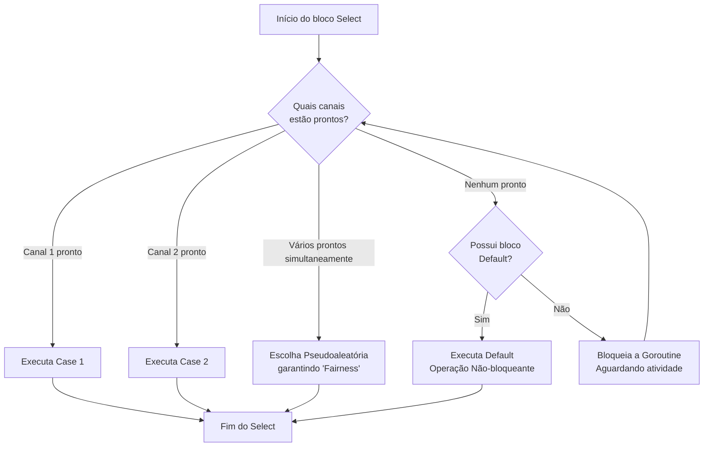

### Visão Geral

A instrução `select` é uma estrutura de controle de fluxo nativa do Go, desenhada especificamente para lidar com operações de concorrência. Análoga a um bloco `switch`, mas operando exclusivamente sobre canais (channels), o `select` permite que uma *goroutine* aguarde em múltiplas operações de envio ou recebimento simultaneamente.

No ecossistema Go, o `select` resolve o problema da **multiplexação de canais**. Sem ele, ler ou escrever em canais de forma sequencial poderia causar bloqueios (*deadlocks*) se um dos canais estivesse ocioso, travando toda a *goroutine*. O `select` introduz resiliência, permitindo implementar padrões avançados como *timeouts*, execução não-bloqueante e cancelamento coordenado (*graceful shutdown*) em aplicações concorrentes de alta performance.

---

### Organização por Tópicos

* **Tópico 1: Multiplexação Básica:** Gerenciamento simultâneo de eventos vindos de múltiplos canais.
* **Tópico 2: Timeout Pattern:** Uso de temporizadores para evitar bloqueios infinitos na espera de respostas.
* **Tópico 3: Operações Não-Bloqueantes:** Utilização da cláusula `default` para tentativas instantâneas de leitura/escrita.
* **Tópico 4: For-Select (Loop Infinito Controlado):** Padrão idiomático para *background workers* e sinalização de parada.

---

### Visualização do Fluxo (Mermaid)



**Implementação Passo a Passo (Fluxo Visual):**

* **Avaliação Simultânea (B):** Diferente de condicionais encadeadas, o `select` avalia todas as operações de canal declaradas nos `cases` ao mesmo tempo.
* **Comportamento de Bloqueio (H):** Se nenhum canal estiver pronto para enviar ou receber dados, e não houver um bloco `default`, a *goroutine* atual entra em estado de *sleep*, cedendo a CPU.
* **Resolução de Conflitos (E):** Se dois ou mais canais estiverem prontos no exato mesmo nanossegundo, o *runtime* do Go escolhe um deles de forma aleatória. Isso evita cenários de *starvation* (onde um canal monopoliza o processamento).
* **Válvula de Escape (G):** A presença de um bloco `default` altera radicalmente o fluxo, transformando o `select` de uma barreira de bloqueio em uma operação de passagem instantânea.

---

### Exemplos de Código (Idiomático)

#### Tópico 1: Multiplexação Básica

```go
package main

import (
	"fmt"
	"time"
)

func main() {
	chAlpha := make(chan string)
	chBeta := make(chan string)

	go func() {
		time.Sleep(2 * time.Second)
		chAlpha <- "Dados do Serviço Alpha"
	}()

	go func() {
		time.Sleep(1 * time.Second)
		chBeta <- "Dados do Serviço Beta"
	}()

	// O select aguarda até que UM dos canais emita um valor
	select {
	case msg := <-chAlpha:
		fmt.Println("Recebido primeiro:", msg)
	case msg := <-chBeta:
		fmt.Println("Recebido primeiro:", msg)
	}
}

```

**Implementação Passo a Passo:**

* `chAlpha` e `chBeta`: Instanciamos dois canais para simular requisições concorrentes a serviços distintos.
* `case msg := <-...`: O `select` se inscreve em ambos os canais. Ele não lê sequencialmente.
* Como a *goroutine* que escreve em `chBeta` possui um *sleep* menor (1s vs 2s), `chBeta` ficará pronto primeiro. O `select` captura a mensagem, executa o bloco correspondente e finaliza. A mensagem de `chAlpha` será ignorada neste contexto de execução única.

#### Tópico 2: Timeout Pattern

```go
package main

import (
	"fmt"
	"time"
)

func fetchS3Object() chan string {
	ch := make(chan string)
	go func() {
		// Simulando uma latência imprevisível de rede
		time.Sleep(4 * time.Second)
		ch <- "Objeto S3 baixado"
	}()
	return ch
}

func main() {
	s3Data := fetchS3Object()

	select {
	case res := <-s3Data:
		fmt.Println("Sucesso:", res)
	case <-time.After(2 * time.Second):
		fmt.Println("Erro: Timeout excedido. Cancelando operação.")
	}
}

```

**Implementação Passo a Passo:**

* `case res := <-s3Data`: Tenta realizar a leitura do processamento principal.
* `case <-time.After(2 * time.Second)`: A função `time.After` retorna um canal que envia um valor após a duração especificada.
* **O Padrão:** O `select` atua como um juiz numa corrida. Se a operação no S3 demorar mais que o limite aceitável de 2 segundos, o canal do temporizador "vence", a *goroutine* retoma o controle e pode logar um erro ou iniciar um fluxo de contingência, impedindo que o servidor trave por requisições zumbis.

#### Tópico 3: Operações Não-Bloqueantes

```go
package main

import "fmt"

func main() {
	filaEmails := make(chan string, 1)

	// Inserindo dado para encher o buffer
	filaEmails <- "alerta_1@sistema.com"

	novoEmail := "alerta_2@sistema.com"

	// Tentativa de escrita não-bloqueante
	select {
	case filaEmails <- novoEmail:
		fmt.Println("Email adicionado à fila.")
	default:
		fmt.Println("Fila cheia. O e-mail", novoEmail, "foi descartado (Drop).")
	}
}

```

**Implementação Passo a Passo:**

* A fila tem capacidade de `1` e já está cheia.
* Em um cenário normal, executar `filaEmails <- novoEmail` diretamente causaria um *deadlock*, pois a *main goroutine* ficaria travada aguardando espaço.
* `default:`: Ao interceptar a operação com um `select` provido de `default`, o Go tenta enviar o dado. Ao detectar que o canal não está pronto para receber, ele cai imediatamente no bloco `default`, permitindo gerenciar o estado da fila em tempo real (como aplicar políticas de *backpressure* ou descarte).

#### Tópico 4: For-Select (Loop Infinito Controlado)

```go
package main

import (
	"fmt"
	"time"
)

func workerNode(done <-chan bool) {
	ticker := time.NewTicker(500 * time.Millisecond)
	defer ticker.Stop()

	for {
		select {
		case <-ticker.C:
			fmt.Println("Executando tarefa de background...")
		case <-done:
			fmt.Println("Sinal de parada recebido. Encerrando worker de forma limpa.")
			return // Sai da goroutine, encerrando o loop
		}
	}
}

func main() {
	shutdownSignal := make(chan bool)

	go workerNode(shutdownSignal)

	// Deixa o worker rodar por um breve período
	time.Sleep(2 * time.Second)

	// Dispara o graceful shutdown
	shutdownSignal <- true
	
	// Pequena pausa para permitir que o worker imprima sua mensagem final
	time.Sleep(100 * time.Millisecond)
	fmt.Println("Programa principal encerrado.")
}

```

**Implementação Passo a Passo:**

* `for { select { ... } }`: Este é possivelmente o padrão de concorrência mais comum em Go. Combina um loop infinito com um bloqueio seletivo.
* `case <-ticker.C:`: O worker executa sua lógica de negócios a cada pulso do temporizador (ex: envio de métricas, limpeza de cache).
* `case <-done:`: Em todas as iterações, o worker escuta o canal de sinalização.
* `return`: Quando `shutdownSignal <- true` é injetado pela `main`, este `case` é ativado e a palavra-chave `return` encerra a função (e consequentemente a *goroutine*), evitando vazamentos de memória e garantindo que arquivos ou conexões abertas no worker possam ser fechadas via `defer`.