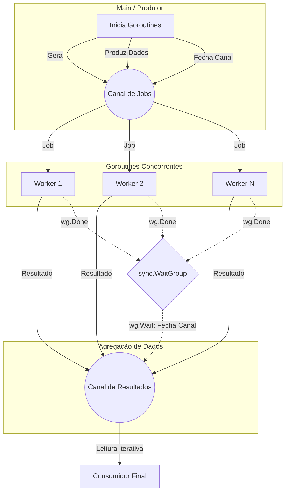

### 1. Visão Geral

O padrão **Worker Pool** (ou Thread Pool em outras linguagens) é um modelo de concorrência onde um número fixo e pré-determinado de *workers* (goroutines no Go) é instanciado para processar um número potencialmente infinito de tarefas (jobs).

No ecossistema do Go, o disparo de goroutines é extremamente barato, o que pode levar ao anti-padrão de criar uma goroutine por requisição ou tarefa. O Worker Pool resolve o problema da **exaustão de recursos** (CPU, Memória, conexões de banco de dados, file descriptors), limitando a concorrência a um teto seguro. Ele garante que o sistema permaneça responsivo sob carga pesada, controlando a taxa de transferência (throughput) através do balanceamento de carga nativo proporcionado pelos *channels*.

---

### 2. Organização por Tópicos

O domínio do padrão Worker Pool em Go exige a compreensão de dois cenários fundamentais:

1. **Implementação Base (Sincronização e Canais):** A estrutura fundamental de distribuição de carga, focada no uso correto de *channels* direcionais (send-only / receive-only), iteração de canais (`range`) e barreiras de sincronização (`sync.WaitGroup`).
2. **Cancelamento e Resiliência (Contexto e Select):** A evolução do padrão para sistemas de produção, onde workers devem respeitar timeouts, sinais de interrupção ou cancelamentos em cascata utilizando o pacote `context` em conjunto com a cláusula `select`.

---

### 3. Visualização do Fluxo (Mermaid)



#### Implementação Passo a Passo (Fluxo Visual)

* **Produtor:** A rotina principal cria um canal com buffer (`Canal de Jobs`) e envia os dados a serem processados. Crucial: O produtor é responsável por **fechar** este canal quando não houver mais tarefas.
* **Workers:** Várias goroutines escutam o mesmo `Canal de Jobs`. O Go realiza automaticamente o balanceamento de carga (um dado enviado ao canal será processado por apenas um worker disponível). Eles processam a tarefa e enviam o produto para o `Canal de Resultados`.
* **Sincronização:** Os workers sinalizam a conclusão de seu ciclo de vida a um `sync.WaitGroup`. Uma rotina independente aguarda (`wg.Wait()`) todos os workers terminarem para poder fechar em segurança o `Canal de Resultados`.
* **Consumidor:** Lê o canal de resultados até que ele seja fechado, agregando os dados finais processados.

---

### 4. Exemplos de Código (Idiomático)

#### Tópico 1: Implementação Base

```go
package main

import (
	"fmt"
	"sync"
	"time"
)

// worker consome tarefas do canal jobs e envia o produto para o canal results.
func worker(id int, jobs <-chan int, results chan<- int, wg *sync.WaitGroup) {
	defer wg.Done()

	// Itera até que o canal 'jobs' seja explicitamente fechado
	for j := range jobs {
		fmt.Printf("Worker %d iniciou job %d\n", id, j)
		time.Sleep(time.Millisecond * 100) // Simula carga de I/O ou CPU
		results <- j * 2                   // Processamento concluído
	}
	fmt.Printf("Worker %d finalizado\n", id)
}

func main() {
	const numJobs = 10
	const numWorkers = 3

	// Canais com buffer evitam bloqueios desnecessários
	jobs := make(chan int, numJobs)
	results := make(chan int, numJobs)

	var wg sync.WaitGroup

	// 1. Inicializa o Pool de Workers
	for w := 1; w <= numWorkers; w++ {
		wg.Add(1)
		go worker(w, jobs, results, &wg)
	}

	// 2. Produtor: Envia tarefas
	for j := 1; j <= numJobs; j++ {
		jobs <- j
	}
	// O fechamento do canal informa ao loop 'range' nos workers que a fila acabou
	close(jobs)

	// 3. Sincronização: Aguarda conclusão e fecha canal de resultados
	// Executado em goroutine separada para não bloquear a thread principal
	go func() {
		wg.Wait()
		close(results)
	}()

	// 4. Consumidor: Coleta os resultados
	for res := range results {
		fmt.Printf("Resultado: %d\n", res)
	}
}

```

### 5. Implementação Passo a Passo (Tópico 1)

* **Assinatura do Worker:** `jobs <-chan int` garante a nível de compilação que o worker apenas lerá de `jobs`, enquanto `results chan<- int` garante que apenas escreverá. Isso previne race conditions arquiteturais. `wg *sync.WaitGroup` é passado como ponteiro, o que é obrigatório; se passado por valor, o controle de estado seria perdido.
* `for j := range jobs`: Esta é a forma mais idiomática de consumir um canal no Go. O loop fica bloqueado aguardando novos dados e termina automaticamente assim que o canal for fechado.
* `close(jobs)`: Linha essencial no `main`. É o gatilho para desconstruir o pool ordenadamente. Sem isso, as goroutines ficariam em *deadlock* esperando indefinidamente na leitura do canal.
* `go func() { wg.Wait(); close(results) }()`: O fechamento do canal de `results` **precisa** acontecer após todos os workers terminarem. Inserimos isso em uma goroutine anônima para permitir que o fluxo principal avance para a etapa 4 e comece a esvaziar o canal de resultados concorrentemente, evitando intertravamento (deadlock) caso os buffers fiquem cheios.

---

#### Tópico 2: Worker Pool com Contexto (Graceful Shutdown)

```go
package main

import (
	"context"
	"fmt"
	"sync"
	"time"
)

func workerCtx(ctx context.Context, id int, jobs <-chan int, results chan<- int, wg *sync.WaitGroup) {
	defer wg.Done()

	for {
		select {
		case <-ctx.Done():
			// Sinal de cancelamento recebido. Abortar operação.
			fmt.Printf("Worker %d interrompido pelo contexto: %v\n", id, ctx.Err())
			return
		case j, ok := <-jobs:
			if !ok {
				// Canal fechado ordenadamente pelo produtor
				fmt.Printf("Worker %d encerrando naturalmente\n", id)
				return
			}
			
			fmt.Printf("Worker %d processando job %d\n", id, j)
			time.Sleep(time.Millisecond * 200) // Simula carga
			
			// Necessário outro select no envio para evitar deadlock se o cancelamento 
			// ocorrer exatamente antes de escrever no canal de resultado bloqueado
			select {
			case <-ctx.Done():
				return
			case results <- j * 2:
			}
		}
	}
}

func main() {
	// Timeout global de 500ms para toda a operação
	ctx, cancel := context.WithTimeout(context.Background(), 500*time.Millisecond)
	defer cancel() // Boa prática para liberar recursos associados ao contexto

	const numJobs = 10
	jobs := make(chan int, numJobs)
	results := make(chan int, numJobs)

	var wg sync.WaitGroup

	for w := 1; w <= 3; w++ {
		wg.Add(1)
		go workerCtx(ctx, w, jobs, results, &wg)
	}

	go func() {
		for j := 1; j <= numJobs; j++ {
			jobs <- j
		}
		close(jobs)
	}()

	go func() {
		wg.Wait()
		close(results)
	}()

	for res := range results {
		fmt.Printf("Resultado final: %d\n", res)
	}
}

```

### 5. Implementação Passo a Passo (Tópico 2)

* `select {}`: O bloco select atua como um roteador de canais. Ele escuta múltiplas operações de canal simultaneamente e executa o *case* que estiver pronto.
* `case <-ctx.Done():`: Verifica o canal do contexto. Se a função criadora do contexto (neste caso `WithTimeout`) determinar o encerramento, ou se `cancel()` for chamado manualmente, este canal emite um sinal fechando-se. O worker então sofre interrupção (retorna), abandonando o que estava prestes a fazer.
* `case j, ok := <-jobs:`: Substitui o loop `range` do Tópico 1. O boolean `ok` é inspecionado para saber se o valor lido é um job real (`true`) ou o valor zero originado do fato de que o canal foi fechado (`false`). Se falso, encerramos a rotina gracefully.
* **Duplo Select (Proteção de vazamento):** O envio para o canal de resultados (`results <- j * 2`) também está dentro de um `select`. Motivo: se o contexto for cancelado no exato momento em que o worker terminou o processamento, mas o canal `results` estiver cheio (bloqueando a gravação), a goroutine travaria para sempre, gerando um memory leak. O segundo `select` permite abortar até mesmo o envio do resultado caso o `ctx.Done()` dispare.