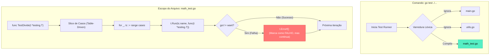

### 1. Visão Geral

No ecossistema Go, testes de software não dependem de *frameworks* de terceiros ou bibliotecas de asserção complexas (como JUnit ou Jest). A linguagem possui um motor de testes embutido no seu *toolchain* de compilação via comando `go test` e o pacote nativo `testing`. O problema central que esse design resolve é a **fricção de configuração e a padronização global**: qualquer desenvolvedor Go sabe exatamente onde encontrar os testes (arquivos sufixados com `_test.go`), como eles são estruturados (funções iniciadas com a palavra `Test`) e como reportam erros (via chamadas de métodos de log na *Struct* `*testing.T`). O compilador exclui automaticamente qualquer arquivo `_test.go` da compilação do binário final de produção, garantindo que o código de validação não onere a memória ou o tamanho da aplicação.

---

### 2. Organização por Tópicos

O domínio da engenharia de testes em Go subdivide-se nas seguintes mecânicas fundamentais:

* **Convenções Léxicas e Assinatura:** As regras rígidas de nomenclatura de arquivos e funções necessárias para que o *runtime* reconheça a função como um teste válido.
* **Reporte de Falhas (Error vs Fatal):** O mecanismo de asserção manual do Go, diferenciando falhas que permitem a continuação do teste (Soft Fail) de falhas que abortam a execução imediatamente (Hard Fail).
* **Table-Driven Tests e Subtestes:** O padrão arquitetural de excelência (*Senior Pattern*) para validação de múltiplos cenários através de fatias (*Slices*) de *Structs* anônimas iteradas pela função isoladora `t.Run()`.

---

### 3. Visualização do Fluxo (Mermaid)



**Implementação Passo a Passo (Diagrama):**

* **Infiltração do Compilador:** O comando `go test` compila um binário executável de teste efêmero apenas com os pacotes e seus respectivos arquivos `_test.go`.
* **A Iteração Table-Driven:** Em vez de escrever 10 funções separadas para testar 10 cenários da mesma regra de negócio, o Go itera sobre um vetor de dados (*Table*).
* **Isolamento de Subtestes (`t.Run`):** Cria um sanduíche de execução. Se um dos 10 casos quebrar e disparar um `t.Errorf`, o `t.Run` sinaliza a falha no console, mas o loop avança para testar o próximo cenário, entregando um relatório completo de falhas em uma única execução.

---

### 4 e 5. Exemplos de Código (Idiomático) e Implementação Passo a Passo

#### Tópico A: Estrutura Base e Controle de Falhas

```go
// Arquivo: calculator.go
package domain

func Add(a, b int) int {
	return a + b
}

// ---------------------------------------------------------
// Arquivo: calculator_test.go (Deve residir no mesmo pacote)
package domain

import "testing"

// A função DEVE começar com 'Test' seguido de letra maiúscula.
// O único parâmetro aceito é o ponteiro *testing.T
func TestAdd_Simple(t *testing.T) {
	result := Add(2, 3)
	expected := 5

	// Go não possui comandos como 'assert.Equal()'.
	// O controle de fluxo (if) é manual e explícito.
	if result != expected {
		// t.Errorf marca o teste como 'FAIL' e imprime a string formatada,
		// mas a função continua executando as linhas abaixo.
		t.Errorf("Add(2, 3) FALHOU: esperado %d, recebido %d", expected, result)
	}

	// t.Fatalf também marca como 'FAIL', mas executa um 'runtime.Goexit()',
	// abortando o teste atual imediatamente (útil quando o erro for impeditivo).
	// if err != nil { t.Fatalf("Erro fatal de setup: %v", err) }
}

```

**Implementação Passo a Passo:**

* **O Sufixo `_test.go`:** Obrigatório. É a única forma do *toolchain* separar o que é código de teste e o que é código de produção.
* **`t *testing.T`:** O parâmetro principal injetado pelo *runtime*. Este objeto de contexto coleta os logs, controla o estado do teste (Pass/Fail) e gerencia a execução de testes paralelos.
* **A Filosofia de Asserção do Go:** Engenheiros vindos do Java ou Node acham o `if got != want` excessivamente verboso e primitivo. Esta foi uma escolha deliberada dos criadores do Go: evitar que frameworks de asserção complexos escondam lógicas mágicas de comparação ou disparem *Panics* para controlar o fluxo. A falha de um teste é tratada como uma operação de *log* de erro regular.

#### Tópico B: Padrão Sênior (Table-Driven Tests)

```go
// Arquivo: validator.go
package domain

import "errors"

var ErrInvalidAge = errors.New("idade não pode ser negativa")

func IsAdult(age int) (bool, error) {
	if age < 0 {
		return false, ErrInvalidAge
	}
	return age >= 18, nil
}

// ---------------------------------------------------------
// Arquivo: validator_test.go
package domain

import (
	"errors"
	"testing"
)

func TestIsAdult(t *testing.T) {
	// 1. Declaração do Slice de Structs Anônimas (A "Tabela" de casos)
	tests := []struct {
		name        string // Nome descritivo do cenário
		inputAge    int    // Dados de entrada
		wantResult  bool   // Saída esperada (State)
		wantErr     error  // Erro esperado (Error/Behavior)
	}{
		{"Adulto de 20 anos", 20, true, nil},
		{"Menor de 17 anos", 17, false, nil},
		{"Exatamente 18 anos", 18, true, nil},
		{"Idade negativa", -5, false, ErrInvalidAge},
	}

	// 2. Iteração sobre a Tabela
	for _, tc := range tests {
		
		// 3. Execução Isolada via Subteste (t.Run)
		t.Run(tc.name, func(t *testing.T) {
			// (Opcional) t.Parallel() permite que os subtestes rodem concorrentemente
			
			gotResult, gotErr := IsAdult(tc.inputAge)

			// Validação do Erro (Comportamento)
			if !errors.Is(gotErr, tc.wantErr) {
				t.Fatalf("Erro inesperado: recebido %v, esperado %v", gotErr, tc.wantErr)
			}

			// Validação do Resultado (Estado)
			if gotResult != tc.wantResult {
				t.Errorf("Falha lógica: recebido %v, esperado %v", gotResult, tc.wantResult)
			}
		})
	}
}

```

**Implementação Passo a Passo:**

* **O Slice de Structs Anônimas (`tests := []struct{...}{...}`):** Este é o *Table-Driven Pattern*. Você define a estrutura de dados (inputs e outputs) e na mesma expressão a popula com os literais. Isso centraliza os cenários de teste, eliminando a repetição do *boilerplate* de execução (`IsAdult(...)`) e dos blocos `if`.
* **`t.Run(nome, func(t *testing.T))`:** Para cada cenário iterado, instruímos o *test runner* a iniciar um subteste nomeado. Quando você executa `go test -v` no terminal, o Go reportará a execução hierárquica (ex: `TestIsAdult/Menor_de_17_anos`). Isso garante rastreabilidade exata de qual linha da tabela falhou.
* **`errors.Is()` vs `==`:** Na avaliação de erros em testes (*Assertion*), o padrão de qualidade obriga o uso da biblioteca nativa `errors.Is` (ou `errors.As` para checagem de tipos), em vez do comparador matemático `==`. O `errors.Is` consegue penetrar em erros "envelopados" (*Wrapped Errors* via `fmt.Errorf("%w")`), tornando o teste robusto contra refatorações internas da arquitetura.