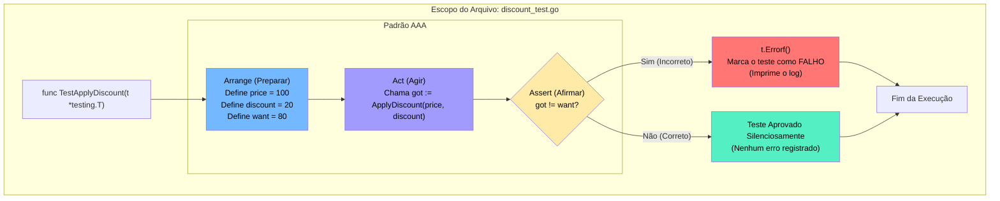

### 1. Visão Geral

No ecossistema Go, um teste unitário básico é a menor unidade de validação automatizada, focado em testar o comportamento de uma única função isolada do resto do sistema. Diferente de linguagens que dependem fortemente de frameworks externos (como JUnit, NUnit ou Mocha), o Go embute essa capacidade nativamente através do pacote `testing`. O problema central que o design de testes do Go resolve é a dependência de abstrações mágicas: não existem comandos como `assert.Equal` na biblioteca padrão. O engenheiro deve escrever o fluxo de validação utilizando lógica de programação comum (`if got != want`), o que garante que o código de teste seja tão legível, explícito e debugável quanto o próprio código de produção. O padrão arquitetural Sênior para escrever esses testes é o **AAA (Arrange, Act, Assert)**.

---

### 2. Organização por Tópicos

A construção de um teste unitário singular fundamenta-se nas seguintes mecânicas:

* **Assinatura Contratual:** A exigência léxica de que a função comece com `Test` seguido por letra maiúscula e receba estritamente o ponteiro `*testing.T`.
* **O Padrão AAA (Arrange, Act, Assert):** A divisão visual e lógica do teste em três etapas: configuração de estado, execução da função e verificação do resultado.
* **Granularidade de Falhas (`Error` vs `Fatal`):** A decisão arquitetural de registrar um erro e continuar o teste (`t.Errorf`) ou abortar a execução imediatamente devido a uma falha irrecuperável de estado (`t.Fatalf`).

---

### 3. Visualização do Fluxo (Mermaid)



---

### 4 e 5. Exemplos de Código (Idiomático) e Implementação Passo a Passo

#### Tópico A: O Padrão AAA e Asserções Manuais

```go
// Arquivo: billing.go
package domain

import "errors"

// ApplyDiscount subtrai um valor do preço original, com limite zero.
func ApplyDiscount(price float64, discount float64) (float64, error) {
	if discount < 0 {
		return 0, errors.New("desconto não pode ser negativo")
	}
	
	finalPrice := price - discount
	if finalPrice < 0 {
		return 0, nil
	}
	
	return finalPrice, nil
}

// ---------------------------------------------------------
// Arquivo: billing_test.go
package domain

import "testing"

// TestApplyDiscount_Valid verifica o caminho feliz da função.
func TestApplyDiscount_Valid(t *testing.T) {
	// 1. ARRANGE (Preparar o estado e expectativas)
	initialPrice := 100.0
	discountAmount := 25.0
	want := 75.0

	// 2. ACT (Executar a lógica de negócios isolada)
	got, err := ApplyDiscount(initialPrice, discountAmount)

	// 3. ASSERT (Verificar os resultados esperados)
	// Primeiro validamos se houve erro técnico (Behavior)
	if err != nil {
		// Fatalf aborta o teste aqui. Não faz sentido checar 'got' se a função retornou erro.
		t.Fatalf("Erro não esperado durante o cálculo: %v", err)
	}

	// Depois validamos o estado dos dados (State)
	if got != want {
		// Errorf marca como falho, mas permite que o teste termine graciosamente.
		t.Errorf("Resultado lógico incorreto: recebido %.2f, esperado %.2f", got, want)
	}
}

```

**Implementação Passo a Passo:**

* **`func TestApplyDiscount_Valid(t *testing.T)`:** O nome da função documenta imediatamente qual comportamento está sendo validado (`_Valid` indica o caminho feliz). A injeção de `*testing.T` fornece o terminal de controle para este teste específico.
* **Separação AAA:** Visualmente separar as variáveis de entrada/saída (Arrange), a invocação (Act) e os blocos `if` (Assert) é uma prática que acelera a leitura do código por outros engenheiros e facilita manutenções futuras.
* **A Regra do `t.Fatalf` vs `t.Errorf`:** Em um teste unitário básico, a checagem de erros explícitos (`err != nil`) é tratada primeiro. Se a função retornou um erro quando não deveria, o valor da variável `got` é, por definição, não-confiável (geralmente o *Zero Value*). Usar `t.Fatalf` encerra a execução daquele teste imediatamente, poupando a CPU de rodar o bloco `if got != want` inutilmente.

#### Tópico B: Testando Caminhos de Erro (Sad Path)

```go
package domain

import "testing"

// TestApplyDiscount_NegativeDiscount verifica as barreiras de proteção (Guard Clauses).
func TestApplyDiscount_NegativeDiscount(t *testing.T) {
	// ARRANGE
	price := 50.0
	invalidDiscount := -10.0

	// ACT
	got, err := ApplyDiscount(price, invalidDiscount)

	// ASSERT
	// Em testes de "caminho triste", a presença do erro é o nosso SUCESSO.
	if err == nil {
		t.Fatal("Esperava um erro para desconto negativo, mas retornou nil")
	}

	// Validação de segurança: O retorno de dados deve ser o Zero Value em caso de erro
	if got != 0 {
		t.Errorf("O valor de retorno deveria ser 0 em caso de erro, mas recebido %.2f", got)
	}

	// (Opcional) Validação da mensagem de erro exata
	expectedErrMsg := "desconto não pode ser negativo"
	if err.Error() != expectedErrMsg {
		t.Errorf("Mensagem de erro incorreta.\nRecebido: %q\nEsperado: %q", err.Error(), expectedErrMsg)
	}
}

```

**Implementação Passo a Passo:**

* **Inversão de Expectativa (`if err == nil`):** Quando estamos testando cenários de falha, se o `err` for nulo, isso significa que a nossa barreira de segurança falhou (a função aceitou um desconto negativo). Invocamos o *Hard Fail* (`t.Fatal`).
* **Validação do *Zero Value*:** O engenheiro Sênior testa não apenas o erro, mas se a função respeitou o contrato de devolver `0` para o float64. Se a função retornasse `(finalPrice, err)` sem zerar os dados corrompidos, isso seria um bug grave, detectado por este `Errorf`.
* **Comparação de Mensagens (`err.Error() != ...`):** Validar a string exata do erro garante que a falha foi gerada pelo motivo correto, e não por um outro erro genérico que escapou pela mesma barreira. O operador de formatação `%q` (quoted) embute a string entre aspas no log do terminal, revelando espaços em branco ocultos que frequentemente causam testes intermitentes (flaky tests).