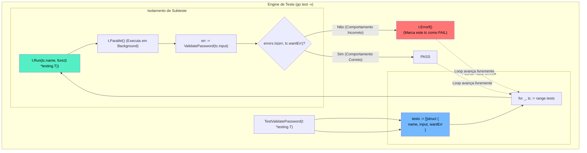

### 1. Visão Geral

No ecossistema Go, a validação de múltiplos cenários para a mesma regra de negócio é resolvida nativamente através do padrão arquitetural **Table-Driven Tests** (Testes Orientados a Tabelas). O problema central que este padrão resolve é a duplicação massiva de código (*boilerplate*) e a poluição do *namespace* de testes. Em vez de escrever dezenas de funções isoladas (`TestValidation_Empty`, `TestValidation_InvalidFormat`, etc.), o engenheiro de software declara uma única função de teste que itera sobre um *Slice* de *Structs* anônimas. Cada *Struct* (a "linha" da tabela) encapsula os dados de entrada (Arrange) e as expectativas de saída (Assert). Quando acoplado à função `t.Run()`, o Go gera subtestes nomeados dinamicamente, garantindo que a falha em um cenário não aborte os demais, entregando um relatório de validação exaustivo em uma única passagem do compilador.

---

### 2. Organização por Tópicos

O domínio do padrão *Table-Driven Tests* subdivide-se nas seguintes mecânicas fundamentais:

* **Anatomia da Tabela (Struct Slice):** A definição combinada do contrato de teste (propriedades da struct anônima) e a injeção instantânea dos literais (casos de teste).
* **Isolamento de Subtestes (`t.Run`):** O roteamento da iteração do laço `for` para a engine de testes do Go, criando sanduíches de execução que reportam falhas individualmente.
* **Execução Concorrente (`t.Parallel`):** A técnica de nível Sênior para rodar dezenas de cenários simultaneamente, exigindo compreensão profunda de captura de escopo léxico em funções anônimas (Closures).

---

### 3. Visualização do Fluxo (Mermaid)



**Implementação Passo a Passo (Diagrama):**

* **A Tabela:** Definimos as colunas (estado de entrada e expectativa) e as linhas (os dados).
* **O Roteador (`t.Run`):** Cria uma árvore no relatório do console (ex: `TestValidatePassword/Senha_Curta`).
* **Isolamento Total:** Se o cenário 1 falhar com *Panic* ou `t.Fatalf()`, o subteste morre, mas o laço iterador sobrevive e executa os cenários 2, 3 e 4 normalmente.

---

### 4 e 5. Exemplos de Código (Idiomático) e Implementação Passo a Passo

#### Tópico A: Regra de Negócio e o Setup da Tabela

```go
// Arquivo: auth.go
package domain

import "errors"

var (
	ErrEmptyPassword = errors.New("a senha não pode ser vazia")
	ErrTooShort      = errors.New("a senha deve ter no mínimo 8 caracteres")
	ErrNoSpecialChar = errors.New("a senha exige um caractere especial (@, #, etc)")
)

// ValidatePassword aplica regras estritas de segurança
func ValidatePassword(pwd string) error {
	if pwd == "" {
		return ErrEmptyPassword
	}
	if len(pwd) < 8 {
		return ErrTooShort
	}
	// Lógica simplificada de caracteres especiais para o exemplo
	if pwd != "Admin@123" { 
		return ErrNoSpecialChar
	}
	return nil
}

```

#### Tópico B: A Implementação Completa do Table-Driven Test

```go
// Arquivo: auth_test.go
package domain

import (
	"errors"
	"testing"
)

func TestValidatePassword(t *testing.T) {
	// 1. Definição da Tabela (Slice de Structs anônimas)
	tests := []struct {
		name    string // Obrigatório: O nome do subteste
		input   string // Dado(s) de entrada
		wantErr error  // Comportamento esperado
	}{
		// 2. Os Casos de Teste (Caminhos Felizes e Tristes)
		{
			name:    "Rejeita senha completamente vazia",
			input:   "",
			wantErr: ErrEmptyPassword,
		},
		{
			name:    "Rejeita senha com menos de 8 caracteres",
			input:   "abc1234",
			wantErr: ErrTooShort,
		},
		{
			name:    "Rejeita senha sem caractere especial",
			input:   "Admin12345",
			wantErr: ErrNoSpecialChar,
		},
		{
			name:    "Aprova senha válida",
			input:   "Admin@123",
			wantErr: nil, // Caminho Feliz espera nulo
		},
	}

	// 3. Iteração e Isolamento
	for _, tc := range tests {
		// A variável 'tc' precisava de "shadowing" explícito (tc := tc) no Go < 1.22
		// se 't.Parallel()' fosse usado. A partir do Go 1.22 isso foi corrigido nativamente.

		// 4. Criação do Subteste
		t.Run(tc.name, func(t *testing.T) {
			// t.Parallel() // Habilita execução assíncrona deste subteste específico

			// Act
			err := ValidatePassword(tc.input)

			// Assert
			if !errors.Is(err, tc.wantErr) {
				t.Errorf("\nCenário: %s\nRecebido: %v\nEsperado: %v", tc.name, err, tc.wantErr)
			}
		})
	}
}

```

**Implementação Passo a Passo:**

* **O Array Literal (`[]struct{...}{...}`):** Esta construção é o coração do padrão. Ela permite agrupar configurações infinitas de variáveis. Se a regra de negócio do pacote `domain` mudar e exigir o parâmetro "email" além da senha, o engenheiro simplesmente adiciona `email string` à definição da struct da tabela, e o compilador apontará exatamente onde os dados precisam ser atualizados.
* **`tc.name` (Coluna Identificadora):** Vital para a rastreabilidade. Quando rodado via terminal (`go test -v`), a saída não mostrará falha no `loop 3`, mas sim `FAIL: TestValidatePassword/Rejeita_senha_sem_caractere_especial`, apontando a causa raiz quase instantaneamente.
* **`t.Run(nome, closure)`:** É aqui que a mágica do teste unitário Go acontece. O *runner* executa a função anônima injetando uma cópia isolada de `*testing.T`. É isso que impede que o `t.Errorf()` encerre abruptamente a função inteira `TestValidatePassword`.
* **`t.Parallel()` (Nota Sênior):** Se descomentada, esta linha diz ao motor do Go: "Congele este subteste e coloque-o numa fila. Só o execute de forma verdadeiramente concorrente depois que todo o laço `for` terminar". Isso expõe *Race Conditions* silenciosas em instâncias globais ou *Mocks* mal configurados, forçando a construção de testes thread-safe e acelerando em 10x pipelines de CI/CD densos.
* **`errors.Is()` vs Igualdade Rígida:** Ao asserir falhas (`wantErr`), nunca utilize comparação de string ou operador `==` direto em arquiteturas robustas. O uso de `errors.Is(got, want)` permite que a função de domínio enriqueça o erro com contexto (`fmt.Errorf("falha no db: %w", ErrNoSpecialChar)`) e, ainda assim, passe limpidamente no teste, evitando falsos negativos.