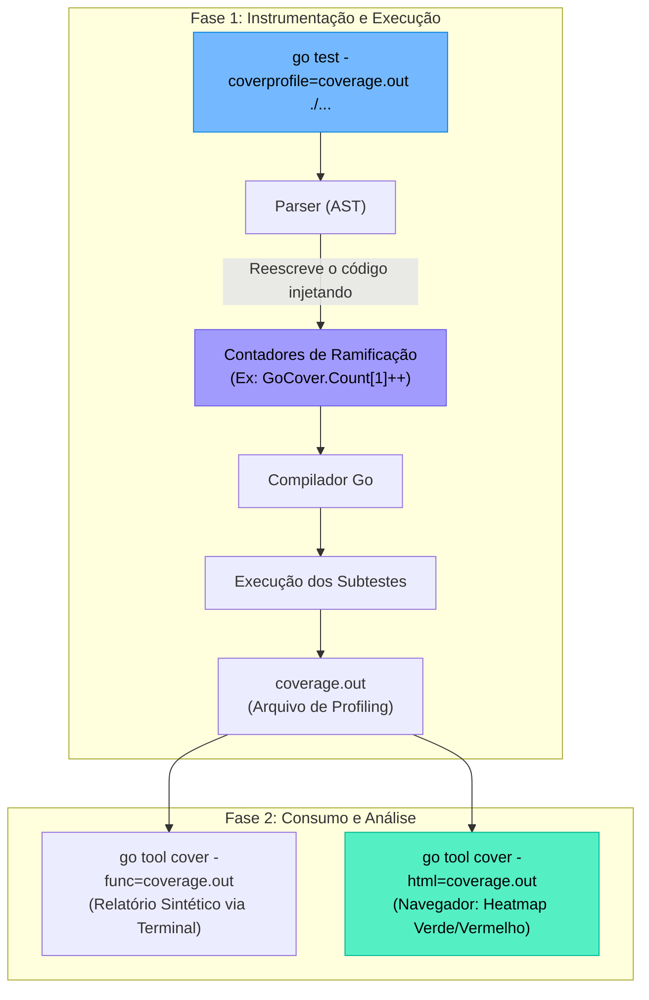

### 1. Visão Geral

No ecossistema Go, a medição de cobertura de código (*Code Coverage*) e a execução de testes não exigem ferramentas de terceiros (como Istanbul ou JaCoCo); ambas são nativas e profundamente integradas ao *toolchain* de compilação da linguagem. O problema central que o comando `go test` resolve é a automação da validação, mas o brilho arquitetural reside em **como** o Go calcula a cobertura. Diferente de outras linguagens que utilizam *hooks* de depuração dinâmicos em tempo de execução para rastrear quais linhas foram chamadas, o Go utiliza **Reescrita de Código Fonte (AST Manipulation)**. Quando você aciona a flag de cobertura, o compilador modifica temporariamente o código-fonte antes de compilá-lo, injetando contadores atômicos invisíveis em cada ramificação lógica (blocos `if`, `for`, `switch`). Isso resulta em medições de cobertura com precisão matemática estrita e *overhead* de performance quase imperceptível.

---

### 2. Organização por Tópicos

O domínio da suíte de testes e cobertura subdivide-se nas seguintes mecânicas fundamentais:

* **O Motor de Execução (`go test`):** A utilização de flags avançadas para contornar o sistema de cache de testes agressivo do Go e direcionar execuções específicas usando Expressões Regulares (Regex).
* **Instrumentação de Cobertura (`-coverprofile`):** O processo de geração do arquivo de *profiling*, que mapeia exatamente quantas vezes cada instrução foi acionada durante os testes.
* **Inspeção Visual e Funcional (`go tool cover`):** A leitura do arquivo de profiling para gerar relatórios estruturados no terminal ou mapas de calor (*heatmaps*) em HTML diretamente no navegador.

---

### 3. Visualização do Fluxo (Mermaid)



**Implementação Passo a Passo (Diagrama):**

* **O Gatilho:** O desenvolvedor invoca o teste pedindo um arquivo de saída (`coverage.out`).
* **A Mágica da AST:** O Go não compila seu código original. Ele analisa a Árvore Sintática Abstrata (AST) e injeta variáveis de contagem em cada bloco de código.
* **O Arquivo Out:** É um arquivo de texto simples que mapeia `NomeDoArquivo:LinhaInicio.ColunaInicio,LinhaFim.ColunaFim NúmeroDeExecuções`.
* **A Ferramenta `tool cover`:** O binário original `go test` apenas gera os dados. Para interpretá-los humanamente, chamamos a ferramenta auxiliar que pinta o código original baseado na contagem.

---

### 4 e 5. Exemplos de Código (Idiomático) e Implementação Passo a Passo

#### Tópico A: O Arsenal do Comando `go test` (Flags Sêniores)

```bash
# 1. Execução Padrão Recursiva
# O operador './...' instrui o Go a descer em todos os subdiretórios a partir da raiz.
go test ./...

# 2. Modo Verbose (Logs detalhados)
# Mostra o status (PASS/FAIL) de cada subteste individual (t.Run).
go test -v ./...

# 3. Bypass do Cache de Teste (Padrão Sênior)
# O Go armazena testes que passaram em cache. Se você não alterou o código,
# ele apenas imprime "(cached)" e não roda o teste. '-count=1' desativa o cache.
go test -count=1 ./...

# 4. Detector de Corrida (Race Detector)
# Obrigatório em pipelines de CI/CD para projetos concorrentes. O compilador
# injeta monitores de memória para alertar se duas Goroutines colidirem.
go test -race ./...

# 5. Filtragem por Expressão Regular (Regex)
# Roda exclusivamente a função de teste chamada "TestValidatePassword"
go test -run ^TestValidatePassword$ ./domain

# 6. Modo Curto
# Útil para pular testes pesados de integração rodando localmente (exige if testing.Short() no código)
go test -short ./...

```

**Implementação Passo a Passo:**

* **A Matemática do `./...`:** Se você digitar apenas `go test`, o compilador avaliará apenas os arquivos no diretório atual (ignorando pastas filhas). O `./...` garante a varredura completa do repositório.
* **A Proteção Oculta do `-count=1`:** Se o seu teste depender de variáveis de ambiente do sistema operacional ou chamadas de banco de dados (estado externo) e não mudar o código `.go`, o Go devolverá um "PASS (cached)" mesmo que o banco de dados esteja fora do ar. A flag `-count=1` força o *runtime* a rodar fisicamente as funções novamente.

#### Tópico B: Instrumentação de Cobertura e Profiling

```bash
# 1. Apenas descobrir a porcentagem global (Sem relatórios visuais)
go test -cover ./...
# Saída: ok      meuprojeto/domain    0.015s  coverage: 85.5% of statements

# 2. Geração do Arquivo de Profiling (O Padrão Ouro)
go test -coverprofile=coverage.out ./...

# 3. Múltiplas Flags Combinadas (O cenário real de CI/CD)
go test -v -race -covermode=atomic -coverprofile=coverage.out ./...

```

**Implementação Passo a Passo:**

* **`coverage: 85.5% of statements`:** Note que o Go mede cobertura por *statements* (instruções), não rigidamente por linhas. Se você tiver um `if cond { a() }` em uma única linha, ele quebrará isso em duas instruções na AST para rastrear se `a()` foi ou não acionada.
* **`coverprofile=coverage.out`:** Este comando cria um arquivo na raiz do projeto. Ele contém coordenadas puras. Exemplo de conteúdo gerado: `github.com/empresa/projeto/auth.go:12.43,15.16 1 0`. Isso significa: "Do caractere 43 da linha 12 até o caractere 16 da linha 15, existe 1 bloco condicional que foi executado 0 vezes".
* **`-covermode=atomic`:** Extremamente importante. Quando rodamos testes paralelos ou usamos a flag `-race`, múltiplas *Goroutines* podem passar pela mesma instrução lógica ao mesmo tempo. Se os contadores injetados não forem "atômicos" (`sync/atomic`), haverá perda de dados na contagem de cobertura. O `-covermode=atomic` garante a precisão matemática em cenários de alta concorrência.

#### Tópico C: Inspeção Visual e Relatórios (A Ferramenta Tool Cover)

```bash
# PASSO 1: Sempre gerar o profile primeiro
go test -coverprofile=coverage.out ./...

# PASSO 2: Opção A - Relatório via Terminal (Útil para scripts e validação rápida)
# A flag -func lê o arquivo .out e devolve uma tabela listando cada função
# e sua respectiva cobertura, além do "Total" na última linha.
go tool cover -func=coverage.out

# PASSO 3: Opção B - Relatório Visual (HTML no Browser)
# O comando de maior valor no dia a dia do engenheiro.
go tool cover -html=coverage.out

```

**Implementação Passo a Passo:**

* **`go tool ...`:** O prefixo `tool` permite invocar binários utilitários internos que a equipe do Google embutiu no compilador (como formatadores, profiladores de CPU/Memória Pprof e o Cover).
* **O Mapa de Calor em HTML:** Ao executar `go tool cover -html`, o Go sobe um mini-servidor local efêmero e abre seu navegador padrão.
* O código-fonte será pintado de **Verde** (blocos que foram percorridos pelo menos uma vez nos testes) e **Vermelho** (blocos fantasmas que não têm nenhum teste cobrindo-os).
* Passar o mouse sobre o código verde mostrará uma *tooltip* indicando `1x`, `50x`, revelando exatamente quantas vezes aquele caminho lógico foi estressado durante a suíte de testes. É a ferramenta mais poderosa para identificar *Guard Clauses* (`if err != nil`) que você esqueceu de testar.