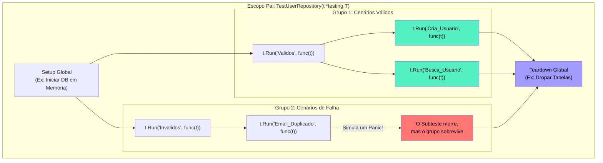

### 1. Visão Geral

No ecossistema Go, a capacidade de criar **Subtestes** é viabilizada nativamente pelo método `t.Run(nome string, f func(t *testing.T))`. Enquanto o padrão "Table-Driven" define a estrutura dos dados, o `t.Run` atua como o motor de isolamento e roteamento. O problema central que os subtestes resolvem é a **falta de isolamento em laços de repetição**: se você tiver um loop com 10 casos de teste em um único bloco de função e o segundo caso disparar um *Panic* ou chamar um `t.Fatalf`, os 8 casos restantes nunca serão executados. Ao envelopar o interior do laço em um `t.Run`, o *runtime* de testes do Go intercepta falhas graves, reporta o erro exato na árvore hierárquica do console e continua graciosamente a execução dos próximos subtestes. Além disso, ele habilita a execução estritamente concorrente de cenários (`t.Parallel()`) e permite executar apenas uma fração específica da suíte via linha de comando.

---

### 2. Organização por Tópicos

O domínio profundo da arquitetura de subtestes subdivide-se nas seguintes mecânicas:

* **Isolamento de Estado e Panics:** Como a injeção de uma nova instância isolada de `*testing.T` para cada *Closure* protege a suíte de testes contra colapsos em cascata.
* **Hierarquia e Setup/Teardown (Aninhamento):** O uso de subtestes aninhados para agrupar contextos lógicos (ex: separando cenários de banco de dados *Mockado* vs *Real*) e garantindo limpeza de recursos.
* **Roteamento Cirúrgico via CLI:** A técnica de utilizar a flag `-run` com *Regex* para instruir o compilador a rodar apenas uma "folha" específica da árvore de subtestes, economizando tempo computacional em *debugs* focados.

---

### 3. Visualização do Fluxo (Mermaid)



**Implementação Passo a Passo (Diagrama):**

* **A Árvore de Testes:** O `t.Run` pode ser chamado dentro de outro `t.Run`. Isso cria uma hierarquia lógica. Se o cenário de *Email Duplicado* falhar, o terminal mostrará: `FAIL: TestUserRepository/Invalidos/Email_Duplicado`.
* **Isolamento Absoluto:** O *Panic* no Grupo 2 destroi a Goroutine isolada do subteste 3, mas não afeta o *Teardown Global* que precisa ser executado no final da função pai para limpar o banco de dados.

---

### 4 e 5. Exemplos de Código (Idiomático) e Implementação Passo a Passo

#### Tópico A: Aninhamento e Controle de Ciclo de Vida (Setup/Teardown)

```go
package domain_test

import (
	"fmt"
	"testing"
)

// Processamento Simulado
func ProcessPayment(method string) error {
	if method == "INVALIDO" {
		panic("sistema de pagamentos corrompido")
	}
	return nil
}

func TestPaymentGateway(t *testing.T) {
	// 1. SETUP GLOBAL (Roda 1 vez antes de todos os subtestes)
	fmt.Println("[Setup Global] Conectando ao Sandbox de Pagamentos...")

	// 5. TEARDOWN GLOBAL (Uso de defer para garantir limpeza pós-testes)
	defer fmt.Println("[Teardown Global] Desconectando do Sandbox...")

	// 2. AGRUPAMENTO LÓGICO DE SUCESSO
	t.Run("Caminhos_Felizes", func(t *testing.T) {
		
		t.Run("Cartao_Credito", func(t *testing.T) {
			err := ProcessPayment("CREDITO")
			if err != nil {
				t.Fatalf("falha inesperada: %v", err)
			}
		})

		t.Run("Boleto", func(t *testing.T) {
			err := ProcessPayment("BOLETO")
			if err != nil {
				t.Fatalf("falha inesperada: %v", err)
			}
		})
	})

	// 3. AGRUPAMENTO LÓGICO DE FALHA E PANIC
	t.Run("Tratamento_Erros", func(t *testing.T) {
		
		t.Run("Metodo_Corrompido", func(t *testing.T) {
			// 4. PREVENÇÃO DE PANIC: Usamos defer+recover no subteste para
			// capturar falhas críticas simuladas e passarmos o teste de propósito.
			defer func() {
				if r := recover(); r == nil {
					t.Errorf("Esperava um panic com método inválido, mas não ocorreu")
				}
			}()
			
			// Dispara o panic e interrompe ESTE subteste, mas não a função inteira
			ProcessPayment("INVALIDO") 
		})
	})
}

```

**Implementação Passo a Passo:**

* **Setup/Teardown com `defer`:** A injeção do comando de banco de dados, inicialização de *cache* ou *mock* de servidores fica no topo. O `defer` no `Teardown Global` é vital. Mesmo se um subteste mal escrito causar um *Panic* que o *runtime* do Go não consiga isolar adequadamente, o `defer` da função principal rodará as limpezas de *sockets* ou processos zumbis antes do teste morrer.
* **Nomeação sem Espaços:** Note o uso de *Underlines* (`_`) nos nomes dos testes (`Caminhos_Felizes`). Se você usar espaços, o Go os substituirá internamente por *underscores* no relatório de linha de comando. Manter a coerência visual evita confusões ao buscar as rotas via CLI.
* **Captura de Panics (Sandboxing):** Em subtestes, é perfeitamente válido testar se a sua aplicação reage a um comportamento destrutivo utilizando `defer func() { recover() }`. O subteste termina graciosamente e a bateria de testes continua.

#### Tópico B: Roteamento Cirúrgico via CLI (Acelerando o Debug)

Se você tem uma suíte que demora 5 minutos para rodar o pacote inteiro, e você alterou apenas a regra do boleto, não faz sentido rodar tudo de novo. Você pode usar a flag `-run` para "mergulhar" na árvore de subtestes utilizando *Expressões Regulares* separadas por barras `/`.

```bash
# 1. Roda TODOS os testes da aplicação (Padrão)
go test ./...

# 2. Roda apenas a função raiz (Executará Crédito, Boleto e Erros)
go test -run ^TestPaymentGateway$ ./...

# 3. Mergulha no Nível 1: Roda apenas o agrupamento de sucesso
go test -run ^TestPaymentGateway/Caminhos_Felizes$ ./...

# 4. Mergulha no Nível 2 (Cirúrgico): Roda APENAS o subteste de Boleto
go test -run ^TestPaymentGateway/Caminhos_Felizes/Boleto$ ./...

# 5. Regex Avançado: Roda qualquer subteste que tenha "Credito" no nome, 
# não importando o grupo ao qual pertence.
go test -run /Credito ./...

```

#### Tópico C: Variáveis e Paralelismo Extremo (A Armadilha do Go < 1.22)

Quando unimos Table-Driven Tests com `t.Parallel()`, um detalhe crítico de engenharia separa um código júnior de um código sênior.

```go
package domain_test

import (
	"testing"
	"time"
)

func TestParallelProcessing(t *testing.T) {
	cases := []struct {
		name string
		val  int
	}{
		{"Cenario 1", 10},
		{"Cenario 2", 20},
		{"Cenario 3", 30},
	}

	for _, tc := range cases {
		// A ARMADILHA HISTÓRICA DO GO:
		// Em versões anteriores ao Go 1.22, a variável 'tc' era reescrita a cada volta
		// do loop. Como t.Parallel() pausa os subtestes e os executa todos juntos
		// no final, todos os subtestes acabariam avaliando o "Cenario 3" (o último valor de 'tc').
		
		// SOLUÇÃO CLÁSSICA (Obrigatória antes do Go 1.22):
		// tc := tc // Shadowing léxico para copiar o valor na Stack da iteração atual

		t.Run(tc.name, func(t *testing.T) {
			// A diretiva t.Parallel() informa ao motor: "Pode pausar este closure.
			// Continue lendo o 'for', crie todos os outros subtestes, e depois
			// execute todos eles simultaneamente em múltiplas OS Threads".
			t.Parallel()

			time.Sleep(100 * time.Millisecond) // Simula demora de I/O
			
			if tc.val < 0 {
				t.Errorf("valor inválido")
			}
		})
	}
}

```

**Implementação Passo a Passo:**

* **`t.Parallel()`:** Esta chamada transforma a execução sequencial em estritamente concorrente. Se sua tabela tiver 500 cenários de acesso a um Banco de Dados (*Mock*), eles serão disparados de uma só vez, reduzindo o tempo de teste de minutos para milissegundos.
* **O Conserto do Go 1.22:** O Go 1.22 reformou a semântica do laço `for`. Agora, o compilador recria as variáveis do laço implicitamente a cada iteração, tornando o uso de `t.Parallel()` dentro de `for _, tc := range` perfeitamente seguro sem a necessidade de recorrer ao artifício obscuro do *Shadowing* (`tc := tc`). O conhecimento desse contexto histórico, contudo, é vital ao dar manutenção em bases de código legadas.