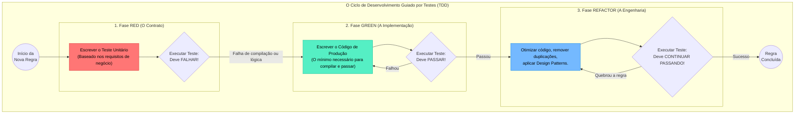

### 1. Visão Geral

Na engenharia de software moderna, a prática de guiar o desenvolvimento através da validação de regras de negócio é a essência do **Test-Driven Development (TDD)** fundido com princípios de **Domain-Driven Design (DDD)** e **Arquitetura Limpa**. O problema central que essa prática resolve é o acoplamento prematuro: em vez de começar o sistema pensando em qual banco de dados usar ou como será a rota da API HTTP, o engenheiro Sênior começa escrevendo um teste que traduz estritamente uma regra de negócio pura (ex: "Um cliente não pode sacar dinheiro se a conta estiver bloqueada"). O código de produção só é escrito *após* o teste falhar. Isso garante que o núcleo da sua aplicação (o Domínio) seja agnóstico a infraestrutura, 100% testável em milissegundos e atue como um escudo intransponível contra estados inválidos.

---

### 2. Organização por Tópicos

O domínio dessa prática arquitetural subdivide-se nas seguintes mecânicas:

* **O Ciclo Red-Green-Refactor:** A disciplina estrita de escrever o teste que falha (Red), escrever o código mínimo e acoplado para passar (Green) e, por fim, lapidar o design e performance (Refactor).
* **Isolamento do Domínio (Core Business):** A criação de *Structs* e funções que operam apenas com estruturas de dados nativas, sem importar pacotes de HTTP, SQL ou Kafka.
* **Inversão de Dependência via Interfaces:** O uso de *Mocks* e *Stubs* baseados em interfaces para simular dependências externas (ex: checar o saldo no banco de dados) durante a validação da regra de negócio.

---

### 3. Visualização do Fluxo (Mermaid)



**Implementação Passo a Passo (Diagrama):**

* **Red (A Dor):** Você tenta instanciar uma regra de "Processamento de Assinatura". O código nem compila, pois a função não existe. Você cria a assinatura da função, roda o teste, e ele falha porque não há lógica implementada. O teste guia o design da API.
* **Green (O Alívio):** Você escreve *ifs* feios, hardcodes e lógica bruta só para o teste ficar verde. O objetivo aqui não é código limpo, é provar que o computador entende a regra.
* **Refactor (A Maestria):** Com o teste te protegendo (sua rede de segurança), você transforma o código feio em uma obra de engenharia de software otimizada, garantindo que o comportamento externo da regra não mude.

---

### 4 e 5. Exemplos de Código (Idiomático) e Implementação Passo a Passo

Nesta simulação, vamos desenvolver uma regra de negócio de renovação de assinatura de *SaaS*. A regra é: **"O sistema deve processar a renovação apenas se o cliente estiver ativo e a cobrança no gateway for bem-sucedida"**.

#### Passo 1: A Fase RED (O Teste Primeiro)

Criamos o arquivo de teste `subscription_test.go` *antes* do código de produção.

```go
package domain_test

import (
	"errors"
	"testing"
	
	"meuprojeto/internal/domain" // Importamos o pacote onde a lógica existirá
)

// 1. Criamos um Mock do Gateway de Pagamento focado no teste
type MockPaymentGateway struct {
	ShouldFail bool
}

func (m *MockPaymentGateway) Charge(accountID string, amount float64) error {
	if m.ShouldFail {
		return errors.New("cartão recusado")
	}
	return nil
}

func TestRenewSubscription(t *testing.T) {
	tests := []struct {
		name       string
		client     domain.Client
		gateway    *MockPaymentGateway
		wantErrMsg string
	}{
		{
			name:       "Rejeita renovação de cliente inativo",
			client:     domain.Client{ID: "C1", Status: "INACTIVE"},
			gateway:    &MockPaymentGateway{ShouldFail: false},
			wantErrMsg: domain.ErrClientInactive.Error(),
		},
		{
			name:       "Rejeita se gateway recusar pagamento",
			client:     domain.Client{ID: "C2", Status: "ACTIVE"},
			gateway:    &MockPaymentGateway{ShouldFail: true},
			wantErrMsg: "falha no pagamento: cartão recusado",
		},
		{
			name:       "Renova com sucesso (Caminho Feliz)",
			client:     domain.Client{ID: "C3", Status: "ACTIVE"},
			gateway:    &MockPaymentGateway{ShouldFail: false},
			wantErrMsg: "",
		},
	}

	for _, tc := range tests {
		t.Run(tc.name, func(t *testing.T) {
			// A função RenewUseCase AINDA NÃO EXISTE. O código vai quebrar aqui!
			err := domain.RenewUseCase(tc.client, tc.gateway, 50.0)

			if tc.wantErrMsg != "" {
				if err == nil {
					t.Fatalf("esperava erro '%s', mas retornou nil", tc.wantErrMsg)
				}
				if err.Error() != tc.wantErrMsg {
					t.Errorf("erro incorreto. Recebido: %s | Esperado: %s", err.Error(), tc.wantErrMsg)
				}
			} else if err != nil {
				t.Fatalf("esperava sucesso, mas falhou com: %v", err)
			}
		})
	}
}

```

*Ao rodar `go test`, o compilador grita: "undefined: domain.RenewUseCase" e "undefined: domain.Client". Isso é perfeito. O teste desenhou a API que precisamos construir.*

#### Passo 2 e 3: A Fase GREEN e REFACTOR (A Implementação)

Agora, criamos o arquivo `subscription.go` para fazer os testes compilarem e passarem.

```go
package domain

import (
	"errors"
	"fmt"
)

// Erros de Domínio explícitos
var (
	ErrClientInactive = errors.New("operação bloqueada: cliente inativo")
)

// Client representa a entidade central da regra de negócio
type Client struct {
	ID     string
	Status string
}

// PaymentGateway é o contrato (Interface). O domínio NÃO sabe se é Stripe, PayPal ou Mock.
type PaymentGateway interface {
	Charge(accountID string, amount float64) error
}

// RenewUseCase aplica estritamente a regra de negócio orquestrando os dados e a interface.
func RenewUseCase(c Client, gateway PaymentGateway, amount float64) error {
	// Regra 1: Validação de Estado do Domínio
	if c.Status != "ACTIVE" {
		return ErrClientInactive
	}

	// Regra 2: Chamada ao serviço externo via interface
	err := gateway.Charge(c.ID, amount)
	if err != nil {
		// Envelopamento do erro para adicionar contexto do negócio
		return fmt.Errorf("falha no pagamento: %w", err)
	}

	// A partir daqui, o caso de uso poderia emitir um evento, atualizar banco, etc.
	return nil
}

```

**Implementação Passo a Passo (O Padrão Sênior):**

* **A Força da Interface:** A regra de negócio (`RenewUseCase`) aceita a interface `PaymentGateway`. Isso permitiu que passássemos o `MockPaymentGateway` no arquivo de teste. Em produção, na função `main`, você passará um ponteiro para `StripeGateway` que satisfaz a mesma interface. A regra de negócio foi validada com 100% de precisão sem precisar bater em um servidor web real, rodando em microssegundos.
* **Confiabilidade:** Se um júnior entrar amanhã no projeto e comentar a linha `if c.Status != "ACTIVE"`, o subteste `"Rejeita renovação de cliente inativo"` vai estourar imediatamente na linha de comando (`go test`), impedindo que o bug vá para produção. O teste unitário atua como documentação viva e executável das regras da empresa.

---

Essa mecânica de começar pelo comportamento e proteger o domínio com interfaces faz sentido para o tipo de aplicação que você está planejando construir, ou você costuma integrar mais com infraestrutura (banco de dados real/APIs) logo no início do desenvolvimento?